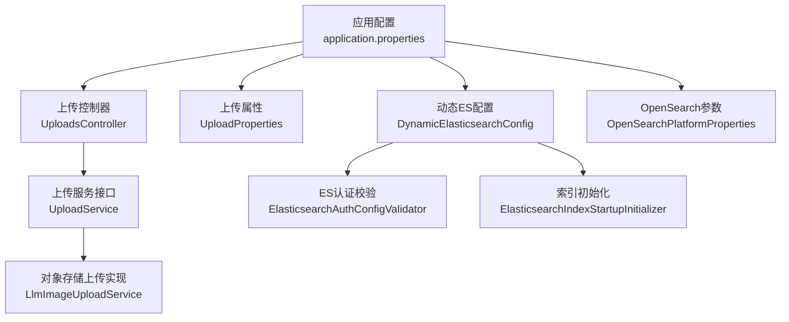
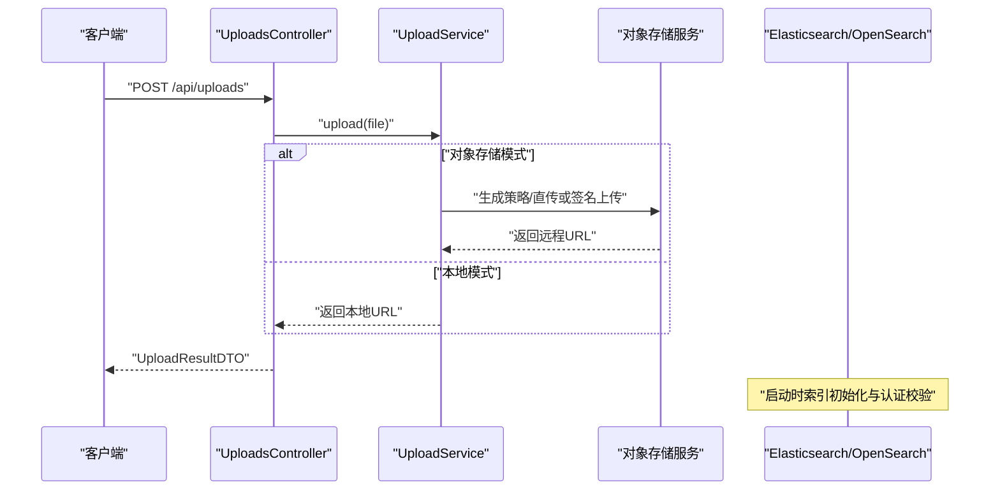
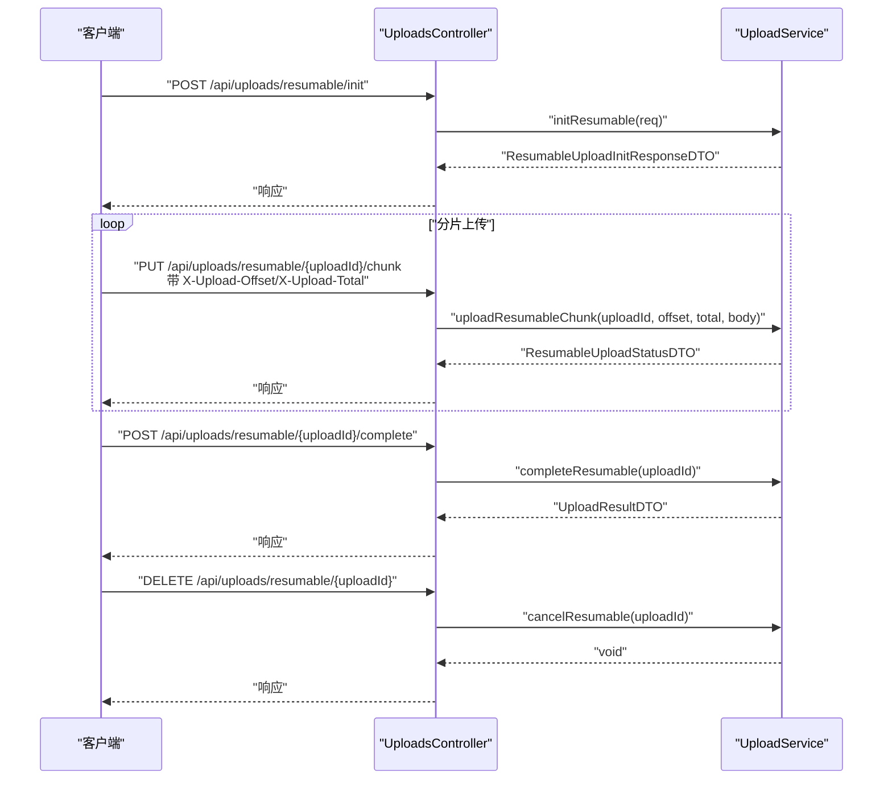
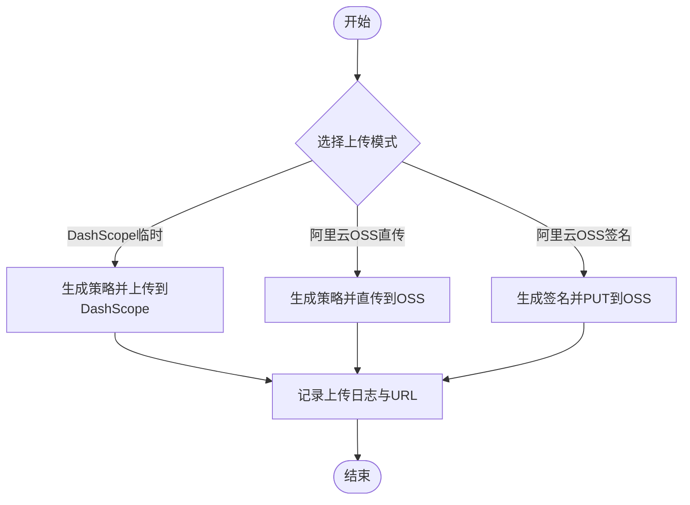
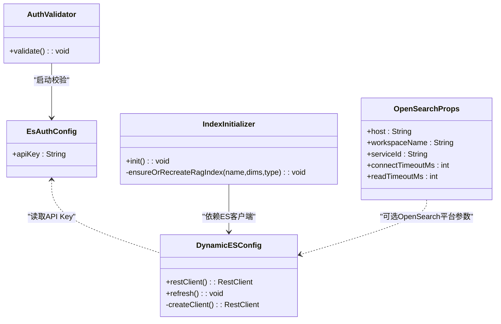
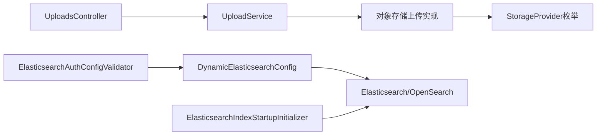

# 存储配置

<cite>
**本文引用的文件**
- [application.properties](file://src/main/resources/application.properties)
- [UploadProperties.java](file://src/main/java/com/example/EnterpriseRagCommunity/config/UploadProperties.java)
- [UploadsController.java](file://src/main/java/com/example/EnterpriseRagCommunity/controller/UploadsController.java)
- [UploadService.java](file://src/main/java/com/example/EnterpriseRagCommunity/service/monitor/UploadService.java)
- [DynamicElasticsearchConfig.java](file://src/main/java/com/example/EnterpriseRagCommunity/config/DynamicElasticsearchConfig.java)
- [ElasticsearchAuthConfigValidator.java](file://src/main/java/com/example/EnterpriseRagCommunity/config/ElasticsearchAuthConfigValidator.java)
- [EsAuthProperties.java](file://src/main/java/com/example/EnterpriseRagCommunity/config/EsAuthProperties.java)
- [ElasticsearchIndexStartupInitializer.java](file://src/main/java/com/example/EnterpriseRagCommunity/config/ElasticsearchIndexStartupInitializer.java)
- [OpenSearchPlatformProperties.java](file://src/main/java/com/example/EnterpriseRagCommunity/config/OpenSearchPlatformProperties.java)
- [LlmImageUploadService.java](file://src/main/java/com/example/EnterpriseRagCommunity/service/ai/LlmImageUploadService.java)
- [LogRetentionConfigService.java](file://src/main/java/com/example/EnterpriseRagCommunity/service/monitor/LogRetentionConfigService.java)
- [LogRetentionMode.java](file://src/main/java/com/example/EnterpriseRagCommunity/service/monitor/LogRetentionMode.java)
- [StorageProvider.java](file://src/main/java/com/example/EnterpriseRagCommunity/entity/monitor/enums/StorageProvider.java)
</cite>

## 目录
1. [简介](#简介)
2. [项目结构](#项目结构)
3. [核心组件](#核心组件)
4. [架构总览](#架构总览)
5. [详细组件分析](#详细组件分析)
6. [依赖分析](#依赖分析)
7. [性能考虑](#性能考虑)
8. [故障排查指南](#故障排查指南)
9. [结论](#结论)
10. [附录](#附录)

## 简介
本文件系统性梳理本项目的存储配置，覆盖以下方面：
- 文件上传配置：本地存储根目录、URL前缀、大小限制、格式校验与断点续传能力
- 对象存储配置：支持阿里云OSS等后端的上传模式与鉴权
- 搜索引擎配置：Elasticsearch/OpenSearch的认证、索引初始化与启动时校验
- 性能调优参数：连接超时、读取超时、批量大小、线程池等
- 监控、备份与容量规划：日志保留策略、索引容量与重建策略

## 项目结构
围绕存储相关的关键位置如下：
- 应用配置：application.properties 中定义了文件上传大小上限、ES/OpenSearch基础参数、应用上传目录等
- 上传控制器与服务：/api/uploads 提供文件上传、批量上传、断点续传接口
- 上传属性：UploadProperties 提供本地上传根路径与URL前缀的标准化
- 动态ES客户端：DynamicElasticsearchConfig 支持运行时刷新ES客户端（含ApiKey）
- ES认证校验：ElasticsearchAuthConfigValidator 在启动时检查API Key状态
- ES索引初始化：ElasticsearchIndexStartupInitializer 在启动阶段按需创建/确保索引
- OpenSearch平台参数：OpenSearchPlatformProperties 提供平台连接参数
- 对象存储：LlmImageUploadService 支持多种上传模式（DashScope临时、阿里云OSS直传等）

**图表来源**
- [application.properties:33-36](file://src/main/resources/application.properties#L33-L36)
- [UploadsController.java:16-71](file://src/main/java/com/example/EnterpriseRagCommunity/controller/UploadsController.java#L16-L71)
- [UploadService.java:12-28](file://src/main/java/com/example/EnterpriseRagCommunity/service/monitor/UploadService.java#L12-L28)
- [UploadProperties.java:10-26](file://src/main/java/com/example/EnterpriseRagCommunity/config/UploadProperties.java#L10-L26)
- [DynamicElasticsearchConfig.java:24-127](file://src/main/java/com/example/EnterpriseRagCommunity/config/DynamicElasticsearchConfig.java#L24-L127)
- [ElasticsearchAuthConfigValidator.java:10-32](file://src/main/java/com/example/EnterpriseRagCommunity/config/ElasticsearchAuthConfigValidator.java#L10-L32)
- [ElasticsearchIndexStartupInitializer.java:27-239](file://src/main/java/com/example/EnterpriseRagCommunity/config/ElasticsearchIndexStartupInitializer.java#L27-L239)
- [OpenSearchPlatformProperties.java:7-16](file://src/main/java/com/example/EnterpriseRagCommunity/config/OpenSearchPlatformProperties.java#L7-L16)
- [LlmImageUploadService.java:178-273](file://src/main/java/com/example/EnterpriseRagCommunity/service/ai/LlmImageUploadService.java#L178-L273)

**章节来源**
- [application.properties:33-36](file://src/main/resources/application.properties#L33-L36)
- [UploadsController.java:16-71](file://src/main/java/com/example/EnterpriseRagCommunity/controller/UploadsController.java#L16-L71)
- [UploadProperties.java:10-26](file://src/main/java/com/example/EnterpriseRagCommunity/config/UploadProperties.java#L10-L26)
- [DynamicElasticsearchConfig.java:24-127](file://src/main/java/com/example/EnterpriseRagCommunity/config/DynamicElasticsearchConfig.java#L24-L127)
- [ElasticsearchAuthConfigValidator.java:10-32](file://src/main/java/com/example/EnterpriseRagCommunity/config/ElasticsearchAuthConfigValidator.java#L10-L32)
- [ElasticsearchIndexStartupInitializer.java:27-239](file://src/main/java/com/example/EnterpriseRagCommunity/config/ElasticsearchIndexStartupInitializer.java#L27-L239)
- [OpenSearchPlatformProperties.java:7-16](file://src/main/java/com/example/EnterpriseRagCommunity/config/OpenSearchPlatformProperties.java#L7-L16)
- [LlmImageUploadService.java:178-273](file://src/main/java/com/example/EnterpriseRagCommunity/service/ai/LlmImageUploadService.java#L178-L273)

## 核心组件
- 文件上传配置
  - 本地上传根目录与URL前缀由 UploadProperties 提供，并对路径进行绝对化与规范化处理
  - 上传接口位于 UploadsController，支持单文件、批量、基于SHA256查询、断点续传（初始化、分片上传、完成、取消）
  - 上传大小限制在 application.properties 中集中配置（单文件、请求总量、Tomcat参数）
- 对象存储配置
  - LlmImageUploadService 支持多种上传模式（DashScope临时、阿里云OSS直传等），并具备缓存命中逻辑
  - 存储提供商枚举包括 LOCAL、S3、AZURE_BLOB、GCS
- 搜索引擎配置
  - DynamicElasticsearchConfig 动态构建 RestClient，支持从数据库加载 API Key 并注入默认头
  - ElasticsearchAuthConfigValidator 启动时输出认证状态日志
  - ElasticsearchIndexStartupInitializer 在启动时根据配置创建/确保索引存在
  - OpenSearchPlatformProperties 提供平台连接参数（主机、工作空间、服务ID、连接/读取超时）

**章节来源**
- [UploadProperties.java:10-26](file://src/main/java/com/example/EnterpriseRagCommunity/config/UploadProperties.java#L10-L26)
- [UploadsController.java:16-71](file://src/main/java/com/example/EnterpriseRagCommunity/controller/UploadsController.java#L16-L71)
- [application.properties:33-36](file://src/main/resources/application.properties#L33-L36)
- [LlmImageUploadService.java:178-273](file://src/main/java/com/example/EnterpriseRagCommunity/service/ai/LlmImageUploadService.java#L178-L273)
- [StorageProvider.java:1-8](file://src/main/java/com/example/EnterpriseRagCommunity/entity/monitor/enums/StorageProvider.java#L1-L8)
- [DynamicElasticsearchConfig.java:92-126](file://src/main/java/com/example/EnterpriseRagCommunity/config/DynamicElasticsearchConfig.java#L92-L126)
- [ElasticsearchAuthConfigValidator.java:23-31](file://src/main/java/com/example/EnterpriseRagCommunity/config/ElasticsearchAuthConfigValidator.java#L23-L31)
- [ElasticsearchIndexStartupInitializer.java:57-69](file://src/main/java/com/example/EnterpriseRagCommunity/config/ElasticsearchIndexStartupInitializer.java#L57-L69)
- [OpenSearchPlatformProperties.java:7-16](file://src/main/java/com/example/EnterpriseRagCommunity/config/OpenSearchPlatformProperties.java#L7-L16)

## 架构总览
下图展示上传与对象存储、搜索引擎的整体交互：

**图表来源**
- [UploadsController.java:24-27](file://src/main/java/com/example/EnterpriseRagCommunity/controller/UploadsController.java#L24-L27)
- [UploadService.java:12-28](file://src/main/java/com/example/EnterpriseRagCommunity/service/monitor/UploadService.java#L12-L28)
- [LlmImageUploadService.java:178-273](file://src/main/java/com/example/EnterpriseRagCommunity/service/ai/LlmImageUploadService.java#L178-L273)
- [DynamicElasticsearchConfig.java:92-126](file://src/main/java/com/example/EnterpriseRagCommunity/config/DynamicElasticsearchConfig.java#L92-L126)
- [ElasticsearchIndexStartupInitializer.java:57-69](file://src/main/java/com/example/EnterpriseRagCommunity/config/ElasticsearchIndexStartupInitializer.java#L57-L69)

## 详细组件分析

### 文件上传配置
- 本地存储路径与URL前缀
  - UploadProperties 提供 root 与 urlPrefix 的默认值，并提供 rootPath() 与 normalizedUrlPrefix() 方法用于标准化
- 上传接口与功能
  - UploadsController 提供 /api/uploads 下的上传、批量上传、按SHA256查询、断点续传（init、status、chunk、complete、cancel）
- 上传大小限制
  - application.properties 中集中配置 multipart 与 Tomcat 参数，确保服务端与客户端一致
- 断点续传流程
  - 初始化：生成 uploadId，记录元信息
  - 分片上传：按偏移量写入
  - 完成：合并分片并产出最终结果
  - 取消：清理中间状态

**图表来源**
- [UploadsController.java:42-70](file://src/main/java/com/example/EnterpriseRagCommunity/controller/UploadsController.java#L42-L70)
- [UploadService.java:12-28](file://src/main/java/com/example/EnterpriseRagCommunity/service/monitor/UploadService.java#L12-L28)

**章节来源**
- [UploadProperties.java:10-26](file://src/main/java/com/example/EnterpriseRagCommunity/config/UploadProperties.java#L10-L26)
- [UploadsController.java:16-71](file://src/main/java/com/example/EnterpriseRagCommunity/controller/UploadsController.java#L16-L71)
- [application.properties:33-36](file://src/main/resources/application.properties#L33-L36)

### 对象存储配置
- 支持的存储提供商
  - 枚举 StorageProvider 包括 LOCAL、S3、AZURE_BLOB、GCS
- 上传模式与鉴权
  - LlmImageUploadService 支持 DashScope 临时上传与阿里云 OSS 直传/签名上传
  - 采用缓存命中策略避免重复上传
- 配置要点
  - 通过系统配置加载上传策略与凭证
  - 上传成功后记录上传日志与远程URL

**图表来源**
- [LlmImageUploadService.java:178-273](file://src/main/java/com/example/EnterpriseRagCommunity/service/ai/LlmImageUploadService.java#L178-L273)
- [StorageProvider.java:1-8](file://src/main/java/com/example/EnterpriseRagCommunity/entity/monitor/enums/StorageProvider.java#L1-L8)

**章节来源**
- [LlmImageUploadService.java:178-273](file://src/main/java/com/example/EnterpriseRagCommunity/service/ai/LlmImageUploadService.java#L178-L273)
- [StorageProvider.java:1-8](file://src/main/java/com/example/EnterpriseRagCommunity/entity/monitor/enums/StorageProvider.java#L1-L8)

### 搜索引擎配置（Elasticsearch/OpenSearch）
- 认证配置
  - DynamicElasticsearchConfig 从系统配置加载 API Key，并注入到 RestClient 默认头中
  - ElasticsearchAuthConfigValidator 在启动时输出 API Key 是否存在的日志
- 索引配置与启动初始化
  - ElasticsearchIndexStartupInitializer 在启动时检查 API Key，若缺失则跳过初始化
  - 根据配置与向量维度确保/重建索引，支持按数据源类型（文章、评论、文件资产）选择对应服务
- OpenSearch平台参数
  - OpenSearchPlatformProperties 提供 host、workspaceName、serviceId、连接/读取超时等参数

**图表来源**
- [EsAuthProperties.java:12-24](file://src/main/java/com/example/EnterpriseRagCommunity/config/EsAuthProperties.java#L12-L24)
- [DynamicElasticsearchConfig.java:92-126](file://src/main/java/com/example/EnterpriseRagCommunity/config/DynamicElasticsearchConfig.java#L92-L126)
- [ElasticsearchAuthConfigValidator.java:23-31](file://src/main/java/com/example/EnterpriseRagCommunity/config/ElasticsearchAuthConfigValidator.java#L23-L31)
- [ElasticsearchIndexStartupInitializer.java:57-191](file://src/main/java/com/example/EnterpriseRagCommunity/config/ElasticsearchIndexStartupInitializer.java#L57-L191)
- [OpenSearchPlatformProperties.java:7-16](file://src/main/java/com/example/EnterpriseRagCommunity/config/OpenSearchPlatformProperties.java#L7-L16)

**章节来源**
- [EsAuthProperties.java:12-24](file://src/main/java/com/example/EnterpriseRagCommunity/config/EsAuthProperties.java#L12-L24)
- [DynamicElasticsearchConfig.java:92-126](file://src/main/java/com/example/EnterpriseRagCommunity/config/DynamicElasticsearchConfig.java#L92-L126)
- [ElasticsearchAuthConfigValidator.java:23-31](file://src/main/java/com/example/EnterpriseRagCommunity/config/ElasticsearchAuthConfigValidator.java#L23-L31)
- [ElasticsearchIndexStartupInitializer.java:57-191](file://src/main/java/com/example/EnterpriseRagCommunity/config/ElasticsearchIndexStartupInitializer.java#L57-L191)
- [OpenSearchPlatformProperties.java:7-16](file://src/main/java/com/example/EnterpriseRagCommunity/config/OpenSearchPlatformProperties.java#L7-L16)

## 依赖分析
- 组件耦合
  - UploadsController 依赖 UploadService 接口，便于替换实现（本地/对象存储）
  - DynamicElasticsearchConfig 通过系统配置注入 API Key，避免硬编码
  - ElasticsearchIndexStartupInitializer 依赖多个索引服务与系统配置，统一管理索引生命周期
- 外部依赖
  - Elasticsearch/OpenSearch 作为向量检索后端
  - 对象存储（如阿里云OSS）作为文件/图片存储后端

**图表来源**
- [UploadsController.java:21-22](file://src/main/java/com/example/EnterpriseRagCommunity/controller/UploadsController.java#L21-L22)
- [UploadService.java:12-28](file://src/main/java/com/example/EnterpriseRagCommunity/service/monitor/UploadService.java#L12-L28)
- [LlmImageUploadService.java:178-273](file://src/main/java/com/example/EnterpriseRagCommunity/service/ai/LlmImageUploadService.java#L178-L273)
- [DynamicElasticsearchConfig.java:92-126](file://src/main/java/com/example/EnterpriseRagCommunity/config/DynamicElasticsearchConfig.java#L92-L126)
- [ElasticsearchIndexStartupInitializer.java:57-191](file://src/main/java/com/example/EnterpriseRagCommunity/config/ElasticsearchIndexStartupInitializer.java#L57-L191)
- [ElasticsearchAuthConfigValidator.java:23-31](file://src/main/java/com/example/EnterpriseRagCommunity/config/ElasticsearchAuthConfigValidator.java#L23-L31)
- [StorageProvider.java:1-8](file://src/main/java/com/example/EnterpriseRagCommunity/entity/monitor/enums/StorageProvider.java#L1-L8)

**章节来源**
- [UploadsController.java:21-22](file://src/main/java/com/example/EnterpriseRagCommunity/controller/UploadsController.java#L21-L22)
- [UploadService.java:12-28](file://src/main/java/com/example/EnterpriseRagCommunity/service/monitor/UploadService.java#L12-L28)
- [LlmImageUploadService.java:178-273](file://src/main/java/com/example/EnterpriseRagCommunity/service/ai/LlmImageUploadService.java#L178-L273)
- [DynamicElasticsearchConfig.java:92-126](file://src/main/java/com/example/EnterpriseRagCommunity/config/DynamicElasticsearchConfig.java#L92-L126)
- [ElasticsearchIndexStartupInitializer.java:57-191](file://src/main/java/com/example/EnterpriseRagCommunity/config/ElasticsearchIndexStartupInitializer.java#L57-L191)
- [ElasticsearchAuthConfigValidator.java:23-31](file://src/main/java/com/example/EnterpriseRagCommunity/config/ElasticsearchAuthConfigValidator.java#L23-L31)
- [StorageProvider.java:1-8](file://src/main/java/com/example/EnterpriseRagCommunity/entity/monitor/enums/StorageProvider.java#L1-L8)

## 性能考虑
- 上传性能
  - 合理设置 multipart 与 Tomcat 参数，避免大文件上传失败
  - 断点续传减少网络抖动带来的失败成本
- 搜索引擎性能
  - API Key 认证建议启用，避免未授权访问导致的额外开销
  - 启动时索引初始化可根据数据规模与硬件资源调整分片/副本数
  - 使用动态ES客户端可在配置变更后平滑切换，降低停机风险
- 对象存储性能
  - 优先使用直传/签名上传以减轻应用服务器负载
  - 缓存命中可显著降低重复上传次数

**章节来源**
- [application.properties:33-36](file://src/main/resources/application.properties#L33-L36)
- [DynamicElasticsearchConfig.java:57-79](file://src/main/java/com/example/EnterpriseRagCommunity/config/DynamicElasticsearchConfig.java#L57-L79)
- [ElasticsearchIndexStartupInitializer.java:147-191](file://src/main/java/com/example/EnterpriseRagCommunity/config/ElasticsearchIndexStartupInitializer.java#L147-L191)
- [LlmImageUploadService.java:218-256](file://src/main/java/com/example/EnterpriseRagCommunity/service/ai/LlmImageUploadService.java#L218-L256)

## 故障排查指南
- 上传失败
  - 检查 multipart 与 Tomcat 参数是否满足文件大小要求
  - 断点续传失败时查看初始化/状态/分片接口返回
- 对象存储上传异常
  - 确认上传模式与凭证配置正确；关注缓存命中与错误日志
- Elasticsearch 认证失败（401）
  - 启动日志中确认 API Key 是否存在；若为空，将执行未认证请求
  - 若集群启用了安全策略，请确保 API Key 正确配置
- 索引初始化失败
  - 确认 APP_ES_API_KEY 已配置；检查 embedding 维度与数据源类型
  - 可开启强制重建或失败即停止选项以定位问题

**章节来源**
- [application.properties:33-36](file://src/main/resources/application.properties#L33-L36)
- [ElasticsearchAuthConfigValidator.java:23-31](file://src/main/java/com/example/EnterpriseRagCommunity/config/ElasticsearchAuthConfigValidator.java#L23-L31)
- [ElasticsearchIndexStartupInitializer.java:57-191](file://src/main/java/com/example/EnterpriseRagCommunity/config/ElasticsearchIndexStartupInitializer.java#L57-L191)
- [LlmImageUploadService.java:218-256](file://src/main/java/com/example/EnterpriseRagCommunity/service/ai/LlmImageUploadService.java#L218-L256)

## 结论
本项目在存储层面提供了完善的上传、对象存储与搜索引擎配置能力。通过集中化的配置项、动态的ES客户端与启动时索引初始化，能够满足生产环境的稳定性与可维护性需求。建议在部署时明确各后端的认证与容量规划，并结合断点续传与缓存策略优化用户体验。

## 附录

### 配置模板与迁移策略
- 文件上传
  - 本地上传根目录与URL前缀：参考 UploadProperties 的默认值与标准化方法
  - 上传大小限制：统一在 application.properties 中配置 multipart 与 Tomcat 参数
  - 断点续传：使用 /api/uploads 下的 resumable 接口族
- 对象存储
  - 上传模式：DashScope临时、阿里云OSS直传/签名上传
  - 存储提供商：LOCAL、S3、AZURE_BLOB、GCS
  - 迁移策略：先启用缓存命中逻辑，逐步切换至目标后端，保留回滚路径
- 搜索引擎
  - 认证：优先使用 API Key；启动时由 ElasticsearchAuthConfigValidator 输出状态
  - 索引：启动时由 ElasticsearchIndexStartupInitializer 确保/重建
  - 迁移策略：先在非生产环境验证索引映射与分片设置，再灰度切换

**章节来源**
- [UploadProperties.java:10-26](file://src/main/java/com/example/EnterpriseRagCommunity/config/UploadProperties.java#L10-L26)
- [application.properties:33-36](file://src/main/resources/application.properties#L33-L36)
- [UploadsController.java:42-70](file://src/main/java/com/example/EnterpriseRagCommunity/controller/UploadsController.java#L42-L70)
- [LlmImageUploadService.java:178-273](file://src/main/java/com/example/EnterpriseRagCommunity/service/ai/LlmImageUploadService.java#L178-L273)
- [StorageProvider.java:1-8](file://src/main/java/com/example/EnterpriseRagCommunity/entity/monitor/enums/StorageProvider.java#L1-L8)
- [ElasticsearchAuthConfigValidator.java:23-31](file://src/main/java/com/example/EnterpriseRagCommunity/config/ElasticsearchAuthConfigValidator.java#L23-L31)
- [ElasticsearchIndexStartupInitializer.java:57-191](file://src/main/java/com/example/EnterpriseRagCommunity/config/ElasticsearchIndexStartupInitializer.java#L57-L191)

### 监控、备份与容量规划
- 日志保留策略
  - 通过 LogRetentionConfigService 读取配置项（启用、保留天数、模式），支持归档表或删除两种模式
- 备份与恢复
  - 建议结合对象存储桶策略与Elasticsearch快照机制进行定期备份
- 容量规划
  - 上传容量：依据 multipart 与 Tomcat 参数评估峰值并发与总容量
  - 搜索引擎容量：根据索引数量、分片/副本数与文档大小估算磁盘与内存需求

**章节来源**
- [LogRetentionConfigService.java:10-26](file://src/main/java/com/example/EnterpriseRagCommunity/service/monitor/LogRetentionConfigService.java#L10-L26)
- [LogRetentionMode.java:1-6](file://src/main/java/com/example/EnterpriseRagCommunity/service/monitor/LogRetentionMode.java#L1-L6)