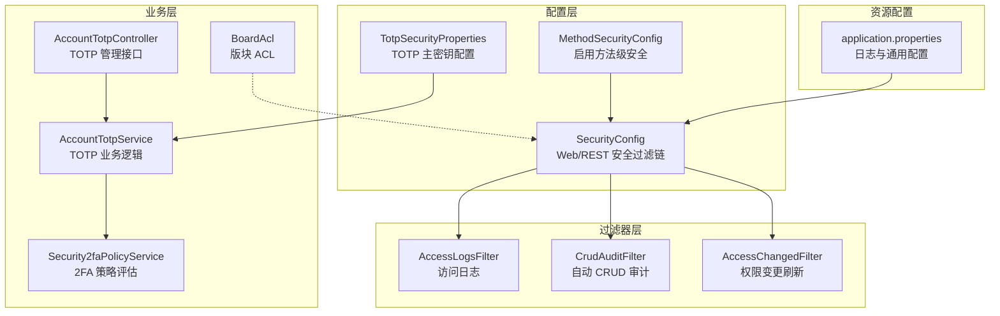
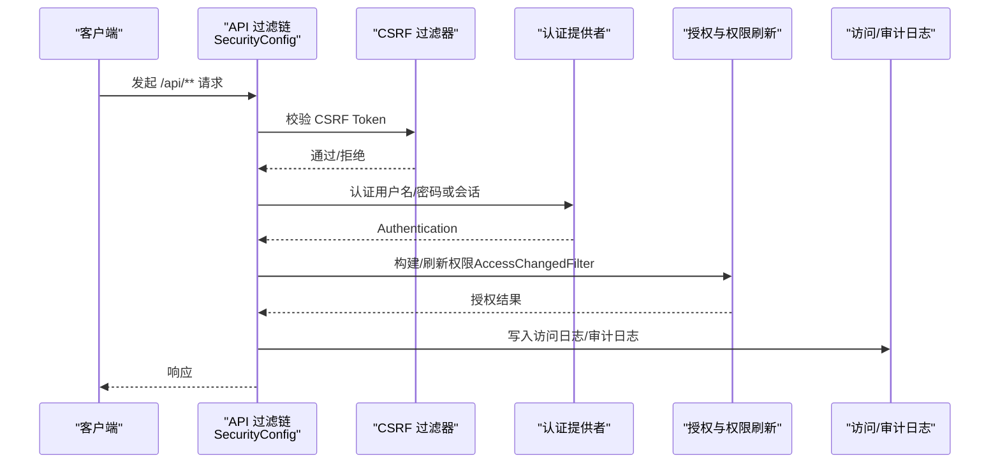
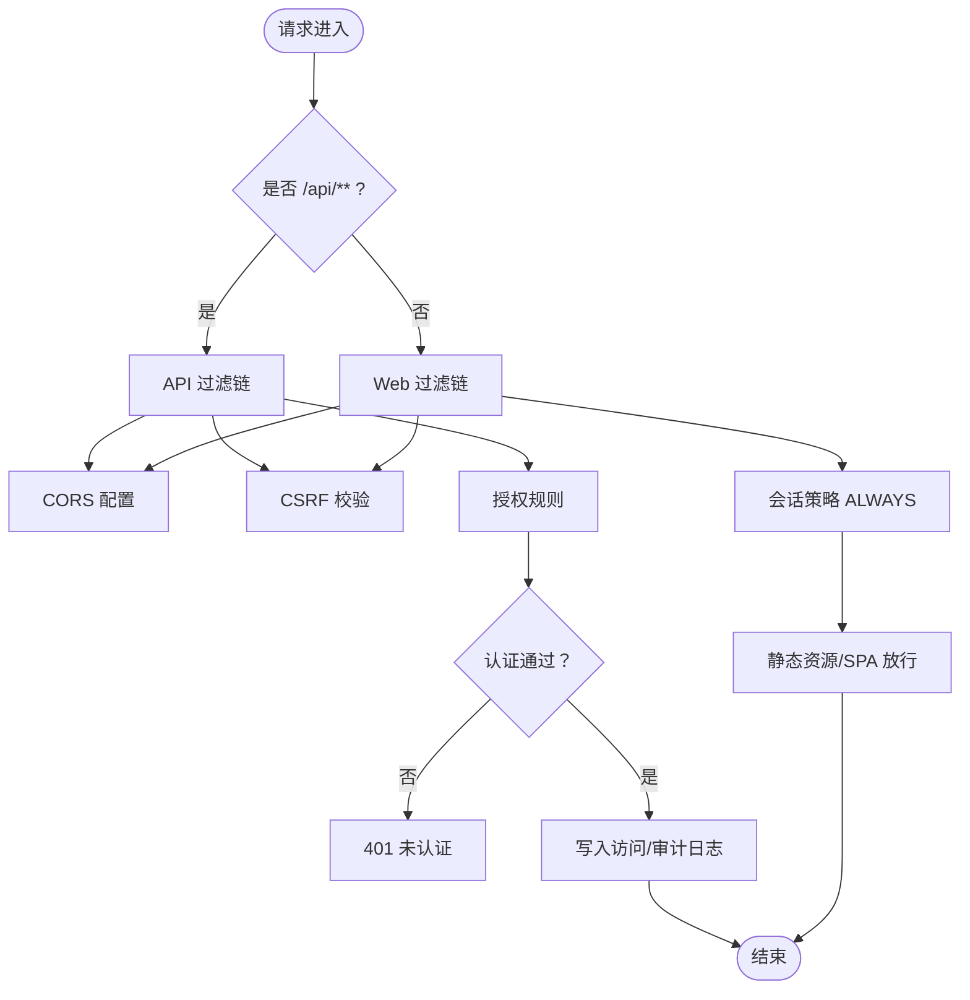
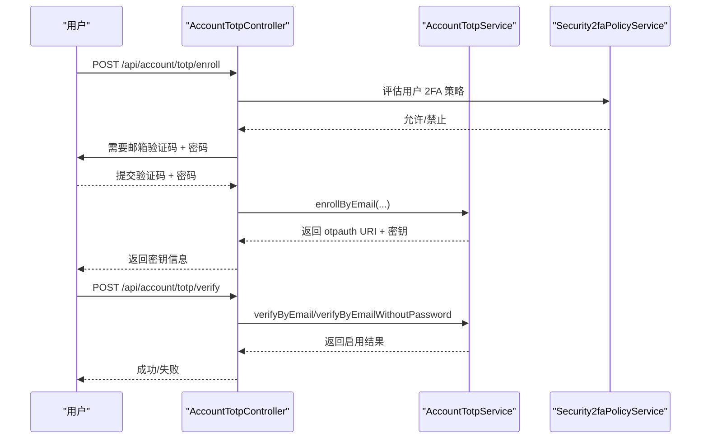
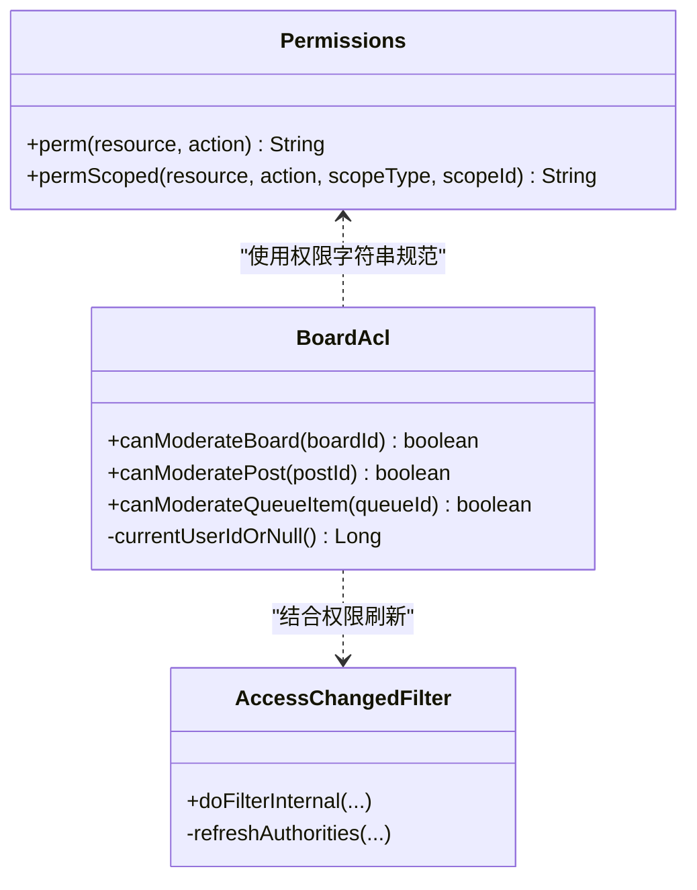
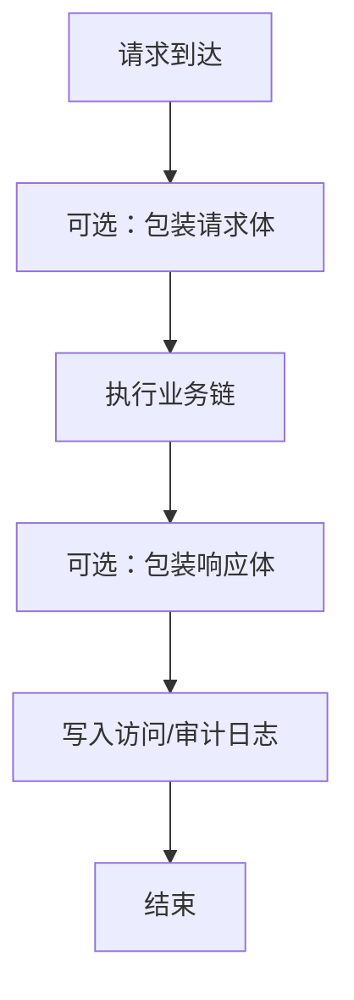
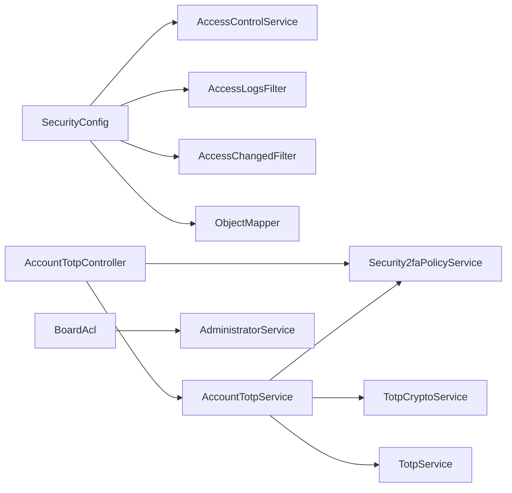

# 安全配置

<cite>
**本文引用的文件**
- [SecurityConfig.java](file://src/main/java/com/example/EnterpriseRagCommunity/config/SecurityConfig.java)
- [MethodSecurityConfig.java](file://src/main/java/com/example/EnterpriseRagCommunity/config/MethodSecurityConfig.java)
- [TotpSecurityProperties.java](file://src/main/java/com/example/EnterpriseRagCommunity/config/TotpSecurityProperties.java)
- [Permissions.java](file://src/main/java/com/example/EnterpriseRagCommunity/security/Permissions.java)
- [AccessLogsFilter.java](file://src/main/java/com/example/EnterpriseRagCommunity/security/AccessLogsFilter.java)
- [CrudAuditFilter.java](file://src/main/java/com/example/EnterpriseRagCommunity/security/CrudAuditFilter.java)
- [AccessChangedFilter.java](file://src/main/java/com/example/EnterpriseRagCommunity/security/AccessChangedFilter.java)
- [BoardAcl.java](file://src/main/java/com/example/EnterpriseRagCommunity/security/BoardAcl.java)
- [AccountTotpController.java](file://src/main/java/com/example/EnterpriseRagCommunity/controller/AccountTotpController.java)
- [AccountTotpService.java](file://src/main/java/com/example/EnterpriseRagCommunity/service/AccountTotpService.java)
- [Security2faPolicyService.java](file://src/main/java/com/example/EnterpriseRagCommunity/service/access/Security2faPolicyService.java)
- [application.properties](file://src/main/resources/application.properties)
- [SecurityConfigTest.java](file://src/test/java/com/example/EnterpriseRagCommunity/config/SecurityConfigTest.java)
</cite>

## 目录
1. [引言](#引言)
2. [项目结构](#项目结构)
3. [核心组件](#核心组件)
4. [架构总览](#架构总览)
5. [详细组件分析](#详细组件分析)
6. [依赖分析](#依赖分析)
7. [性能考虑](#性能考虑)
8. [故障排查指南](#故障排查指南)
9. [结论](#结论)
10. [附录](#附录)

## 引言
本文件系统性梳理本项目的安全配置，覆盖以下主题：
- Spring Security WebFlux/Servlet 配置与过滤链
- 方法级安全注解启用
- TOTP 双因素认证配置与策略
- 访问控制列表（ACL）与权限模型
- 权限管理与权限字符串命名规范
- 审计日志与访问日志配置
- CSRF 保护、会话管理与密码策略
- 安全加固最佳实践与常见模式
- 安全事件监控与威胁检测配置思路

## 项目结构
围绕安全的关键模块分布如下：
- 配置层：SecurityConfig、MethodSecurityConfig、TotpSecurityProperties
- 过滤器层：AccessLogsFilter、CrudAuditFilter、AccessChangedFilter、BoardAcl
- 控制器与服务：AccountTotpController、AccountTotpService、Security2faPolicyService
- 资源配置：application.properties

图表来源
- [SecurityConfig.java:74-236](file://src/main/java/com/example/EnterpriseRagCommunity/config/SecurityConfig.java#L74-L236)
- [MethodSecurityConfig.java:10-12](file://src/main/java/com/example/EnterpriseRagCommunity/config/MethodSecurityConfig.java#L10-L12)
- [TotpSecurityProperties.java:9-16](file://src/main/java/com/example/EnterpriseRagCommunity/config/TotpSecurityProperties.java#L9-L16)
- [AccessLogsFilter.java:44-213](file://src/main/java/com/example/EnterpriseRagCommunity/security/AccessLogsFilter.java#L44-L213)
- [CrudAuditFilter.java:35-128](file://src/main/java/com/example/EnterpriseRagCommunity/security/CrudAuditFilter.java#L35-L128)
- [AccessChangedFilter.java:37-136](file://src/main/java/com/example/EnterpriseRagCommunity/security/AccessChangedFilter.java#L37-L136)
- [AccountTotpController.java:43-326](file://src/main/java/com/example/EnterpriseRagCommunity/controller/AccountTotpController.java#L43-L326)
- [AccountTotpService.java:28-359](file://src/main/java/com/example/EnterpriseRagCommunity/service/AccountTotpService.java#L28-L359)
- [Security2faPolicyService.java:27-150](file://src/main/java/com/example/EnterpriseRagCommunity/service/access/Security2faPolicyService.java#L27-L150)
- [application.properties:58-61](file://src/main/resources/application.properties#L58-L61)

章节来源
- [SecurityConfig.java:74-236](file://src/main/java/com/example/EnterpriseRagCommunity/config/SecurityConfig.java#L74-L236)
- [application.properties:58-61](file://src/main/resources/application.properties#L58-L61)

## 核心组件
- 安全过滤链（API/Web 双链）
  - API 链（优先级更高）：仅匹配 /api/**，启用 CORS、CSRF、RBAC 授权、异常入口等
  - Web 链（优先级更低）：匹配其余请求，启用 CORS、CSRF、会话策略、静态资源放行
- 方法级安全
  - 通过 @EnableMethodSecurity 启用基于注解的授权
- TOTP 双因素认证
  - 通过 TotpSecurityProperties 注入主密钥，AccountTotpController 提供启用/验证/禁用接口
- 权限与 ACL
  - Permissions 工具类定义权限字符串命名规范；BoardAcl 提供版块维度的 ACL 判断
- 审计与访问日志
  - AccessLogsFilter 捕获请求/响应细节并写入访问日志；CrudAuditFilter 自动记录 CRUD 行为
- 权限变更即时生效
  - AccessChangedFilter 在会话中维护“权限版本”，当数据库权限元数据变化时刷新当前会话权限

章节来源
- [SecurityConfig.java:74-236](file://src/main/java/com/example/EnterpriseRagCommunity/config/SecurityConfig.java#L74-L236)
- [MethodSecurityConfig.java:10-12](file://src/main/java/com/example/EnterpriseRagCommunity/config/MethodSecurityConfig.java#L10-L12)
- [TotpSecurityProperties.java:9-16](file://src/main/java/com/example/EnterpriseRagCommunity/config/TotpSecurityProperties.java#L9-L16)
- [Permissions.java:8-24](file://src/main/java/com/example/EnterpriseRagCommunity/security/Permissions.java#L8-L24)
- [BoardAcl.java:14-60](file://src/main/java/com/example/EnterpriseRagCommunity/security/BoardAcl.java#L14-L60)
- [AccessLogsFilter.java:44-213](file://src/main/java/com/example/EnterpriseRagCommunity/security/AccessLogsFilter.java#L44-L213)
- [CrudAuditFilter.java:35-128](file://src/main/java/com/example/EnterpriseRagCommunity/security/CrudAuditFilter.java#L35-L128)
- [AccessChangedFilter.java:37-136](file://src/main/java/com/example/EnterpriseRagCommunity/security/AccessChangedFilter.java#L37-L136)

## 架构总览
下图展示安全配置在请求生命周期中的作用点与交互。

图表来源
- [SecurityConfig.java:105-194](file://src/main/java/com/example/EnterpriseRagCommunity/config/SecurityConfig.java#L105-L194)
- [AccessLogsFilter.java:167-213](file://src/main/java/com/example/EnterpriseRagCommunity/security/AccessLogsFilter.java#L167-L213)
- [CrudAuditFilter.java:58-128](file://src/main/java/com/example/EnterpriseRagCommunity/security/CrudAuditFilter.java#L58-L128)
- [AccessChangedFilter.java:117-133](file://src/main/java/com/example/EnterpriseRagCommunity/security/AccessChangedFilter.java#L117-L133)

## 详细组件分析

### Spring Security 配置（Web/REST 双链）
- API 过滤链（/api/**）
  - CORS：基于配置项动态选择 allowedOrigins 或 allowedOriginPatterns，默认回退到本地开发域名
  - CSRF：Cookie 存储 CSRF Token，使用 CsrfTokenRequestAttributeHandler，忽略初始化/注册/登录/2FA/密码重置等端点
  - 授权：对公开端点放行，其余需认证；前台发现页 GET /api/boards,/api/posts 等匿名可访问
  - 异常：未认证返回 401，不附加 WWW-Authenticate
  - 过滤器顺序：AccessChangedFilter → AccessLogsFilter → ContentSafetyCircuitBreakerFilter
- Web 过滤链（/**）
  - 同样启用 CORS/CSRF，会话策略为 ALWAYS
  - 静态资源与前端入口放行，其余页面交由 SPA 处理
- 用户详情与认证
  - UserDetailsService 从 AdministratorService 加载用户，校验 AccountStatus，构建 GrantedAuthority
  - PasswordEncoder 使用 BCrypt
  - AuthenticationManager 使用 DaoAuthenticationProvider + ProviderManager

图表来源
- [SecurityConfig.java:74-236](file://src/main/java/com/example/EnterpriseRagCommunity/config/SecurityConfig.java#L74-L236)
- [SecurityConfigTest.java:177-202](file://src/test/java/com/example/EnterpriseRagCommunity/config/SecurityConfigTest.java#L177-L202)

章节来源
- [SecurityConfig.java:74-236](file://src/main/java/com/example/EnterpriseRagCommunity/config/SecurityConfig.java#L74-L236)
- [SecurityConfigTest.java:26-82](file://src/test/java/com/example/EnterpriseRagCommunity/config/SecurityConfigTest.java#L26-L82)

### 方法级安全配置
- 通过 @EnableMethodSecurity 启用基于注解的授权（如 @PreAuthorize），配合 AccessControlService 构建的权限集进行判定

章节来源
- [MethodSecurityConfig.java:10-12](file://src/main/java/com/example/EnterpriseRagCommunity/config/MethodSecurityConfig.java#L10-L12)

### TOTP 双因素认证配置
- 主密钥配置
  - TotpSecurityProperties 提供 app.security.totp.master-key，用于加密/解密 TOTP 密钥
- 控制器接口
  - /api/account/totp/policy、/api/account/totp/status
  - /api/account/totp/enroll（邮箱验证码 + 密码验证）
  - /api/account/totp/verify（启用/验证）
  - /api/account/totp/disable（TOTP/邮箱验证码两种禁用方式）
  - /api/account/totp/verify-password（密码二次验证）
- 业务逻辑
  - AccountTotpService 生成密钥、构建 otpauth URI、验证验证码、启用/禁用密钥
  - Security2faPolicyService 评估用户是否允许启用/要求 TOTP，支持角色/用户白名单
- 会话内密码验证
  - 控制器在会话中缓存“密码已验证”的时间戳，5 分钟有效期内免重复验证

图表来源
- [AccountTotpController.java:79-162](file://src/main/java/com/example/EnterpriseRagCommunity/controller/AccountTotpController.java#L79-L162)
- [AccountTotpService.java:103-222](file://src/main/java/com/example/EnterpriseRagCommunity/service/AccountTotpService.java#L103-L222)
- [Security2faPolicyService.java:137-150](file://src/main/java/com/example/EnterpriseRagCommunity/service/access/Security2faPolicyService.java#L137-L150)

章节来源
- [TotpSecurityProperties.java:9-16](file://src/main/java/com/example/EnterpriseRagCommunity/config/TotpSecurityProperties.java#L9-L16)
- [AccountTotpController.java:43-326](file://src/main/java/com/example/EnterpriseRagCommunity/controller/AccountTotpController.java#L43-L326)
- [AccountTotpService.java:28-359](file://src/main/java/com/example/EnterpriseRagCommunity/service/AccountTotpService.java#L28-L359)
- [Security2faPolicyService.java:27-150](file://src/main/java/com/example/EnterpriseRagCommunity/service/access/Security2faPolicyService.java#L27-L150)

### 访问控制列表（ACL）与权限管理
- 权限字符串命名
  - Permissions.perm(resource, action) 与 permScoped(resource, action, scopeType, scopeId) 统一规范
- 版块 ACL
  - BoardAcl.canModerateBoard/post/queueItem 基于当前用户与内容归属判断是否有版主权限
- 权限即时生效
  - AccessChangedFilter 将用户权限版本写入会话，当数据库元数据变化时替换 SecurityContext 中的权限集合

图表来源
- [Permissions.java:8-24](file://src/main/java/com/example/EnterpriseRagCommunity/security/Permissions.java#L8-L24)
- [BoardAcl.java:14-60](file://src/main/java/com/example/EnterpriseRagCommunity/security/BoardAcl.java#L14-L60)
- [AccessChangedFilter.java:37-136](file://src/main/java/com/example/EnterpriseRagCommunity/security/AccessChangedFilter.java#L37-L136)

章节来源
- [Permissions.java:8-24](file://src/main/java/com/example/EnterpriseRagCommunity/security/Permissions.java#L8-L24)
- [BoardAcl.java:14-60](file://src/main/java/com/example/EnterpriseRagCommunity/security/BoardAcl.java#L14-L60)
- [AccessChangedFilter.java:37-136](file://src/main/java/com/example/EnterpriseRagCommunity/security/AccessChangedFilter.java#L37-L136)

### 审计日志与访问日志
- 访问日志 AccessLogsFilter
  - 捕获请求头、查询串、请求体、响应体（受开关与大小限制）、会话指纹、延迟、状态码等
  - 对敏感字段（密码、token、cookie 等）进行掩码或脱敏
  - 排除特定管理端点，避免日志风暴
- 自动 CRUD 审计 CrudAuditFilter
  - 基于 HTTP 方法推导 CRUD 动作（读/增/改/删）
  - 自动记录 API 调用结果、耗时、处理器信息等
  - 可配置包含/排除路径前缀，支持开启/关闭读操作记录

图表来源
- [AccessLogsFilter.java:83-213](file://src/main/java/com/example/EnterpriseRagCommunity/security/AccessLogsFilter.java#L83-L213)
- [CrudAuditFilter.java:58-128](file://src/main/java/com/example/EnterpriseRagCommunity/security/CrudAuditFilter.java#L58-L128)

章节来源
- [AccessLogsFilter.java:44-710](file://src/main/java/com/example/EnterpriseRagCommunity/security/AccessLogsFilter.java#L44-L710)
- [CrudAuditFilter.java:35-304](file://src/main/java/com/example/EnterpriseRagCommunity/security/CrudAuditFilter.java#L35-L304)

### CSRF 保护、会话管理与密码策略
- CSRF
  - CookieCsrfTokenRepository.withHttpOnlyFalse()，前端通过 _csrf 属性名获取
  - 忽略初始化/注册/登录/2FA/密码重置等端点，减少对前端流程的干扰
- 会话
  - Web 链采用 SessionCreationPolicy.ALWAYS，API 链未显式设置，遵循默认策略
- 密码策略
  - PasswordEncoder 使用 BCrypt
  - 提供工具类 PasswordEncoderUtil 便于生成哈希

章节来源
- [SecurityConfig.java:110-142](file://src/main/java/com/example/EnterpriseRagCommunity/config/SecurityConfig.java#L110-L142)
- [SecurityConfig.java:219-224](file://src/main/java/com/example/EnterpriseRagCommunity/config/SecurityConfig.java#L219-L224)
- [SecurityConfig.java:310-313](file://src/main/java/com/example/EnterpriseRagCommunity/config/SecurityConfig.java#L310-L313)
- [application.properties:58-61](file://src/main/resources/application.properties#L58-L61)

## 依赖分析
- 组件耦合
  - SecurityConfig 依赖 AdministratorService、AccessControlService、AccessLogsFilter、AccessChangedFilter、ContentSafetyCircuitBreakerService、ObjectMapper
  - AccountTotpController 依赖 AccountTotpService、Security2faPolicyService、EmailVerificationService、PasswordEncoder、AuditLogWriter
  - BoardAcl 依赖 BoardModeratorsRepository、PostsRepository、CommentsRepository、ModerationQueueRepository、AdministratorService
- 外部集成
  - 数据库（MySQL/Hibernate）、Elasticsearch/OpenSearch、邮件服务（用于验证码与通知）

图表来源
- [SecurityConfig.java:49-72](file://src/main/java/com/example/EnterpriseRagCommunity/config/SecurityConfig.java#L49-L72)
- [AccountTotpController.java:52-61](file://src/main/java/com/example/EnterpriseRagCommunity/controller/AccountTotpController.java#L52-L61)
- [BoardAcl.java:18-22](file://src/main/java/com/example/EnterpriseRagCommunity/security/BoardAcl.java#L18-L22)

章节来源
- [SecurityConfig.java:49-72](file://src/main/java/com/example/EnterpriseRagCommunity/config/SecurityConfig.java#L49-L72)
- [AccountTotpController.java:52-61](file://src/main/java/com/example/EnterpriseRagCommunity/controller/AccountTotpController.java#L52-L61)
- [BoardAcl.java:18-22](file://src/main/java/com/example/EnterpriseRagCommunity/security/BoardAcl.java#L18-L22)

## 性能考虑
- 过滤器链顺序与最小化开销
  - API 链仅处理 /api/**，避免与 Web 链重叠带来的重复处理
  - AccessLogsFilter/ CrudAuditFilter 的请求/响应体捕获受开关与字节上限控制，防止内存与 IO 放大
- 权限刷新缓存
  - AccessChangedFilter 使用会话存储权限版本，降低频繁重建权限的成本
- 日志落盘
  - 合理设置日志轮转参数，避免磁盘 IO 抖动

## 故障排查指南
- CSRF 403
  - 确认前端使用 CookieCsrfTokenRepository 暴露的 _csrf 属性名
  - 确认未携带 CSRF Token 的端点已在忽略列表中
- 会话权限未更新
  - 检查 AccessChangedFilter 是否启用，确认会话中 ACCESS_VER 字段是否随数据库权限元数据变化而更新
- TOTP 启用失败
  - 检查 TotpSecurityProperties.masterKey 是否配置
  - 确认验证码位数/算法/周期与生成密钥一致，必要时使用 detectAuthenticatorConfig 的提示调整
- 审计/访问日志缺失
  - 检查 app.logging.access.capture-body 与 app.logging.audit.auto-crud.enabled 开关
  - 确认未命中排除路径（如 /api/admin/access-logs、/api/admin/audit-logs）

章节来源
- [SecurityConfig.java:110-142](file://src/main/java/com/example/EnterpriseRagCommunity/config/SecurityConfig.java#L110-L142)
- [AccessChangedFilter.java:117-133](file://src/main/java/com/example/EnterpriseRagCommunity/security/AccessChangedFilter.java#L117-L133)
- [AccountTotpService.java:224-280](file://src/main/java/com/example/EnterpriseRagCommunity/service/AccountTotpService.java#L224-L280)
- [application.properties:58-61](file://src/main/resources/application.properties#L58-L61)

## 结论
本项目通过“API/Web 双链 + 过滤器栈 + 方法级安全 + 审计/访问日志 + 即时权限刷新 + TOTP 策略”的组合，构建了覆盖认证、授权、审计与合规的完整安全体系。建议在生产环境进一步完善：
- 强化 CSRF 与会话安全（HttpOnly、SameSite、Secure Cookie）
- 严格限制 CORS 源与头部
- 定期轮换主密钥与密码
- 配置安全事件监控与告警（如登录失败阈值、异常 IP/UA 检测）

## 附录

### 安全加固最佳实践与常见模式
- 最小权限与纵深防御
  - 基于角色与范围的权限设计，结合 BoardAcl 实现版块级 ACL
- 即时权限生效
  - 使用 AccessChangedFilter 将权限变更与会话绑定，避免“已登录但权限陈旧”
- 审计与可观测性
  - 启用 AccessLogsFilter 与 CrudAuditFilter，保留关键字段脱敏后的证据链
- 2FA 强制与策略
  - 通过 Security2faPolicyService 设置“允许/禁止/要求”策略，并与 TOTP 控制器联动
- 密码安全
  - 使用 BCrypt，定期轮换与审查弱口令

### 安全事件监控与威胁检测配置思路
- 登录失败检测
  - 统计同一 IP/用户短期内失败次数，触发临时封禁或二次验证
- 异常行为识别
  - 基于 AccessLogsFilter 的 UA、Referer、X-Forwarded-For、X-Client-Fingerprint 等字段建立基线
- 审计告警
  - 对高危操作（删除、批量变更）与异常状态码（5xx/429）进行实时告警