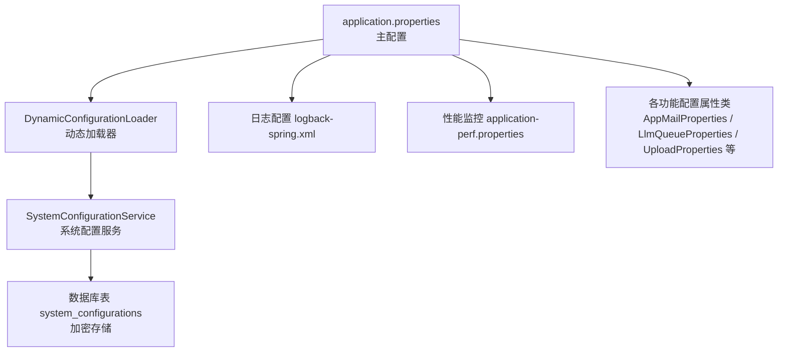
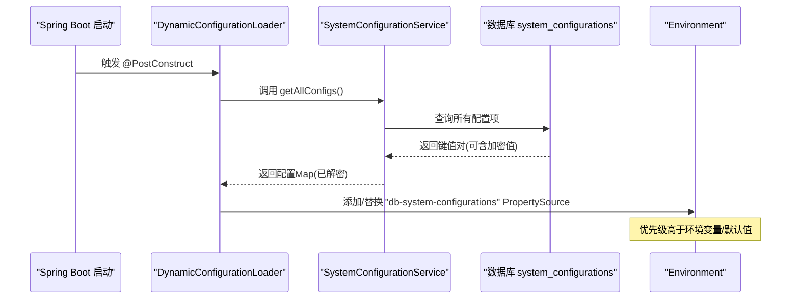
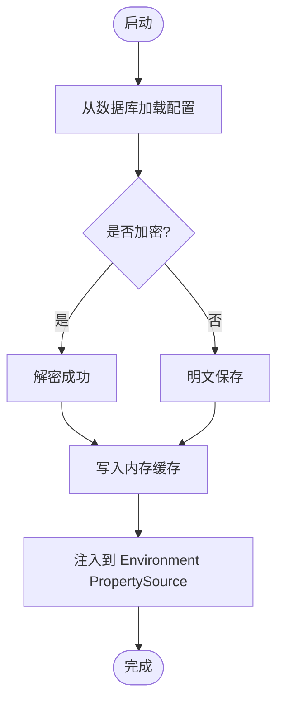
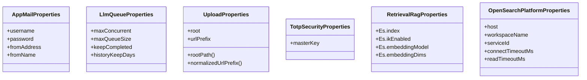

# 应用配置

<cite>
**本文引用的文件**
- [application.properties](file://src/main/resources/application.properties)
- [application-perf.properties](file://src/main/resources/application-perf.properties)
- [logback-spring.xml](file://src/main/resources/logback-spring.xml)
- [application-test.properties](file://src/test/resources/application.properties)
- [DynamicConfigurationLoader.java](file://src/main/java/com/example/EnterpriseRagCommunity/config/DynamicConfigurationLoader.java)
- [SystemConfigurationService.java](file://src/main/java/com/example/EnterpriseRagCommunity/service/config/SystemConfigurationService.java)
- [ElasticsearchAuthConfigValidator.java](file://src/main/java/com/example/EnterpriseRagCommunity/config/ElasticsearchAuthConfigValidator.java)
- [AppMailProperties.java](file://src/main/java/com/example/EnterpriseRagCommunity/config/AppMailProperties.java)
- [LlmQueueProperties.java](file://src/main/java/com/example/EnterpriseRagCommunity/config/LlmQueueProperties.java)
- [UploadProperties.java](file://src/main/java/com/example/EnterpriseRagCommunity/config/UploadProperties.java)
- [TotpSecurityProperties.java](file://src/main/java/com/example/EnterpriseRagCommunity/config/TotpSecurityProperties.java)
- [RetrievalRagProperties.java](file://src/main/java/com/example/EnterpriseRagCommunity/config/RetrievalRagProperties.java)
- [OpenSearchPlatformProperties.java](file://src/main/java/com/example/EnterpriseRagCommunity/config/OpenSearchPlatformProperties.java)
</cite>

## 目录
1. [简介](#简介)
2. [项目结构](#项目结构)
3. [核心组件](#核心组件)
4. [架构总览](#架构总览)
5. [详细组件分析](#详细组件分析)
6. [依赖分析](#依赖分析)
7. [性能考虑](#性能考虑)
8. [故障排查指南](#故障排查指南)
9. [结论](#结论)
10. [附录](#附录)

## 简介
本文件面向应用配置管理，系统性梳理 application.properties 中的全部配置项，涵盖数据库连接、服务器端口、日志级别、上传与访问控制、AI服务、搜索引擎平台、以及动态配置加载与热更新机制。文档同时提供开发、测试、生产环境的配置模板建议、配置优先级与覆盖规则、配置验证与错误处理策略，帮助团队在不同环境中安全、稳定地运行系统。

## 项目结构
应用配置主要集中在以下位置：
- 主要配置：src/main/resources/application.properties
- 性能监控配置：src/main/resources/application-perf.properties
- 日志配置：src/main/resources/logback-spring.xml
- 测试配置：src/test/resources/application.properties
- 动态配置加载器：src/main/java/.../config/DynamicConfigurationLoader.java
- 系统配置服务：src/main/java/.../service/config/SystemConfigurationService.java
- 搜索引擎认证校验器：src/main/java/.../config/ElasticsearchAuthConfigValidator.java
- 配置属性类（基于前缀）：多个 config 包下的 XxxProperties 类

图表来源
- [application.properties:1-84](file://src/main/resources/application.properties#L1-L84)
- [DynamicConfigurationLoader.java:1-47](file://src/main/java/com/example/EnterpriseRagCommunity/config/DynamicConfigurationLoader.java#L1-L47)
- [SystemConfigurationService.java:1-95](file://src/main/java/com/example/EnterpriseRagCommunity/service/config/SystemConfigurationService.java#L1-L95)
- [logback-spring.xml:1-8](file://src/main/resources/logback-spring.xml#L1-L8)
- [application-perf.properties:1-6](file://src/main/resources/application-perf.properties#L1-L6)

章节来源
- [application.properties:1-84](file://src/main/resources/application.properties#L1-L84)
- [application-perf.properties:1-6](file://src/main/resources/application-perf.properties#L1-L6)
- [logback-spring.xml:1-8](file://src/main/resources/logback-spring.xml#L1-L8)

## 核心组件
- 主配置文件 application.properties：集中定义数据源、迁移、服务器、文件上传、日志、租户与访问日志、AI与搜索引擎平台、JPA 等基础配置。
- 动态配置加载器 DynamicConfigurationLoader：启动时从数据库拉取系统配置，注入到 Spring Environment，实现“数据库 > 环境变量/默认值”的覆盖。
- 系统配置服务 SystemConfigurationService：负责从数据库读取配置、缓存、解密、持久化与更新；启动阶段强制要求设置主密钥。
- 搜索引擎认证校验器 ElasticsearchAuthConfigValidator：启动时检查数据库中是否配置了 ES 的 API Key，提示潜在的认证风险。
- 配置属性类：通过 @ConfigurationProperties 将带前缀的配置映射为强类型对象，便于在业务层使用。

章节来源
- [DynamicConfigurationLoader.java:1-47](file://src/main/java/com/example/EnterpriseRagCommunity/config/DynamicConfigurationLoader.java#L1-L47)
- [SystemConfigurationService.java:1-95](file://src/main/java/com/example/EnterpriseRagCommunity/service/config/SystemConfigurationService.java#L1-L95)
- [ElasticsearchAuthConfigValidator.java:1-33](file://src/main/java/com/example/EnterpriseRagCommunity/config/ElasticsearchAuthConfigValidator.java#L1-L33)

## 架构总览
动态配置加载与覆盖流程如下：

图表来源
- [DynamicConfigurationLoader.java:24-45](file://src/main/java/com/example/EnterpriseRagCommunity/config/DynamicConfigurationLoader.java#L24-L45)
- [SystemConfigurationService.java:63-69](file://src/main/java/com/example/EnterpriseRagCommunity/service/config/SystemConfigurationService.java#L63-L69)

## 详细组件分析

### 数据库连接与 Flyway 迁移
- 关键配置
  - 数据源驱动、URL、用户名、密码
  - Hikari 连接池参数：最大池大小、最小空闲、连接超时、验证超时、空闲超时、最大生存时间
  - Flyway：启用、迁移脚本位置、基线版本、失败策略、编码
- 默认值与取值范围
  - 连接池参数采用毫秒或整数，需根据实例规模与延迟容忍度调整
  - Flyway 基线版本默认 1，迁移位置默认 classpath:db/migration
- 环境变量覆盖
  - DB_* 系列变量用于覆盖连接信息与池参数
- 建议
  - 生产环境建议开启 SSL、合理设置连接池上限与超时
  - 使用只读用户执行查询，写操作使用专用用户

章节来源
- [application.properties:7-24](file://src/main/resources/application.properties#L7-L24)

### 服务器与文件上传
- 关键配置
  - server.port、context-path、字符集
  - multipart 与 Tomcat 参数：最大文件大小、请求大小、表单提交大小、吞吐限制
- 默认值与取值范围
  - 文件大小与请求大小以字节计，需结合业务场景评估
- 环境变量覆盖
  - 可通过环境变量覆盖端口与编码
- 建议
  - 生产环境建议限制上传大小并开启鉴权
  - 静态资源路径与上传 URL 前缀需保持一致

章节来源
- [application.properties:27-36](file://src/main/resources/application.properties#L27-L36)

### 日志与日志级别
- 关键配置
  - 控制台与文件字符集
  - 日志文件名、滚动策略（单文件大小、保留天数、总大小上限）
  - 根日志级别与包级别（如 Spring Web、静态资源处理器）
  - 关闭特定 JDK 日志输出
- 默认值与取值范围
  - 日志级别支持 TRACE/DEBUG/INFO/WARN/ERROR/OFF
  - 滚动策略参数以字节与天数计
- 环境变量覆盖
  - LOG_* 系列变量可覆盖文件名、大小、历史、级别等
- 建议
  - 开发环境使用较低级别以便调试；生产环境使用 INFO 或 WARN 并限制文件大小

章节来源
- [application.properties:38-53](file://src/main/resources/application.properties#L38-L53)
- [logback-spring.xml:1-8](file://src/main/resources/logback-spring.xml#L1-L8)

### 租户与访问日志
- 关键配置
  - app.tenant.*：默认租户代码与名称
  - app.logging.access.*：是否捕获请求/响应体、最大体大小
- 默认值与取值范围
  - 体大小以字节计，过大可能影响性能
- 建议
  - 生产环境谨慎开启 body 捕获，避免敏感信息泄露与性能开销

章节来源
- [application.properties:55-60](file://src/main/resources/application.properties#L55-L60)

### 上传与 URL 前缀
- 关键配置
  - app.upload.root：上传根目录
  - app.upload.url-prefix：对外访问前缀
- 属性类 UploadProperties 提供路径规范化与前缀标准化方法
- 建议
  - 上传目录应具备写权限且与 Nginx/CDN 配置一致

章节来源
- [application.properties:62-63](file://src/main/resources/application.properties#L62-L63)
- [UploadProperties.java:1-28](file://src/main/java/com/example/EnterpriseRagCommunity/config/UploadProperties.java#L1-L28)

### AI 服务与队列
- 关键配置
  - app.ai.connect-timeout-ms、read-timeout-ms、default-history-limit
  - app.ai.queue.*：并发、队列大小、完成任务保留、历史保留天数
  - app.ai.tokenizer.api-key：令牌
- 属性类
  - LlmQueueProperties：队列与历史策略
  - AiTokenizerProperties：分词器密钥
- 建议
  - 根据下游模型延迟设置超时；队列容量与历史保留需平衡内存与审计需求

章节来源
- [application.properties:68-69](file://src/main/resources/application.properties#L68-L69)
- [application.properties:70-70](file://src/main/resources/application.properties#L70-L70)
- [LlmQueueProperties.java:1-16](file://src/main/java/com/example/EnterpriseRagCommunity/config/LlmQueueProperties.java#L1-L16)
- [AiTokenizerProperties.java:1-14](file://src/main/java/com/example/EnterpriseRagCommunity/config/AiTokenizerProperties.java#L1-L14)

### OpenSearch 平台
- 关键配置
  - app.opensearch.platform.host、workspace-name、service-id
  - 连接与读超时
- 属性类 OpenSearchPlatformProperties：统一承载上述字段
- 建议
  - 生产环境建议使用内网域名或私有网络地址，避免公网暴露

章节来源
- [application.properties:72-76](file://src/main/resources/application.properties#L72-L76)
- [OpenSearchPlatformProperties.java:1-17](file://src/main/java/com/example/EnterpriseRagCommunity/config/OpenSearchPlatformProperties.java#L1-L17)

### Elasticsearch 认证与连接
- 关键配置
  - spring.elasticsearch.*：连接超时、套接字超时、用户名、密码
  - app.es.api-key：数据库中存储的 API Key（通过 SystemConfigurationService 获取）
- 校验器 ElasticsearchAuthConfigValidator：启动时检查 API Key 是否存在，提示未配置的安全风险
- 建议
  - 推荐使用 API Key；若未配置，ES 启用安全时会返回 401

章节来源
- [application.properties:78-82](file://src/main/resources/application.properties#L78-L82)
- [ElasticsearchAuthConfigValidator.java:1-33](file://src/main/java/com/example/EnterpriseRagCommunity/config/ElasticsearchAuthConfigValidator.java#L1-L33)
- [SystemConfigurationService.java:21-22](file://src/main/java/com/example/EnterpriseRagCommunity/service/config/SystemConfigurationService.java#L21-L22)

### JPA 与虚拟线程
- 关键配置
  - spring.jpa.open-in-view=false：关闭 open-in-view，避免事务外访问实体
  - spring.threads.virtual.enabled=true：启用虚拟线程（如运行时支持）
- 建议
  - 生产环境建议关闭 open-in-view，避免懒加载异常与事务泄漏

章节来源
- [application.properties:83-84](file://src/main/resources/application.properties#L83-L84)

### 动态配置加载与热更新
- 加载机制
  - 启动时 DynamicConfigurationLoader 从 SystemConfigurationService 拉取所有配置，封装为 MapPropertySource，并插入到 Environment 的首部，实现“数据库 > 环境变量/默认值”的优先级覆盖
  - SystemConfigurationService 在初始化时强制要求设置主密钥 APP_MASTER_KEY，随后从数据库加载并解密配置，放入内存缓存
- 热更新
  - 通过刷新 Environment 的 PropertySource 实现热更新；当数据库配置变更后，调用 refreshEnvironment 即可生效
- 建议
  - 对于敏感配置，建议在数据库侧加密存储；变更后及时触发刷新

图表来源
- [SystemConfigurationService.java:41-61](file://src/main/java/com/example/EnterpriseRagCommunity/service/config/SystemConfigurationService.java#L41-L61)
- [DynamicConfigurationLoader.java:29-45](file://src/main/java/com/example/EnterpriseRagCommunity/config/DynamicConfigurationLoader.java#L29-L45)

章节来源
- [DynamicConfigurationLoader.java:1-47](file://src/main/java/com/example/EnterpriseRagCommunity/config/DynamicConfigurationLoader.java#L1-L47)
- [SystemConfigurationService.java:1-95](file://src/main/java/com/example/EnterpriseRagCommunity/service/config/SystemConfigurationService.java#L1-L95)

### 配置验证与错误处理
- 启动期校验
  - SystemConfigurationService 初始化时若未设置 APP_MASTER_KEY，直接抛出异常阻止启动
  - ElasticsearchAuthConfigValidator 在启动时检查 API Key，若为空给出警告
- 运行期容错
  - 数据库解密失败时记录错误并跳过该条目，不影响整体启动
- 建议
  - 生产环境必须设置主密钥；ES 安全启用时务必配置 API Key

章节来源
- [SystemConfigurationService.java:33-40](file://src/main/java/com/example/EnterpriseRagCommunity/service/config/SystemConfigurationService.java#L33-L40)
- [ElasticsearchAuthConfigValidator.java:23-31](file://src/main/java/com/example/EnterpriseRagCommunity/config/ElasticsearchAuthConfigValidator.java#L23-L31)

## 依赖分析
- 配置属性类与其前缀的关系
  - app.mail.* → AppMailProperties
  - app.ai.queue.* → LlmQueueProperties
  - app.upload.* → UploadProperties
  - app.security.totp.* → TotpSecurityProperties
  - app.retrieval.rag.* → RetrievalRagProperties
  - app.opensearch.platform.* → OpenSearchPlatformProperties

图表来源
- [AppMailProperties.java:1-16](file://src/main/java/com/example/EnterpriseRagCommunity/config/AppMailProperties.java#L1-L16)
- [LlmQueueProperties.java:1-16](file://src/main/java/com/example/EnterpriseRagCommunity/config/LlmQueueProperties.java#L1-L16)
- [UploadProperties.java:1-28](file://src/main/java/com/example/EnterpriseRagCommunity/config/UploadProperties.java#L1-L28)
- [TotpSecurityProperties.java:1-18](file://src/main/java/com/example/EnterpriseRagCommunity/config/TotpSecurityProperties.java#L1-L18)
- [RetrievalRagProperties.java:1-22](file://src/main/java/com/example/EnterpriseRagCommunity/config/RetrievalRagProperties.java#L1-L22)
- [OpenSearchPlatformProperties.java:1-17](file://src/main/java/com/example/EnterpriseRagCommunity/config/OpenSearchPlatformProperties.java#L1-L17)

## 性能考虑
- 日志滚动策略：通过 max-file-size、max-history、total-size-cap 控制磁盘占用
- 上传大小：multipart 与 Tomcat 参数过大可能导致内存压力与 GC 抖动
- 连接池：合理设置最大池大小与超时，避免连接泄漏与抖动
- 虚拟线程：在支持的运行时启用，有助于提升 IO 密集型场景的吞吐
- 监控端点：application-perf.properties 暴露健康与指标端点，便于运维观测

章节来源
- [application.properties:38-43](file://src/main/resources/application.properties#L38-L43)
- [application.properties:33-36](file://src/main/resources/application.properties#L33-L36)
- [application.properties:5-5](file://src/main/resources/application.properties#L5-L5)
- [application-perf.properties:1-6](file://src/main/resources/application-perf.properties#L1-L6)

## 故障排查指南
- 启动失败：提示未设置 APP_MASTER_KEY
  - 现象：启动时报错阻止
  - 处理：确保环境变量或数据库配置包含主密钥
- Elasticsearch 401
  - 现象：请求返回 401
  - 处理：在数据库中配置 APP_ES_API_KEY，或提供用户名/密码
- 日志文件不生成或乱码
  - 现象：日志缺失或中文乱码
  - 处理：确认 logback 字符集与 application.properties 字符集一致
- 上传失败或路径异常
  - 现象：文件无法保存或访问 404
  - 处理：检查 app.upload.root 与 url-prefix，确保 Nginx/CDN 配置一致

章节来源
- [SystemConfigurationService.java:35-37](file://src/main/java/com/example/EnterpriseRagCommunity/service/config/SystemConfigurationService.java#L35-L37)
- [ElasticsearchAuthConfigValidator.java:26-30](file://src/main/java/com/example/EnterpriseRagCommunity/config/ElasticsearchAuthConfigValidator.java#L26-L30)
- [logback-spring.xml:3-4](file://src/main/resources/logback-spring.xml#L3-L4)
- [UploadProperties.java:17-25](file://src/main/java/com/example/EnterpriseRagCommunity/config/UploadProperties.java#L17-L25)

## 结论
本项目通过 application.properties 统一管理基础配置，结合动态配置加载器与系统配置服务，实现了“数据库 > 环境变量/默认值”的灵活覆盖与热更新能力。配合严格的启动期校验与日志/上传/搜索等关键模块的配置属性类，能够在多环境（开发/测试/生产）下安全、可控地运行。建议在生产环境严格管理密钥与 API Key，合理设置连接池与日志滚动策略，并通过监控端点持续观察系统健康状态。

## 附录

### 配置项清单与说明（按类别）

- 数据库与迁移
  - spring.datasource.*：驱动、URL、用户名、密码
  - spring.datasource.hikari.*：连接池参数
  - spring.flyway.*：迁移启用、位置、基线、失败策略、编码
  - 环境变量：DB_* 系列覆盖连接与池参数
  - 参考路径：[application.properties:7-24](file://src/main/resources/application.properties#L7-L24)

- 服务器与编码
  - server.port、context-path、编码
  - multipart 与 Tomcat 上传参数
  - 参考路径：[application.properties:27-36](file://src/main/resources/application.properties#L27-L36)

- 日志与级别
  - logging.charset.*、logging.file.name、rollingpolicy.*
  - logging.level.*：根级别与包级别
  - 参考路径：[application.properties:38-53](file://src/main/resources/application.properties#L38-L53)，[logback-spring.xml:1-8](file://src/main/resources/logback-spring.xml#L1-L8)

- 租户与访问日志
  - app.tenant.*：默认租户代码与名称
  - app.logging.access.*：是否捕获 body、最大体大小
  - 参考路径：[application.properties:55-60](file://src/main/resources/application.properties#L55-L60)

- 上传与 URL 前缀
  - app.upload.*：root、url-prefix
  - 属性类：UploadProperties
  - 参考路径：[application.properties:62-63](file://src/main/resources/application.properties#L62-L63)，[UploadProperties.java:1-28](file://src/main/java/com/example/EnterpriseRagCommunity/config/UploadProperties.java#L1-L28)

- AI 服务与队列
  - app.ai.*：连接/读超时、历史限制
  - app.ai.queue.*：并发、队列、完成保留、历史保留
  - app.ai.tokenizer.api-key
  - 属性类：LlmQueueProperties、AiTokenizerProperties
  - 参考路径：[application.properties:68-70](file://src/main/resources/application.properties#L68-L70)，[LlmQueueProperties.java:1-16](file://src/main/java/com/example/EnterpriseRagCommunity/config/LlmQueueProperties.java#L1-L16)，[AiTokenizerProperties.java:1-14](file://src/main/java/com/example/EnterpriseRagCommunity/config/AiTokenizerProperties.java#L1-L14)

- OpenSearch 平台
  - app.opensearch.platform.*：host、workspace、serviceId、超时
  - 属性类：OpenSearchPlatformProperties
  - 参考路径：[application.properties:72-76](file://src/main/resources/application.properties#L72-L76)，[OpenSearchPlatformProperties.java:1-17](file://src/main/java/com/example/EnterpriseRagCommunity/config/OpenSearchPlatformProperties.java#L1-L17)

- Elasticsearch 认证与连接
  - spring.elasticsearch.*：超时、用户名、密码
  - app.es.api-key：数据库存储的 API Key
  - 校验器：ElasticsearchAuthConfigValidator
  - 参考路径：[application.properties:78-82](file://src/main/resources/application.properties#L78-L82)，[ElasticsearchAuthConfigValidator.java:1-33](file://src/main/java/com/example/EnterpriseRagCommunity/config/ElasticsearchAuthConfigValidator.java#L1-L33)

- 其他
  - spring.jpa.open-in-view=false：关闭 open-in-view
  - spring.threads.virtual.enabled=true：启用虚拟线程
  - 参考路径：[application.properties:83-84](file://src/main/resources/application.properties#L83-L84)

### 配置优先级与覆盖规则
- 动态配置优先级：数据库配置 > 环境变量/默认值
- 启动期加载：DynamicConfigurationLoader 在 @PostConstruct 时从 SystemConfigurationService 拉取配置并注入到 Environment
- 覆盖方式：若同名键存在于数据库配置中，则替换环境变量/默认值；否则使用环境变量/默认值
- 热更新：调用 refreshEnvironment 刷新 PropertySource

章节来源
- [DynamicConfigurationLoader.java:29-45](file://src/main/java/com/example/EnterpriseRagCommunity/config/DynamicConfigurationLoader.java#L29-L45)
- [SystemConfigurationService.java:63-69](file://src/main/java/com/example/EnterpriseRagCommunity/service/config/SystemConfigurationService.java#L63-L69)

### 开发/测试/生产环境模板建议
- 开发环境
  - 数据库：本地 MySQL，DB_* 环境变量可为空，使用默认池参数
  - 日志：DEBUG 或 INFO，开启 body 捕获便于调试
  - 上传：本地目录，url-prefix 与前端路由一致
  - 参考路径：[application.properties:1-84](file://src/main/resources/application.properties#L1-L84)
- 测试环境
  - 数据库：独立测试库，TEST_DB_* 环境变量覆盖
  - 初始化：spring.sql.init.* 与 test-system-config.sql
  - 关闭调度与索引初始化：app.scheduling.enabled=false、app.es.init.enabled=false
  - 参考路径：[application-test.properties:1-21](file://src/test/resources/application.properties#L1-L21)
- 生产环境
  - 必须设置 APP_MASTER_KEY；ES 启用安全时必须配置 APP_ES_API_KEY
  - 限制日志级别与文件大小，设置合理的连接池与超时
  - 仅暴露必要的监控端点，使用内网域名访问平台服务
  - 参考路径：[application.properties:1-84](file://src/main/resources/application.properties#L1-L84)，[application-perf.properties:1-6](file://src/main/resources/application-perf.properties#L1-L6)