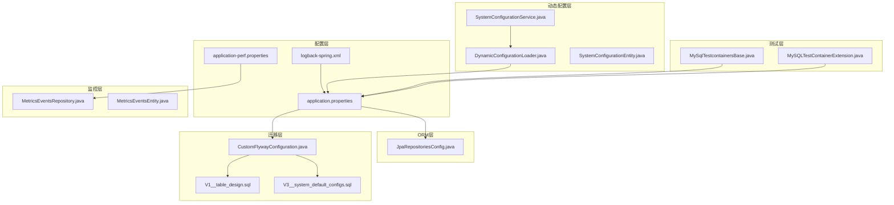
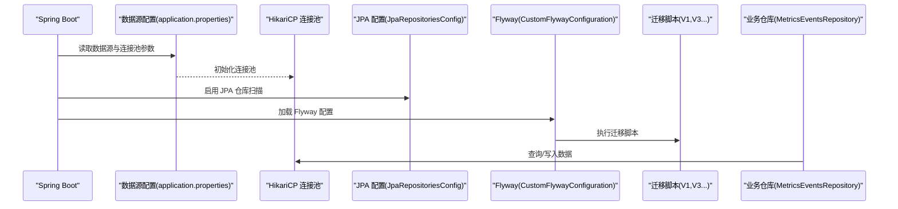
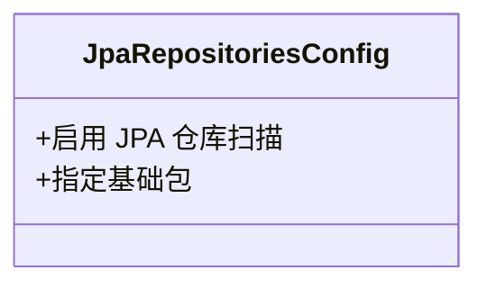
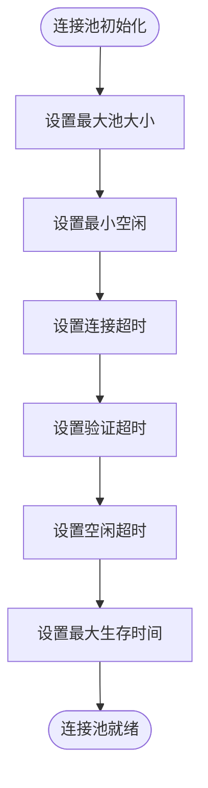
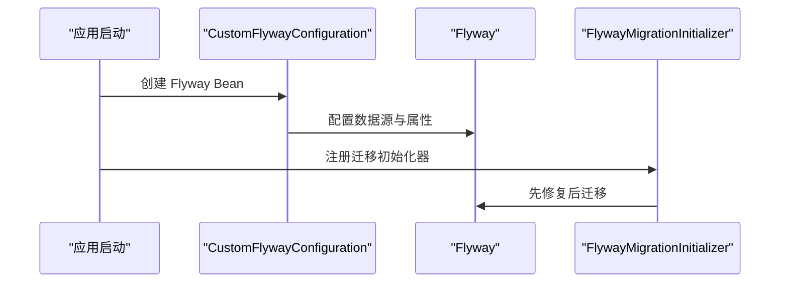
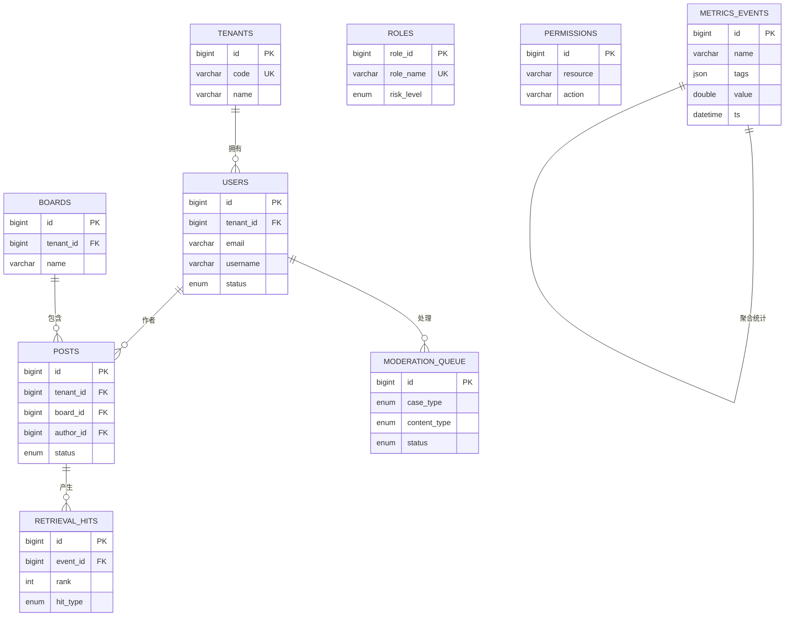
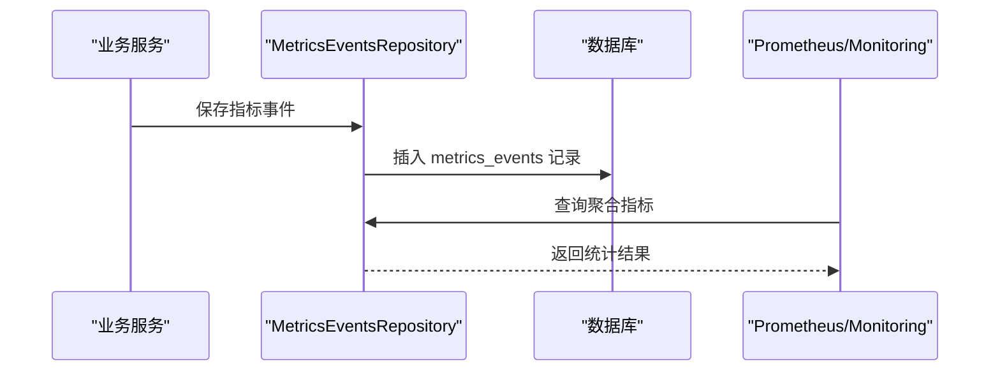
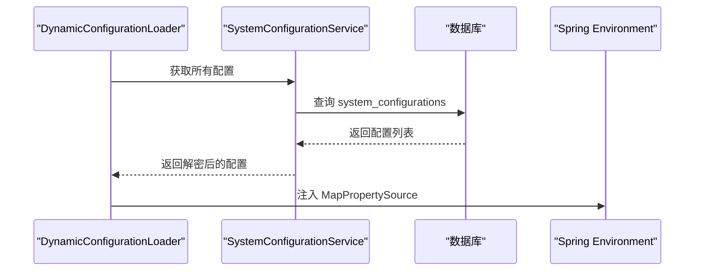
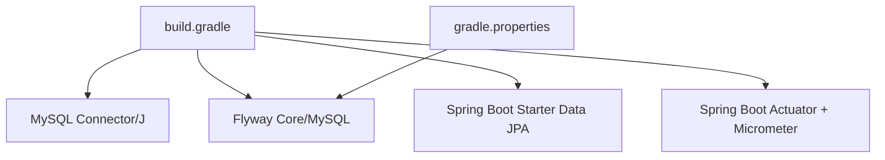

# 数据库配置

<cite>
**本文档引用的文件**
- [application.properties](file://src/main/resources/application.properties)
- [application-perf.properties](file://src/main/resources/application-perf.properties)
- [logback-spring.xml](file://src/main/resources/logback-spring.xml)
- [JpaRepositoriesConfig.java](file://src/main/java/com/example/EnterpriseRagCommunity/config/JpaRepositoriesConfig.java)
- [CustomFlywayConfiguration.java](file://src/main/java/com/example/EnterpriseRagCommunity/config/CustomFlywayConfiguration.java)
- [build.gradle](file://build.gradle)
- [V1__table_design.sql](file://src/main/resources/db/migration/V1__table_design.sql)
- [V3__system_default_configs.sql](file://src/main/resources/db/migration/V3__system_default_configs.sql)
- [MetricsEventsRepository.java](file://src/main/java/com/example/EnterpriseRagCommunity/repository/monitor/MetricsEventsRepository.java)
- [MetricsEventsEntity.java](file://src/main/java/com/example/EnterpriseRagCommunity/entity/monitor/MetricsEventsEntity.java)
- [SystemConfigurationService.java](file://src/main/java/com/example/EnterpriseRagCommunity/service/config/SystemConfigurationService.java)
- [DynamicConfigurationLoader.java](file://src/main/java/com/example/EnterpriseRagCommunity/config/DynamicConfigurationLoader.java)
- [SystemConfigurationEntity.java](file://src/main/java/com/example/EnterpriseRagCommunity/entity/config/SystemConfigurationEntity.java)
- [gradle.properties](file://gradle.properties)
- [MySqlTestcontainersBase.java](file://src/integrationTest/java/com/example/EnterpriseRagCommunity/testsupport/MySqlTestcontainersBase.java)
- [MySQLTestContainerExtension.java](file://src/integrationTest/java/com/example/EnterpriseRagCommunity/testsupport/MySQLTestContainerExtension.java)
</cite>

## 目录
1. [简介](#简介)
2. [项目结构](#项目结构)
3. [核心组件](#核心组件)
4. [架构概览](#架构概览)
5. [详细组件分析](#详细组件分析)
6. [依赖分析](#依赖分析)
7. [性能考虑](#性能考虑)
8. [故障排查指南](#故障排查指南)
9. [结论](#结论)
10. [附录](#附录)

## 简介
本文件面向数据库配置的完整说明，涵盖以下主题：
- JPA 配置与实体映射
- 数据库连接池配置（HikariCP）
- Flyway 迁移配置与版本管理
- 数据库连接参数、事务配置与性能优化
- 不同数据库类型的配置示例与最佳实践
- 数据库监控与故障排查方法

## 项目结构
数据库相关配置分布在多个层次：
- 应用配置层：application.properties、application-perf.properties
- ORM 层：JPA 配置类
- 迁移层：Flyway 配置与 SQL 迁移脚本
- 监控层：指标采集与查询接口
- 测试层：集成测试容器与本地测试配置

**图表来源**
- [application.properties:1-84](file://src/main/resources/application.properties#L1-L84)
- [application-perf.properties:1-6](file://src/main/resources/application-perf.properties#L1-L6)
- [logback-spring.xml:1-8](file://src/main/resources/logback-spring.xml#L1-L8)
- [JpaRepositoriesConfig.java:1-12](file://src/main/java/com/example/EnterpriseRagCommunity/config/JpaRepositoriesConfig.java#L1-L12)
- [CustomFlywayConfiguration.java:1-50](file://src/main/java/com/example/EnterpriseRagCommunity/config/CustomFlywayConfiguration.java#L1-L50)
- [V1__table_design.sql:1-800](file://src/main/resources/db/migration/V1__table_design.sql#L1-L800)
- [V3__system_default_configs.sql:1-691](file://src/main/resources/db/migration/V3__system_default_configs.sql#L1-L691)
- [MetricsEventsRepository.java:1-36](file://src/main/java/com/example/EnterpriseRagCommunity/repository/monitor/MetricsEventsRepository.java#L1-L36)
- [MetricsEventsEntity.java:1-35](file://src/main/java/com/example/EnterpriseRagCommunity/entity/monitor/MetricsEventsEntity.java#L1-L35)
- [SystemConfigurationService.java:33-94](file://src/main/java/com/example/EnterpriseRagCommunity/service/config/SystemConfigurationService.java#L33-L94)
- [DynamicConfigurationLoader.java:1-46](file://src/main/java/com/example/EnterpriseRagCommunity/config/DynamicConfigurationLoader.java#L1-L46)
- [SystemConfigurationEntity.java:1-26](file://src/main/java/com/example/EnterpriseRagCommunity/entity/config/SystemConfigurationEntity.java#L1-L26)
- [MySqlTestcontainersBase.java:1-27](file://src/integrationTest/java/com/example/EnterpriseRagCommunity/testsupport/MySqlTestcontainersBase.java#L1-L27)
- [MySQLTestContainerExtension.java:1-32](file://src/integrationTest/java/com/example/EnterpriseRagCommunity/testsupport/MySQLTestContainerExtension.java#L1-L32)

**章节来源**
- [application.properties:1-84](file://src/main/resources/application.properties#L1-L84)
- [application-perf.properties:1-6](file://src/main/resources/application-perf.properties#L1-L6)
- [logback-spring.xml:1-8](file://src/main/resources/logback-spring.xml#L1-L8)

## 核心组件
- 数据源与连接池：基于 HikariCP 的连接池配置，支持最大池大小、最小空闲、连接超时、验证超时、空闲超时、最大生存时间等参数。
- JPA 配置：启用 JPA 仓库扫描，指定扫描基础包。
- Flyway 迁移：通过自定义配置类加载 Flyway，支持位置、基线迁移、乱序迁移、编码等属性，并在启动时进行修复与迁移。
- 监控与指标：通过 Micrometer Prometheus 暴露数据库相关指标，结合自定义指标事件表实现业务指标采集。
- 动态配置：从数据库系统配置表加载配置到运行时环境，支持加密配置项。

**章节来源**
- [application.properties:7-24](file://src/main/resources/application.properties#L7-L24)
- [JpaRepositoriesConfig.java:6-11](file://src/main/java/com/example/EnterpriseRagCommunity/config/JpaRepositoriesConfig.java#L6-L11)
- [CustomFlywayConfiguration.java:13-48](file://src/main/java/com/example/EnterpriseRagCommunity/config/CustomFlywayConfiguration.java#L13-L48)
- [application-perf.properties:1-6](file://src/main/resources/application-perf.properties#L1-L6)
- [SystemConfigurationService.java:33-94](file://src/main/java/com/example/EnterpriseRagCommunity/service/config/SystemConfigurationService.java#L33-L94)

## 架构概览
数据库配置的整体架构如下：

**图表来源**
- [application.properties:7-24](file://src/main/resources/application.properties#L7-L24)
- [JpaRepositoriesConfig.java:6-11](file://src/main/java/com/example/EnterpriseRagCommunity/config/JpaRepositoriesConfig.java#L6-L11)
- [CustomFlywayConfiguration.java:17-48](file://src/main/java/com/example/EnterpriseRagCommunity/config/CustomFlywayConfiguration.java#L17-L48)
- [V1__table_design.sql:1-800](file://src/main/resources/db/migration/V1__table_design.sql#L1-L800)
- [V3__system_default_configs.sql:1-691](file://src/main/resources/db/migration/V3__system_default_configs.sql#L1-L691)
- [MetricsEventsRepository.java:14-36](file://src/main/java/com/example/EnterpriseRagCommunity/repository/monitor/MetricsEventsRepository.java#L14-L36)

## 详细组件分析

### JPA 配置分析
- 包扫描：通过注解启用 JPA 仓库扫描，指定基础包为 com.example.EnterpriseRagCommunity.repository。
- 开启 open-in-view：在配置文件中设置为 false，避免长时间持有持久化上下文导致的性能问题。

**图表来源**
- [JpaRepositoriesConfig.java:6-11](file://src/main/java/com/example/EnterpriseRagCommunity/config/JpaRepositoriesConfig.java#L6-L11)
- [application.properties:83-84](file://src/main/resources/application.properties#L83-L84)

**章节来源**
- [JpaRepositoriesConfig.java:1-12](file://src/main/java/com/example/EnterpriseRagCommunity/config/JpaRepositoriesConfig.java#L1-L12)
- [application.properties:83-84](file://src/main/resources/application.properties#L83-L84)

### 数据库连接池配置分析
- 连接池实现：HikariCP
- 关键参数：
  - 最大池大小：DB_POOL_MAX，默认 20
  - 最小空闲：DB_POOL_MIN_IDLE，默认 5
  - 连接超时：DB_POOL_CONN_TIMEOUT_MS，默认 10000ms
  - 验证超时：DB_POOL_VALIDATION_TIMEOUT_MS，默认 3000ms
  - 空闲超时：DB_POOL_IDLE_TIMEOUT_MS，默认 600000ms
  - 最大生存时间：DB_POOL_MAX_LIFETIME_MS，默认 1800000ms
- 参数来源：application.properties 中以环境变量形式注入，便于在不同环境灵活调整。

**图表来源**
- [application.properties:11-16](file://src/main/resources/application.properties#L11-L16)

**章节来源**
- [application.properties:7-16](file://src/main/resources/application.properties#L7-L16)

### Flyway 迁移配置分析
- 启用方式：通过 application.properties 启用 Flyway，并指定迁移脚本位置。
- 自定义配置：通过 CustomFlywayConfiguration 注入 DataSource 和 FlywayProperties，映射常用属性，包括位置、基线迁移、乱序迁移、编码、表名等。
- 启动行为：使用 FlywayMigrationInitializer 在启动时先修复再迁移，确保数据库一致性。

**图表来源**
- [CustomFlywayConfiguration.java:17-48](file://src/main/java/com/example/EnterpriseRagCommunity/config/CustomFlywayConfiguration.java#L17-L48)
- [application.properties:18-24](file://src/main/resources/application.properties#L18-L24)

**章节来源**
- [CustomFlywayConfiguration.java:1-50](file://src/main/java/com/example/EnterpriseRagCommunity/config/CustomFlywayConfiguration.java#L1-L50)
- [application.properties:18-24](file://src/main/resources/application.properties#L18-L24)

### 迁移脚本与版本管理
- 版本命名：采用 V<版本号>__<描述>.sql 的命名规范，便于版本追踪与比较。
- 初始设计：V1 脚本包含完整的表结构设计，涵盖多租户、用户、权限、内容、审核、检索、监控等核心业务表。
- 系统默认配置：V3 脚本负责初始化系统默认配置，包括权限点、默认版块、语言列表、RAG 配置等，确保系统开箱即用。
- 幂等性：脚本中广泛使用 INSERT IGNORE、WHERE NOT EXISTS 等机制，保证重复执行的安全性。

**图表来源**
- [V1__table_design.sql:6-800](file://src/main/resources/db/migration/V1__table_design.sql#L6-L800)
- [V3__system_default_configs.sql:18-691](file://src/main/resources/db/migration/V3__system_default_configs.sql#L18-L691)

**章节来源**
- [V1__table_design.sql:1-800](file://src/main/resources/db/migration/V1__table_design.sql#L1-L800)
- [V3__system_default_configs.sql:1-691](file://src/main/resources/db/migration/V3__system_default_configs.sql#L1-L691)

### 监控与指标采集
- 指标暴露：通过 application-perf.properties 暴露 health、info、prometheus、metrics 等端点，便于外部监控系统抓取。
- 指标事件表：MetricsEventsEntity 与 MetricsEventsRepository 提供指标事件的存储与聚合查询能力，支持按名称与时间范围进行统计。
- 日志编码：logback-spring.xml 统一控制控制台与文件日志字符集，确保日志解析一致性。

**图表来源**
- [application-perf.properties:1-6](file://src/main/resources/application-perf.properties#L1-L6)
- [MetricsEventsRepository.java:14-36](file://src/main/java/com/example/EnterpriseRagCommunity/repository/monitor/MetricsEventsRepository.java#L14-L36)
- [MetricsEventsEntity.java:15-35](file://src/main/java/com/example/EnterpriseRagCommunity/entity/monitor/MetricsEventsEntity.java#L15-L35)
- [logback-spring.xml:1-8](file://src/main/resources/logback-spring.xml#L1-L8)

**章节来源**
- [application-perf.properties:1-6](file://src/main/resources/application-perf.properties#L1-L6)
- [MetricsEventsRepository.java:1-36](file://src/main/java/com/example/EnterpriseRagCommunity/repository/monitor/MetricsEventsRepository.java#L1-L36)
- [MetricsEventsEntity.java:1-35](file://src/main/java/com/example/EnterpriseRagCommunity/entity/monitor/MetricsEventsEntity.java#L1-L35)
- [logback-spring.xml:1-8](file://src/main/resources/logback-spring.xml#L1-L8)

### 动态配置加载
- 数据源：SystemConfigurationService 从 system_configurations 表加载配置，支持加密字段的解密。
- 环境注入：DynamicConfigurationLoader 将数据库配置注入 Spring Environment，优先级最高，覆盖其他来源。
- 缓存策略：加载完成后缓存到内存，减少数据库访问压力。

**图表来源**
- [DynamicConfigurationLoader.java:24-45](file://src/main/java/com/example/EnterpriseRagCommunity/config/DynamicConfigurationLoader.java#L24-L45)
- [SystemConfigurationService.java:41-94](file://src/main/java/com/example/EnterpriseRagCommunity/service/config/SystemConfigurationService.java#L41-L94)
- [SystemConfigurationEntity.java:12-25](file://src/main/java/com/example/EnterpriseRagCommunity/entity/config/SystemConfigurationEntity.java#L12-L25)

**章节来源**
- [DynamicConfigurationLoader.java:1-46](file://src/main/java/com/example/EnterpriseRagCommunity/config/DynamicConfigurationLoader.java#L1-L46)
- [SystemConfigurationService.java:33-94](file://src/main/java/com/example/EnterpriseRagCommunity/service/config/SystemConfigurationService.java#L33-L94)
- [SystemConfigurationEntity.java:1-26](file://src/main/java/com/example/EnterpriseRagCommunity/entity/config/SystemConfigurationEntity.java#L1-L26)

## 依赖分析
- 构建脚本依赖：build.gradle 显式声明了 MySQL Connector/J 与 Flyway MySQL 组件，确保运行时具备数据库驱动与迁移能力。
- Gradle 属性：gradle.properties 中提供了 Flyway 的本地连接参数，便于本地开发与 CI 环境统一配置。

**图表来源**
- [build.gradle:10-11](file://build.gradle#L10-L11)
- [build.gradle:116-118](file://build.gradle#L116-L118)
- [gradle.properties:10-12](file://gradle.properties#L10-L12)

**章节来源**
- [build.gradle:10-11](file://build.gradle#L10-L11)
- [build.gradle:116-118](file://build.gradle#L116-L118)
- [gradle.properties:10-12](file://gradle.properties#L10-L12)

## 性能考虑
- 连接池参数调优：根据并发访问量与数据库承载能力调整最大池大小与连接超时，避免连接争用与超时。
- JPA 优化：开启 open-in-view=false，减少持久化上下文生命周期；合理使用懒加载与批量抓取策略。
- 迁移策略：启用基线迁移与严格版本控制，避免生产环境出现版本冲突；在开发环境允许乱序迁移以提升迭代效率。
- 指标监控：通过 Prometheus 暴露数据库相关指标，结合业务指标事件表进行性能分析与容量规划。
- 日志编码：统一 UTF-8 编码，避免字符集问题导致的性能下降与乱码。

[本节为通用性能指导，无需特定文件引用]

## 故障排查指南
- 连接池问题：
  - 检查连接池参数是否合理，关注连接超时与最大生存时间设置。
  - 查看数据库连接数上限与慢查询日志，定位瓶颈。
- 迁移失败：
  - 使用 FlywayMigrationInitializer 的修复流程，先 repair 再 migrate。
  - 检查迁移脚本的幂等性与依赖顺序，确保无循环依赖。
- 动态配置异常：
  - 确认 APP_MASTER_KEY 是否正确设置，加密配置无法解密会导致配置加载失败。
  - 检查 system_configurations 表是否存在损坏或重复键。
- 监控指标缺失：
  - 确认 application-perf.properties 中的端点暴露配置是否正确。
  - 检查指标事件表的写入与查询逻辑，确保聚合查询条件正确。

**章节来源**
- [application.properties:11-16](file://src/main/resources/application.properties#L11-L16)
- [CustomFlywayConfiguration.java:42-48](file://src/main/java/com/example/EnterpriseRagCommunity/config/CustomFlywayConfiguration.java#L42-L48)
- [SystemConfigurationService.java:33-94](file://src/main/java/com/example/EnterpriseRagCommunity/service/config/SystemConfigurationService.java#L33-L94)
- [application-perf.properties:1-6](file://src/main/resources/application-perf.properties#L1-L6)

## 结论
本项目通过明确的配置分层与严格的迁移策略，实现了数据库配置的可维护性与可扩展性。结合连接池优化、指标监控与动态配置加载，能够在不同环境下稳定运行并快速响应业务变化。建议在生产环境中持续关注连接池参数与迁移脚本的幂等性，并定期审查监控指标以保障系统健康。

[本节为总结性内容，无需特定文件引用]

## 附录

### 数据库连接参数与环境变量对照
- 数据库驱动类名：com.mysql.cj.jdbc.Driver
- JDBC URL：包含主机、端口、数据库名与连接参数
- 用户名/密码：通过环境变量注入
- 连接池参数：最大池大小、最小空闲、连接超时、验证超时、空闲超时、最大生存时间

**章节来源**
- [application.properties:7-16](file://src/main/resources/application.properties#L7-L16)

### Flyway 迁移配置要点
- 启用与位置：通过 application.properties 启用并指定迁移脚本位置
- 基线迁移：启用 baseline-on-migrate，确保首次迁移的稳定性
- 乱序迁移：默认关闭，生产环境建议保持关闭
- 编码：统一使用 UTF-8，避免字符集问题

**章节来源**
- [application.properties:18-24](file://src/main/resources/application.properties#L18-L24)
- [CustomFlywayConfiguration.java:17-48](file://src/main/java/com/example/EnterpriseRagCommunity/config/CustomFlywayConfiguration.java#L17-L48)

### 不同数据库类型的配置示例与最佳实践
- MySQL：使用 MySQL Connector/J 与 Flyway MySQL 组件，遵循本项目现有配置即可。
- 其他数据库：需替换驱动与对应 Flyway 组件，并调整 JDBC URL 与方言设置。
- 最佳实践：
  - 生产环境启用基线迁移与严格版本控制
  - 开发环境允许乱序迁移以提升迭代效率
  - 统一字符集与时区设置，避免跨库迁移问题

**章节来源**
- [build.gradle:10-11](file://build.gradle#L10-L11)
- [build.gradle:116-118](file://build.gradle#L116-L118)
- [application.properties:7-24](file://src/main/resources/application.properties#L7-L24)

### 测试环境配置
- 集成测试：通过 MySqlTestcontainersBase 与 MySQLTestContainerExtension 提供本地或容器化的 MySQL 环境，动态注入数据源参数。
- 本地测试：支持从环境变量读取用户名与密码，便于本地快速启动。

**章节来源**
- [MySqlTestcontainersBase.java:1-27](file://src/integrationTest/java/com/example/EnterpriseRagCommunity/testsupport/MySqlTestcontainersBase.java#L1-L27)
- [MySQLTestContainerExtension.java:17-31](file://src/integrationTest/java/com/example/EnterpriseRagCommunity/testsupport/MySQLTestContainerExtension.java#L17-L31)