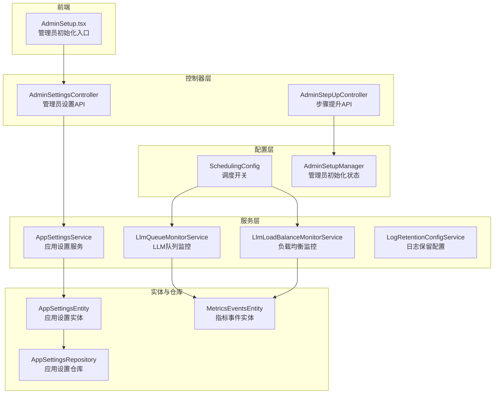
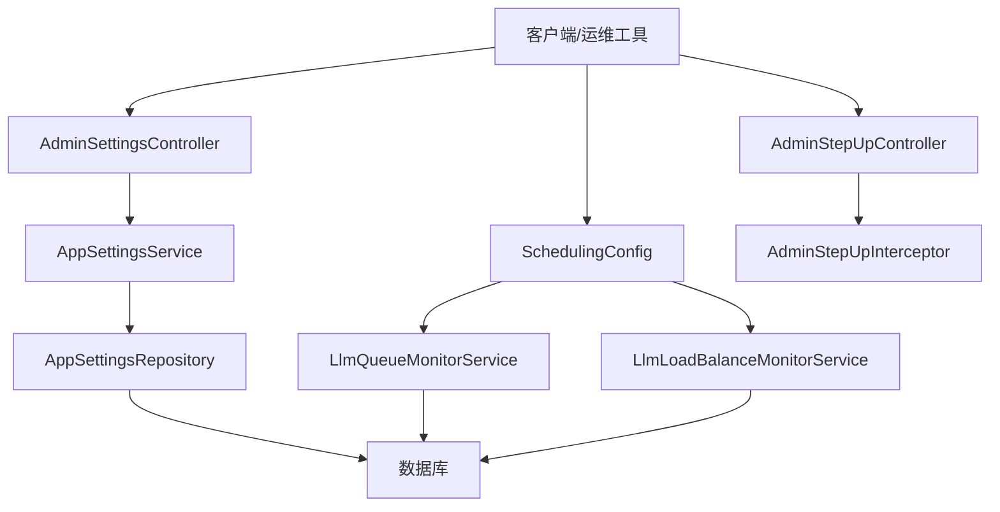
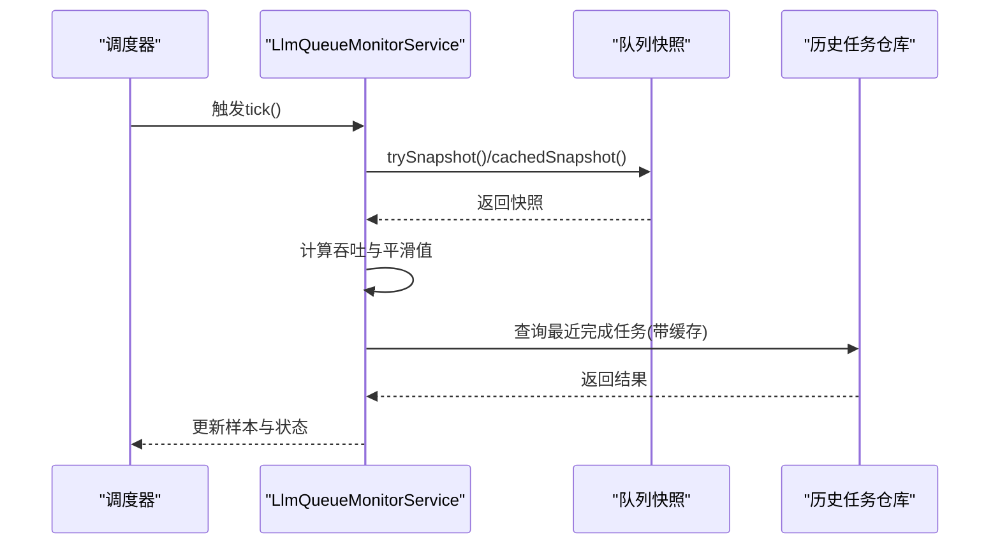
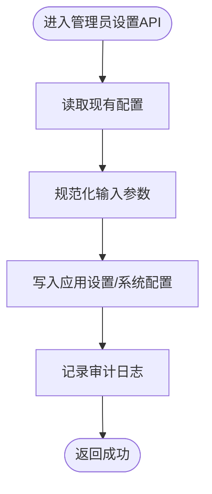
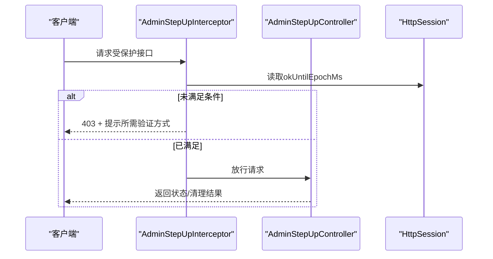
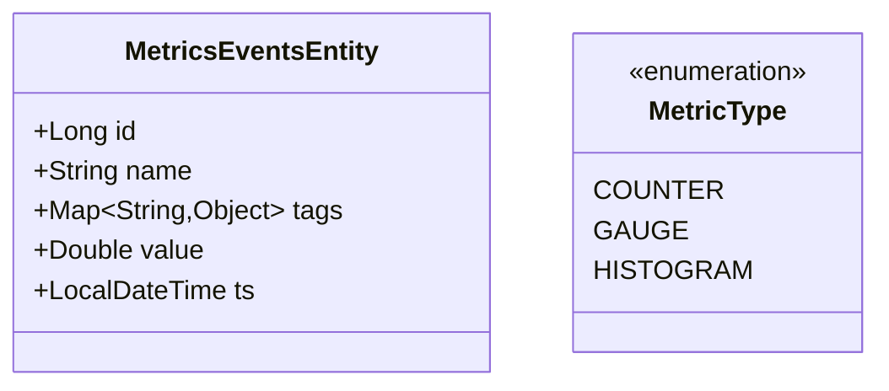
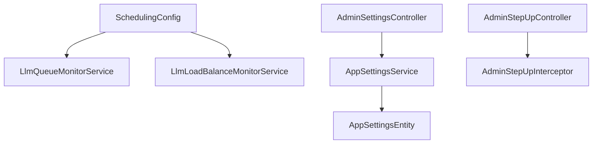

# 监控配置

<cite>
**本文档引用的文件**
- [SchedulingConfig.java](file://src/main/java/com/example/EnterpriseRagCommunity/config/SchedulingConfig.java)
- [AdminSetupManager.java](file://src/main/java/com/example/EnterpriseRagCommunity/config/AdminSetupManager.java)
- [AdminStepUpInterceptor.java](file://src/main/java/com/example/EnterpriseRagCommunity/security/stepup/AdminStepUpInterceptor.java)
- [AdminSettingsController.java](file://src/main/java/com/example/EnterpriseRagCommunity/controller/access/AdminSettingsController.java)
- [AppSettingsService.java](file://src/main/java/com/example/EnterpriseRagCommunity/service/monitor/AppSettingsService.java)
- [AppSettingsEntity.java](file://src/main/java/com/example/EnterpriseRagCommunity/entity/monitor/AppSettingsEntity.java)
- [AppSettingsRepository.java](file://src/main/java/com/example/EnterpriseRagCommunity/repository/monitor/AppSettingsRepository.java)
- [LogRetentionConfigService.java](file://src/main/java/com/example/EnterpriseRagCommunity/service/monitor/LogRetentionConfigService.java)
- [LogRetentionMode.java](file://src/main/java/com/example/EnterpriseRagCommunity/service/monitor/LogRetentionMode.java)
- [LlmQueueMonitorService.java](file://src/main/java/com/example/EnterpriseRagCommunity/service/monitor/LlmQueueMonitorService.java)
- [LlmLoadBalanceMonitorService.java](file://src/main/java/com/example/EnterpriseRagCommunity/service/monitor/LlmLoadBalanceMonitorService.java)
- [MetricsEventsEntity.java](file://src/main/java/com/example/EnterpriseRagCommunity/entity/monitor/MetricsEventsEntity.java)
- [MetricType.java](file://src/main/java/com/example/EnterpriseRagCommunity/entity/monitor/enums/MetricType.java)
- [MetricsEventsCreateDTO.java](file://src/main/java/com/example/EnterpriseRagCommunity/dto/monitor/MetricsEventsCreateDTO.java)
- [AdminStepUpController.java](file://src/main/java/com/example/EnterpriseRagCommunity/controller/access/AdminStepUpController.java)
- [AdminSetup.tsx](file://my-vite-app/src/components/login/AdminSetup.tsx)
</cite>

## 目录
1. [引言](#引言)
2. [项目结构](#项目结构)
3. [核心组件](#核心组件)
4. [架构总览](#架构总览)
5. [详细组件分析](#详细组件分析)
6. [依赖分析](#依赖分析)
7. [性能考虑](#性能考虑)
8. [故障排查指南](#故障排查指南)
9. [结论](#结论)
10. [附录](#附录)

## 引言
本文件面向系统管理员与运维工程师，系统性梳理企业级RAG社区项目的监控配置能力，覆盖以下主题：
- 定时任务配置：调度开关、任务节流与采样
- 管理员设置配置：注册策略、TOTP与安全策略、邮件通知与收件箱
- 步骤提升配置：二次验证拦截与会话控制
- 监控指标配置：指标类型、事件模型与上报接口
- 告警规则配置：基于队列负载与负载均衡的阈值建议
- 通知配置：邮件发送、收件箱查看与测试
- 性能监控、日志监控与业务监控的配置方法
- 监控系统的部署配置与运维最佳实践
- 监控数据的可视化配置与报表生成设置

## 项目结构
监控相关代码主要分布在以下模块：
- 配置层：调度开关、应用设置存储与读取
- 控制器层：管理员设置、步骤提升接口
- 服务层：队列监控、负载均衡监控、日志保留配置
- 实体与仓库：应用设置持久化、指标事件存储
- 前端：管理员初始化入口

**图表来源**
- [SchedulingConfig.java:1-12](file://src/main/java/com/example/EnterpriseRagCommunity/config/SchedulingConfig.java#L1-L12)
- [AdminSetupManager.java:1-61](file://src/main/java/com/example/EnterpriseRagCommunity/config/AdminSetupManager.java#L1-L61)
- [AdminSettingsController.java:1-688](file://src/main/java/com/example/EnterpriseRagCommunity/controller/access/AdminSettingsController.java#L1-L688)
- [AdminStepUpController.java:1-32](file://src/main/java/com/example/EnterpriseRagCommunity/controller/access/AdminStepUpController.java#L1-L32)
- [LlmQueueMonitorService.java:1-397](file://src/main/java/com/example/EnterpriseRagCommunity/service/monitor/LlmQueueMonitorService.java#L1-L397)
- [LlmLoadBalanceMonitorService.java:1-147](file://src/main/java/com/example/EnterpriseRagCommunity/service/monitor/LlmLoadBalanceMonitorService.java#L1-L147)
- [AppSettingsService.java:1-46](file://src/main/java/com/example/EnterpriseRagCommunity/service/monitor/AppSettingsService.java#L1-L46)
- [AppSettingsEntity.java:1-23](file://src/main/java/com/example/EnterpriseRagCommunity/entity/monitor/AppSettingsEntity.java#L1-L23)
- [AppSettingsRepository.java:1-9](file://src/main/java/com/example/EnterpriseRagCommunity/repository/monitor/AppSettingsRepository.java#L1-L9)
- [AdminSetup.tsx:1-8](file://my-vite-app/src/components/login/AdminSetup.tsx#L1-L8)

**章节来源**
- [SchedulingConfig.java:1-12](file://src/main/java/com/example/EnterpriseRagCommunity/config/SchedulingConfig.java#L1-L12)
- [AdminSetupManager.java:1-61](file://src/main/java/com/example/EnterpriseRagCommunity/config/AdminSetupManager.java#L1-L61)
- [AdminSettingsController.java:1-688](file://src/main/java/com/example/EnterpriseRagCommunity/controller/access/AdminSettingsController.java#L1-L688)
- [AdminStepUpController.java:1-32](file://src/main/java/com/example/EnterpriseRagCommunity/controller/access/AdminStepUpController.java#L1-L32)
- [LlmQueueMonitorService.java:1-397](file://src/main/java/com/example/EnterpriseRagCommunity/service/monitor/LlmQueueMonitorService.java#L1-L397)
- [LlmLoadBalanceMonitorService.java:1-147](file://src/main/java/com/example/EnterpriseRagCommunity/service/monitor/LlmLoadBalanceMonitorService.java#L1-L147)
- [AppSettingsService.java:1-46](file://src/main/java/com/example/EnterpriseRagCommunity/service/monitor/AppSettingsService.java#L1-L46)
- [AppSettingsEntity.java:1-23](file://src/main/java/com/example/EnterpriseRagCommunity/entity/monitor/AppSettingsEntity.java#L1-L23)
- [AppSettingsRepository.java:1-9](file://src/main/java/com/example/EnterpriseRagCommunity/repository/monitor/AppSettingsRepository.java#L1-L9)
- [AdminSetup.tsx:1-8](file://my-vite-app/src/components/login/AdminSetup.tsx#L1-L8)

## 核心组件
- 调度配置：通过属性开关控制是否启用Spring调度，避免在特定环境禁用定时任务。
- 管理员设置：集中管理注册策略、TOTP参数、安全策略与邮件配置，并提供邮件测试与收件箱查看。
- 步骤提升：基于会话的二次验证拦截，限制高权限操作的执行范围。
- 应用设置：以键值对形式存储配置项，支持字符串读取与默认值处理。
- 日志保留：统一管理日志保留策略（启用、天数、模式），支持归档或删除。
- 队列监控：周期性采样LLM队列状态，计算吞吐与趋势，提供最近完成任务合并与缓存。
- 负载均衡监控：按时间桶聚合负载均衡指标，输出QPS、错误率、P95等统计。
- 指标事件：支持计数器、仪表盘、直方图三类指标的事件上报与查询。

**章节来源**
- [SchedulingConfig.java:1-12](file://src/main/java/com/example/EnterpriseRagCommunity/config/SchedulingConfig.java#L1-L12)
- [AdminSettingsController.java:1-688](file://src/main/java/com/example/EnterpriseRagCommunity/controller/access/AdminSettingsController.java#L1-L688)
- [AdminStepUpInterceptor.java:1-60](file://src/main/java/com/example/EnterpriseRagCommunity/security/stepup/AdminStepUpInterceptor.java#L1-L60)
- [AppSettingsService.java:1-46](file://src/main/java/com/example/EnterpriseRagCommunity/service/monitor/AppSettingsService.java#L1-L46)
- [LogRetentionConfigService.java:1-26](file://src/main/java/com/example/EnterpriseRagCommunity/service/monitor/LogRetentionConfigService.java#L1-L26)
- [LlmQueueMonitorService.java:1-397](file://src/main/java/com/example/EnterpriseRagCommunity/service/monitor/LlmQueueMonitorService.java#L1-L397)
- [LlmLoadBalanceMonitorService.java:1-147](file://src/main/java/com/example/EnterpriseRagCommunity/service/monitor/LlmLoadBalanceMonitorService.java#L1-L147)
- [MetricsEventsEntity.java:1-35](file://src/main/java/com/example/EnterpriseRagCommunity/entity/monitor/MetricsEventsEntity.java#L1-L35)

## 架构总览
监控配置围绕“配置-服务-控制器-实体”的分层设计展开，定时任务通过调度配置统一开关，管理员设置通过控制器集中管理，应用设置通过服务进行读写，监控数据通过实体持久化并供查询使用。

**图表来源**
- [AdminSettingsController.java:1-688](file://src/main/java/com/example/EnterpriseRagCommunity/controller/access/AdminSettingsController.java#L1-L688)
- [AppSettingsService.java:1-46](file://src/main/java/com/example/EnterpriseRagCommunity/service/monitor/AppSettingsService.java#L1-L46)
- [AppSettingsRepository.java:1-9](file://src/main/java/com/example/EnterpriseRagCommunity/repository/monitor/AppSettingsRepository.java#L1-L9)
- [SchedulingConfig.java:1-12](file://src/main/java/com/example/EnterpriseRagCommunity/config/SchedulingConfig.java#L1-L12)
- [LlmQueueMonitorService.java:1-397](file://src/main/java/com/example/EnterpriseRagCommunity/service/monitor/LlmQueueMonitorService.java#L1-L397)
- [LlmLoadBalanceMonitorService.java:1-147](file://src/main/java/com/example/EnterpriseRagCommunity/service/monitor/LlmLoadBalanceMonitorService.java#L1-L147)
- [AdminStepUpController.java:1-32](file://src/main/java/com/example/EnterpriseRagCommunity/controller/access/AdminStepUpController.java#L1-L32)
- [AdminStepUpInterceptor.java:1-60](file://src/main/java/com/example/EnterpriseRagCommunity/security/stepup/AdminStepUpInterceptor.java#L1-L60)

## 详细组件分析

### 定时任务配置
- 开关机制：通过属性控制是否启用调度，缺省加载且仅当显式关闭时才不加载。
- 采样与平滑：队列监控每秒采样一次，结合指数衰减平滑计算吞吐，避免瞬时波动影响判断。
- 最大限制：对运行、等待、完成任务列表设置上限，防止查询压力过大。
- 缓存策略：最近完成任务列表采用内存队列与数据库缓存双重策略，降低重复查询成本。

**图表来源**
- [SchedulingConfig.java:1-12](file://src/main/java/com/example/EnterpriseRagCommunity/config/SchedulingConfig.java#L1-L12)
- [LlmQueueMonitorService.java:57-120](file://src/main/java/com/example/EnterpriseRagCommunity/service/monitor/LlmQueueMonitorService.java#L57-L120)
- [LlmQueueMonitorService.java:243-301](file://src/main/java/com/example/EnterpriseRagCommunity/service/monitor/LlmQueueMonitorService.java#L243-L301)

**章节来源**
- [SchedulingConfig.java:1-12](file://src/main/java/com/example/EnterpriseRagCommunity/config/SchedulingConfig.java#L1-L12)
- [LlmQueueMonitorService.java:1-397](file://src/main/java/com/example/EnterpriseRagCommunity/service/monitor/LlmQueueMonitorService.java#L1-L397)

### 管理员设置配置
- 注册策略：默认角色ID与注册开关，写入应用设置并记录审计日志。
- TOTP配置：发行者、允许算法/位数/周期、最大偏移与默认值，写入应用设置并校验合法性。
- 安全策略：二次验证策略的读取与保存，支持审计差异记录。
- 邮件配置：启用状态、OTP有效期与重发等待、协议、主机、端口、加密方式、超时、调试、SSL信任、主题前缀、发件人信息等，写入应用设置与系统配置。
- 收件箱配置：协议、主机、端口、加密方式、超时、调试、SSL信任、收件箱与已发送文件夹，写入应用设置。
- 邮件测试：根据当前配置构造传输参数，发送测试邮件并记录审计日志。

**图表来源**
- [AdminSettingsController.java:55-95](file://src/main/java/com/example/EnterpriseRagCommunity/controller/access/AdminSettingsController.java#L55-L95)
- [AdminSettingsController.java:158-188](file://src/main/java/com/example/EnterpriseRagCommunity/controller/access/AdminSettingsController.java#L158-L188)
- [AdminSettingsController.java:196-213](file://src/main/java/com/example/EnterpriseRagCommunity/controller/access/AdminSettingsController.java#L196-L213)
- [AdminSettingsController.java:241-282](file://src/main/java/com/example/EnterpriseRagCommunity/controller/access/AdminSettingsController.java#L241-L282)
- [AdminSettingsController.java:331-364](file://src/main/java/com/example/EnterpriseRagCommunity/controller/access/AdminSettingsController.java#L331-L364)
- [AdminSettingsController.java:284-310](file://src/main/java/com/example/EnterpriseRagCommunity/controller/access/AdminSettingsController.java#L284-L310)

**章节来源**
- [AdminSettingsController.java:1-688](file://src/main/java/com/example/EnterpriseRagCommunity/controller/access/AdminSettingsController.java#L1-L688)
- [AppSettingsService.java:1-46](file://src/main/java/com/example/EnterpriseRagCommunity/service/monitor/AppSettingsService.java#L1-L46)

### 步骤提升配置
- 拦截逻辑：解析方法或类上的注解，若需要二次验证但会话未满足条件，返回403并提示所需验证方式与剩余有效期。
- 会话控制：通过会话属性记录“允许继续”的截止时间，超过即要求重新验证。
- 接口支持：提供状态查询与清理会话属性的接口，便于前端引导用户完成二次验证。

**图表来源**
- [AdminStepUpInterceptor.java:17-36](file://src/main/java/com/example/EnterpriseRagCommunity/security/stepup/AdminStepUpInterceptor.java#L17-L36)
- [AdminStepUpController.java:1-32](file://src/main/java/com/example/EnterpriseRagCommunity/controller/access/AdminStepUpController.java#L1-L32)

**章节来源**
- [AdminStepUpInterceptor.java:1-60](file://src/main/java/com/example/EnterpriseRagCommunity/security/stepup/AdminStepUpInterceptor.java#L1-L60)
- [AdminStepUpController.java:1-32](file://src/main/java/com/example/EnterpriseRagCommunity/controller/access/AdminStepUpController.java#L1-L32)

### 监控指标配置
- 指标类型：计数器、仪表盘、直方图三类，用于不同场景的度量。
- 事件模型：指标名称、标签、数值、时间戳，支持JSON标签结构。
- 数据持久化：指标事件实体包含自增ID、名称、标签映射、数值与时间戳字段。

**图表来源**
- [MetricsEventsEntity.java:1-35](file://src/main/java/com/example/EnterpriseRagCommunity/entity/monitor/MetricsEventsEntity.java#L1-L35)
- [MetricType.java:1-7](file://src/main/java/com/example/EnterpriseRagCommunity/entity/monitor/enums/MetricType.java#L1-L7)

**章节来源**
- [MetricsEventsEntity.java:1-35](file://src/main/java/com/example/EnterpriseRagCommunity/entity/monitor/MetricsEventsEntity.java#L1-L35)
- [MetricType.java:1-7](file://src/main/java/com/example/EnterpriseRagCommunity/entity/monitor/enums/MetricType.java#L1-L7)
- [MetricsEventsCreateDTO.java:1-30](file://src/main/java/com/example/EnterpriseRagCommunity/dto/monitor/MetricsEventsCreateDTO.java#L1-L30)

### 告警规则配置
- 队列负载：基于队列长度、运行任务数与吞吐趋势，设定阈值触发告警（如队列长度超限、吞吐骤降、错误率上升）。
- 负载均衡：基于QPS、P95响应时间、429限流比例等指标，设定阈值触发告警。
- 建议阈值：
  - 队列长度：超过系统峰值容量的70%持续5分钟
  - 吞吐：连续3个采样窗口平均下降30%
  - 错误率：超过5%，429限流占比超过10%
- 告警通道：结合邮件通知配置，确保告警及时送达。

**章节来源**
- [LlmQueueMonitorService.java:1-397](file://src/main/java/com/example/EnterpriseRagCommunity/service/monitor/LlmQueueMonitorService.java#L1-L397)
- [LlmLoadBalanceMonitorService.java:1-147](file://src/main/java/com/example/EnterpriseRagCommunity/service/monitor/LlmLoadBalanceMonitorService.java#L1-L147)
- [AdminSettingsController.java:241-282](file://src/main/java/com/example/EnterpriseRagCommunity/controller/access/AdminSettingsController.java#L241-L282)

### 通知配置
- 邮件发送：启用状态、协议、主机、端口、加密方式、超时、调试、SSL信任、主题前缀、发件人信息。
- 收件箱查看：支持列出收件箱与已发送邮件，便于审计与排障。
- 测试发送：根据当前配置发送测试邮件，快速验证配置正确性。

**章节来源**
- [AdminSettingsController.java:215-282](file://src/main/java/com/example/EnterpriseRagCommunity/controller/access/AdminSettingsController.java#L215-L282)
- [AdminSettingsController.java:312-407](file://src/main/java/com/example/EnterpriseRagCommunity/controller/access/AdminSettingsController.java#L312-L407)
- [AdminSettingsController.java:284-310](file://src/main/java/com/example/EnterpriseRagCommunity/controller/access/AdminSettingsController.java#L284-L310)

### 性能监控、日志监控与业务监控
- 性能监控：通过队列监控与负载均衡监控采集吞吐、延迟、错误率等关键指标，结合调度配置保证采样频率与资源占用平衡。
- 日志监控：通过日志保留配置统一管理日志生命周期，支持归档或删除策略，减少存储压力。
- 业务监控：通过指标事件模型上报业务关键指标，结合前端可视化组件进行展示与报表生成。

**章节来源**
- [LlmQueueMonitorService.java:1-397](file://src/main/java/com/example/EnterpriseRagCommunity/service/monitor/LlmQueueMonitorService.java#L1-L397)
- [LlmLoadBalanceMonitorService.java:1-147](file://src/main/java/com/example/EnterpriseRagCommunity/service/monitor/LlmLoadBalanceMonitorService.java#L1-L147)
- [LogRetentionConfigService.java:1-26](file://src/main/java/com/example/EnterpriseRagCommunity/service/monitor/LogRetentionConfigService.java#L1-L26)

### 监控系统的部署配置与运维最佳实践
- 部署建议：
  - 在生产环境启用调度，确保监控任务正常运行。
  - 将日志保留策略设为归档，避免频繁删除造成数据丢失风险。
  - 使用邮件通知配置保障告警通道畅通，定期进行测试发送。
- 运维实践：
  - 定期审查注册策略与TOTP配置，确保符合安全基线。
  - 结合步骤提升配置，对高权限操作实施二次验证。
  - 建立告警阈值基线，结合历史数据动态调整，避免误报与漏报。

**章节来源**
- [SchedulingConfig.java:1-12](file://src/main/java/com/example/EnterpriseRagCommunity/config/SchedulingConfig.java#L1-L12)
- [LogRetentionConfigService.java:1-26](file://src/main/java/com/example/EnterpriseRagCommunity/service/monitor/LogRetentionConfigService.java#L1-L26)
- [AdminSettingsController.java:1-688](file://src/main/java/com/example/EnterpriseRagCommunity/controller/access/AdminSettingsController.java#L1-L688)
- [AdminStepUpController.java:1-32](file://src/main/java/com/example/EnterpriseRagCommunity/controller/access/AdminStepUpController.java#L1-L32)

### 监控数据的可视化配置与报表生成设置
- 可视化基础：指标事件实体支持JSON标签，便于前端按维度聚合与筛选。
- 报表生成：结合队列监控与负载均衡监控的聚合结果，生成QPS、错误率、P95响应时间等报表。
- 前端入口：管理员初始化页面通过导入配置表单，间接关联监控配置的初始化流程。

**章节来源**
- [MetricsEventsEntity.java:1-35](file://src/main/java/com/example/EnterpriseRagCommunity/entity/monitor/MetricsEventsEntity.java#L1-L35)
- [LlmQueueMonitorService.java:1-397](file://src/main/java/com/example/EnterpriseRagCommunity/service/monitor/LlmQueueMonitorService.java#L1-L397)
- [LlmLoadBalanceMonitorService.java:1-147](file://src/main/java/com/example/EnterpriseRagCommunity/service/monitor/LlmLoadBalanceMonitorService.java#L1-L147)
- [AdminSetup.tsx:1-8](file://my-vite-app/src/components/login/AdminSetup.tsx#L1-L8)

## 依赖分析
- 组件耦合：
  - 调度配置与监控服务强耦合，确保监控任务按需启用。
  - 管理员设置控制器依赖应用设置服务与系统配置服务，实现配置的读取与持久化。
  - 步骤提升拦截器与控制器配合，形成二次验证的控制链路。
- 外部依赖：
  - 邮件通知依赖系统配置中的用户名、密码、发件地址等敏感信息，需妥善保管。
  - 日志保留模式依赖枚举类型，确保配置一致性。

**图表来源**
- [SchedulingConfig.java:1-12](file://src/main/java/com/example/EnterpriseRagCommunity/config/SchedulingConfig.java#L1-L12)
- [LlmQueueMonitorService.java:1-397](file://src/main/java/com/example/EnterpriseRagCommunity/service/monitor/LlmQueueMonitorService.java#L1-L397)
- [LlmLoadBalanceMonitorService.java:1-147](file://src/main/java/com/example/EnterpriseRagCommunity/service/monitor/LlmLoadBalanceMonitorService.java#L1-L147)
- [AdminSettingsController.java:1-688](file://src/main/java/com/example/EnterpriseRagCommunity/controller/access/AdminSettingsController.java#L1-L688)
- [AppSettingsService.java:1-46](file://src/main/java/com/example/EnterpriseRagCommunity/service/monitor/AppSettingsService.java#L1-L46)
- [AppSettingsEntity.java:1-23](file://src/main/java/com/example/EnterpriseRagCommunity/entity/monitor/AppSettingsEntity.java#L1-L23)
- [AdminStepUpController.java:1-32](file://src/main/java/com/example/EnterpriseRagCommunity/controller/access/AdminStepUpController.java#L1-L32)
- [AdminStepUpInterceptor.java:1-60](file://src/main/java/com/example/EnterpriseRagCommunity/security/stepup/AdminStepUpInterceptor.java#L1-L60)

**章节来源**
- [SchedulingConfig.java:1-12](file://src/main/java/com/example/EnterpriseRagCommunity/config/SchedulingConfig.java#L1-L12)
- [AdminSettingsController.java:1-688](file://src/main/java/com/example/EnterpriseRagCommunity/controller/access/AdminSettingsController.java#L1-L688)
- [AdminStepUpController.java:1-32](file://src/main/java/com/example/EnterpriseRagCommunity/controller/access/AdminStepUpController.java#L1-L32)
- [AppSettingsService.java:1-46](file://src/main/java/com/example/EnterpriseRagCommunity/service/monitor/AppSettingsService.java#L1-L46)
- [AppSettingsEntity.java:1-23](file://src/main/java/com/example/EnterpriseRagCommunity/entity/monitor/AppSettingsEntity.java#L1-L23)

## 性能考虑
- 采样频率与窗口：监控采样间隔为1秒，样本窗口建议不超过1小时，避免内存与CPU压力。
- 限制与缓存：对运行、等待、完成任务列表设置上限，最近完成任务采用内存队列与数据库缓存，降低查询开销。
- 平滑算法：采用指数衰减平滑吞吐，避免瞬时波动误导决策。
- 配置优化：合理设置日志保留天数与模式，平衡存储成本与审计需求。

**章节来源**
- [LlmQueueMonitorService.java:1-397](file://src/main/java/com/example/EnterpriseRagCommunity/service/monitor/LlmQueueMonitorService.java#L1-L397)
- [LogRetentionConfigService.java:1-26](file://src/main/java/com/example/EnterpriseRagCommunity/service/monitor/LogRetentionConfigService.java#L1-L26)

## 故障排查指南
- 调度未生效：检查调度开关属性，确认未显式关闭。
- 队列监控异常：检查队列快照获取与最近完成任务合并逻辑，关注缓存命中率与查询限制。
- 邮件发送失败：核对协议、主机、端口、加密方式与超时设置，使用测试发送快速定位问题。
- 步骤提升失败：检查会话属性是否正确设置，确认拦截器返回的剩余有效期与可用验证方式。

**章节来源**
- [SchedulingConfig.java:1-12](file://src/main/java/com/example/EnterpriseRagCommunity/config/SchedulingConfig.java#L1-L12)
- [LlmQueueMonitorService.java:1-397](file://src/main/java/com/example/EnterpriseRagCommunity/service/monitor/LlmQueueMonitorService.java#L1-L397)
- [AdminSettingsController.java:284-310](file://src/main/java/com/example/EnterpriseRagCommunity/controller/access/AdminSettingsController.java#L284-L310)
- [AdminStepUpInterceptor.java:1-60](file://src/main/java/com/example/EnterpriseRagCommunity/security/stepup/AdminStepUpInterceptor.java#L1-L60)

## 结论
本监控配置体系通过调度开关、管理员设置、步骤提升、应用设置与监控服务的协同，实现了对系统性能、日志与业务指标的全面监控。结合告警规则与通知配置，能够有效支撑生产环境的稳定运行与快速排障。建议在部署时遵循最佳实践，定期评估与优化配置，确保监控体系持续有效。

## 附录
- 关键配置项速览：
  - 调度开关：app.scheduling.enabled
  - 注册策略：default_register_role_id、registration_enabled
  - TOTP：totp_*系列键
  - 邮件：email_*与email_inbox_*系列键
  - 日志保留：monitor.logs.retention.*系列键
- 前端入口：管理员初始化页面通过导入配置表单，便于一次性完成监控相关配置的初始化。

**章节来源**
- [AdminSettingsController.java:1-688](file://src/main/java/com/example/EnterpriseRagCommunity/controller/access/AdminSettingsController.java#L1-L688)
- [AdminSetup.tsx:1-8](file://my-vite-app/src/components/login/AdminSetup.tsx#L1-L8)