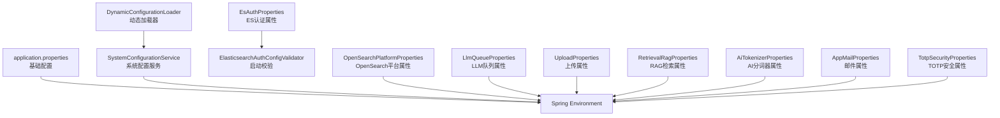
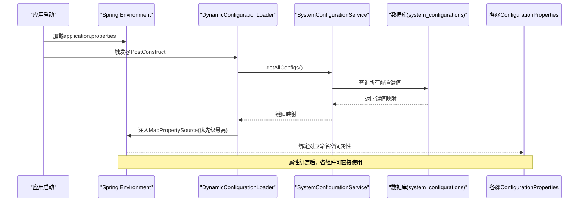
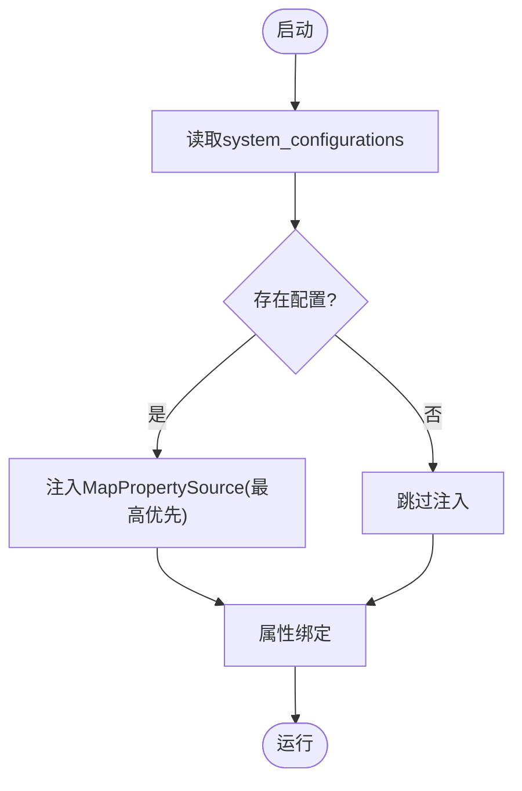
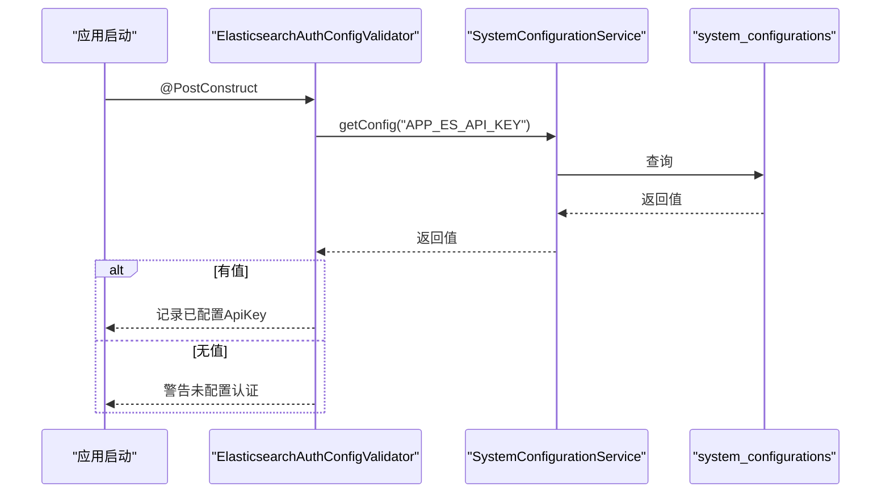
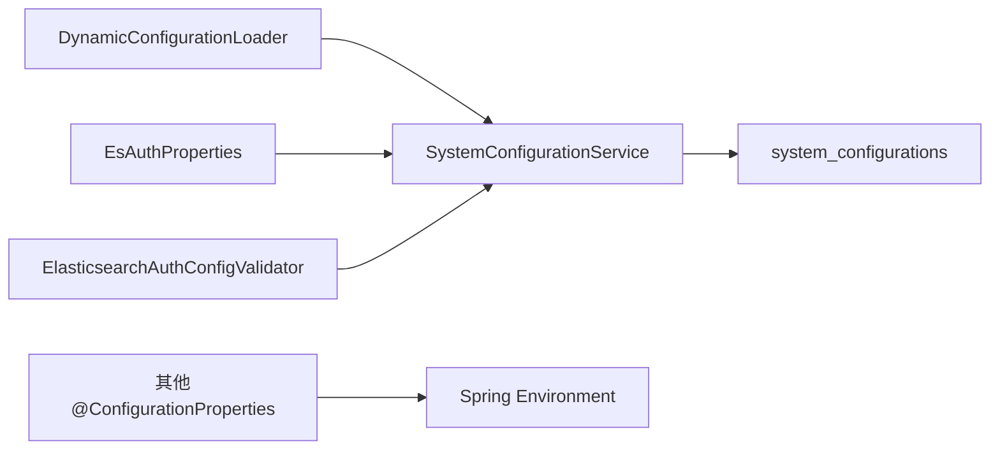

# 配置管理

<cite>
**本文引用的文件**
- [application.properties](file://src/main/resources/application.properties)
- [DynamicConfigurationLoader.java](file://src/main/java/com/example/EnterpriseRagCommunity/config/DynamicConfigurationLoader.java)
- [SystemConfigurationService.java](file://src/main/java/com/example/EnterpriseRagCommunity/service/config/SystemConfigurationService.java)
- [ElasticsearchAuthConfigValidator.java](file://src/main/java/com/example/EnterpriseRagCommunity/config/ElasticsearchAuthConfigValidator.java)
- [ElasticsearchApiKeyConfig.java](file://src/main/java/com/example/EnterpriseRagCommunity/config/ElasticsearchApiKeyConfig.java)
- [EsAuthProperties.java](file://src/main/java/com/example/EnterpriseRagCommunity/config/EsAuthProperties.java)
- [AiTokenizerProperties.java](file://src/main/java/com/example/EnterpriseRagCommunity/config/AiTokenizerProperties.java)
- [AppMailProperties.java](file://src/main/java/com/example/EnterpriseRagCommunity/config/AppMailProperties.java)
- [LlmQueueProperties.java](file://src/main/java/com/example/EnterpriseRagCommunity/config/LlmQueueProperties.java)
- [OpenSearchPlatformProperties.java](file://src/main/java/com/example/EnterpriseRagCommunity/config/OpenSearchPlatformProperties.java)
- [RetrievalRagProperties.java](file://src/main/java/com/example/EnterpriseRagCommunity/config/RetrievalRagProperties.java)
- [UploadProperties.java](file://src/main/java/com/example/EnterpriseRagCommunity/config/UploadProperties.java)
- [TotpSecurityProperties.java](file://src/main/java/com/example/EnterpriseRagCommunity/config/TotpSecurityProperties.java)
- [ViteManifestService.java](file://src/main/java/com/example/EnterpriseRagCommunity/service/ViteManifestService.java)
- [AdminSetupManager.java](file://src/main/java/com/example/EnterpriseRagCommunity/config/AdminSetupManager.java)
- [AdministratorService.java](file://src/main/java/com/example/EnterpriseRagCommunity/service/AdministratorService.java)
- [logback-spring.xml](file://src/main/resources/logback-spring.xml)
- [application-perf.properties](file://src/main/resources/application-perf.properties)
- [ViteManifestService.test.ts](file://my-vite-app/src/services/ViteManifestService.test.ts)
</cite>

## 目录
1. 引言
2. 项目结构
3. 核心组件
4. 架构总览
5. 详细组件分析
6. 依赖分析
7. 性能考虑
8. 故障排查指南
9. 结论
10. 附录

## 引言
本文件为企业级RAG社区平台的配置管理权威指南，覆盖环境变量、配置文件、动态配置加载与更新、配置验证与回滚、以及安全与敏感信息保护等主题。文档以代码为依据，逐项说明配置项的作用、默认值、推荐设置，并给出不同部署环境的配置模板与最佳实践。

## 项目结构
后端基于Spring Boot，配置主要来源于：
- application.properties：基础应用配置（数据库、日志、服务器、上传、动态配置键位等）
- 多个@ConfigurationProperties类：封装命名空间下的配置对象
- 动态配置加载器：从数据库表system_configurations读取键值并注入Spring Environment
- 启动阶段校验器：对关键认证配置进行启动时验证
- 日志配置：logback-spring.xml定义日志输出策略

图表来源
- [application.properties:1-84](file://src/main/resources/application.properties#L1-L84)
- [DynamicConfigurationLoader.java:1-47](file://src/main/java/com/example/EnterpriseRagCommunity/config/DynamicConfigurationLoader.java#L1-L47)
- [EsAuthProperties.java:1-25](file://src/main/java/com/example/EnterpriseRagCommunity/config/EsAuthProperties.java#L1-L25)
- [ElasticsearchAuthConfigValidator.java:1-33](file://src/main/java/com/example/EnterpriseRagCommunity/config/ElasticsearchAuthConfigValidator.java#L1-L33)
- [OpenSearchPlatformProperties.java:1-17](file://src/main/java/com/example/EnterpriseRagCommunity/config/OpenSearchPlatformProperties.java#L1-L17)
- [LlmQueueProperties.java:1-16](file://src/main/java/com/example/EnterpriseRagCommunity/config/LlmQueueProperties.java#L1-L16)
- [UploadProperties.java:1-28](file://src/main/java/com/example/EnterpriseRagCommunity/config/UploadProperties.java#L1-L28)
- [RetrievalRagProperties.java:1-22](file://src/main/java/com/example/EnterpriseRagCommunity/config/RetrievalRagProperties.java#L1-L22)
- [AiTokenizerProperties.java:1-14](file://src/main/java/com/example/EnterpriseRagCommunity/config/AiTokenizerProperties.java#L1-L14)
- [AppMailProperties.java:1-16](file://src/main/java/com/example/EnterpriseRagCommunity/config/AppMailProperties.java#L1-L16)
- [TotpSecurityProperties.java:1-18](file://src/main/java/com/example/EnterpriseRagCommunity/config/TotpSecurityProperties.java#L1-L18)

章节来源
- [application.properties:1-84](file://src/main/resources/application.properties#L1-L84)

## 核心组件
- 动态配置加载器：在应用启动后从数据库system_configurations读取配置键值，注入到Spring Environment的首优先级位置，实现“数据库 > 环境变量/默认值”的覆盖策略。
- Elasticsearch认证配置：支持通过数据库中的APP_ES_API_KEY键加载ES ApiKey；启动时进行模式校验，若为空则提示未配置认证，可能导致安全集群返回401。
- OpenSearch平台属性：封装host、workspace、serviceId及连接/读超时等参数。
- LLM队列属性：并发上限、队列大小、完成任务保留数与历史保留天数等。
- 上传属性：根目录与URL前缀，提供路径规范化与URL前缀标准化工具方法。
- RAG检索属性：ES索引名、IK分词开关、嵌入模型与维度等。
- AI分词器与邮件属性：分别用于外部服务鉴权与发件人配置。
- TOTP安全属性：存储AES主密钥，用于TOTP加密场景。
- 管理员初始化管理器：应用启动时检查管理员数量，决定是否需要初始化设置。

章节来源
- [DynamicConfigurationLoader.java:1-47](file://src/main/java/com/example/EnterpriseRagCommunity/config/DynamicConfigurationLoader.java#L1-L47)
- [ElasticsearchAuthConfigValidator.java:1-33](file://src/main/java/com/example/EnterpriseRagCommunity/config/ElasticsearchAuthConfigValidator.java#L1-L33)
- [EsAuthProperties.java:1-25](file://src/main/java/com/example/EnterpriseRagCommunity/config/EsAuthProperties.java#L1-L25)
- [OpenSearchPlatformProperties.java:1-17](file://src/main/java/com/example/EnterpriseRagCommunity/config/OpenSearchPlatformProperties.java#L1-L17)
- [LlmQueueProperties.java:1-16](file://src/main/java/com/example/EnterpriseRagCommunity/config/LlmQueueProperties.java#L1-L16)
- [UploadProperties.java:1-28](file://src/main/java/com/example/EnterpriseRagCommunity/config/UploadProperties.java#L1-L28)
- [RetrievalRagProperties.java:1-22](file://src/main/java/com/example/EnterpriseRagCommunity/config/RetrievalRagProperties.java#L1-L22)
- [AiTokenizerProperties.java:1-14](file://src/main/java/com/example/EnterpriseRagCommunity/config/AiTokenizerProperties.java#L1-L14)
- [AppMailProperties.java:1-16](file://src/main/java/com/example/EnterpriseRagCommunity/config/AppMailProperties.java#L1-L16)
- [TotpSecurityProperties.java:1-18](file://src/main/java/com/example/EnterpriseRagCommunity/config/TotpSecurityProperties.java#L1-L18)
- [AdminSetupManager.java:1-61](file://src/main/java/com/example/EnterpriseRagCommunity/config/AdminSetupManager.java#L1-L61)

## 架构总览
下图展示配置从静态文件到动态数据库再到运行时生效的整体流程。

图表来源
- [DynamicConfigurationLoader.java:24-45](file://src/main/java/com/example/EnterpriseRagCommunity/config/DynamicConfigurationLoader.java#L24-L45)
- [SystemConfigurationService.java](file://src/main/java/com/example/EnterpriseRagCommunity/service/config/SystemConfigurationService.java)

章节来源
- [application.properties:65-67](file://src/main/resources/application.properties#L65-L67)
- [DynamicConfigurationLoader.java:24-45](file://src/main/java/com/example/EnterpriseRagCommunity/config/DynamicConfigurationLoader.java#L24-L45)

## 详细组件分析

### 数据库连接与连接池
- 关键项
  - JDBC驱动、URL、用户名、密码
  - 连接池最大池大小、最小空闲、连接超时、验证超时、空闲超时、最大生存时间
- 默认与推荐
  - 最大池大小、最小空闲、连接超时、验证超时、空闲超时、最大生存时间均有环境变量覆盖，默认值见application.properties
  - 生产环境建议根据QPS与实例规格调整最大池大小与超时参数
- 依赖与冲突
  - 超时参数需满足“连接超时 > 验证超时”，否则可能导致连接获取失败
- 安全
  - 用户名与密码通过环境变量注入，避免硬编码

章节来源
- [application.properties:7-16](file://src/main/resources/application.properties#L7-L16)

### Flyway迁移
- 关键项
  - 启用开关、迁移脚本位置、基线版本、越序执行、缺失位置处理、编码
- 默认与推荐
  - 默认启用，基线版本为1，越序执行关闭，编码UTF-8
  - 建议生产环境保持越序执行关闭，确保迁移顺序可控

章节来源
- [application.properties:18-24](file://src/main/resources/application.properties#L18-L24)

### 服务器与上传
- 关键项
  - 端口、上下文路径、字符集
  - 上传文件大小限制、表单提交大小、吞吐量限制
- 默认与推荐
  - 端口默认8099；上传与表单大小按业务峰值上浮预留
- 依赖与冲突
  - 表单提交大小应不小于请求体大小，避免拒绝

章节来源
- [application.properties:27-36](file://src/main/resources/application.properties#L27-L36)

### 日志与访问日志
- 关键项
  - 日志文件路径、滚动策略（单文件最大、保留天数、总大小上限）
  - 根日志级别、特定包日志级别、访问日志捕获开关与最大体
- 默认与推荐
  - 根日志级别可调；访问日志体大小默认64KB，可根据审计需求调整
- 安全
  - 访问日志可选捕获响应体，注意敏感信息脱敏

章节来源
- [application.properties:38-61](file://src/main/resources/application.properties#L38-L61)
- [logback-spring.xml](file://src/main/resources/logback-spring.xml)

### 租户与上传基础配置
- 关键项
  - 默认租户代码与名称
  - 上传根目录与URL前缀
- 默认与推荐
  - 租户默认值便于多租户隔离；上传目录建议独立挂载并具备权限控制

章节来源
- [application.properties:55-63](file://src/main/resources/application.properties#L55-L63)

### 动态配置加载与覆盖策略
- 关键机制
  - 应用启动后，DynamicConfigurationLoader从SystemConfigurationService读取system_configurations表中的键值映射
  - 将其作为最高优先级的PropertySource注入Environment，实现“数据库 > 环境变量/默认值”的覆盖
- 默认值与回退
  - 若数据库无配置或为空，不注入该PropertySource，保持环境变量/默认值生效
- 更新与回滚
  - 当前实现为启动时一次性加载；如需热更新，可在业务层触发重新加载并替换PropertySource
  - 回滚可通过恢复数据库中的旧键值或引入版本化配置表实现

图表来源
- [DynamicConfigurationLoader.java:29-45](file://src/main/java/com/example/EnterpriseRagCommunity/config/DynamicConfigurationLoader.java#L29-L45)

章节来源
- [DynamicConfigurationLoader.java:1-47](file://src/main/java/com/example/EnterpriseRagCommunity/config/DynamicConfigurationLoader.java#L1-L47)

### Elasticsearch认证配置
- 关键项
  - 通过EsAuthProperties与SystemConfigurationService读取APP_ES_API_KEY
  - 启动时ElasticsearchAuthConfigValidator进行模式校验
- 默认与推荐
  - 推荐使用ApiKey（ES 8+/9+），避免用户名密码泄露风险
- 冲突与风险
  - 若ES启用了安全但未配置ApiKey，将导致401错误；启动阶段已发出警告

图表来源
- [ElasticsearchAuthConfigValidator.java:23-31](file://src/main/java/com/example/EnterpriseRagCommunity/config/ElasticsearchAuthConfigValidator.java#L23-L31)
- [EsAuthProperties.java:17-23](file://src/main/java/com/example/EnterpriseRagCommunity/config/EsAuthProperties.java#L17-L23)

章节来源
- [ElasticsearchAuthConfigValidator.java:1-33](file://src/main/java/com/example/EnterpriseRagCommunity/config/ElasticsearchAuthConfigValidator.java#L1-L33)
- [EsAuthProperties.java:1-25](file://src/main/java/com/example/EnterpriseRagCommunity/config/EsAuthProperties.java#L1-L25)

### OpenSearch平台配置
- 关键项
  - host、workspaceName、serviceId、连接/读超时
- 默认与推荐
  - host默认值指向示例平台地址；生产请替换为实际域名
  - 超时参数需结合网络延迟与上游服务性能调整

章节来源
- [application.properties:72-76](file://src/main/resources/application.properties#L72-L76)
- [OpenSearchPlatformProperties.java:1-17](file://src/main/java/com/example/EnterpriseRagCommunity/config/OpenSearchPlatformProperties.java#L1-L17)

### LLM队列配置
- 关键项
  - 并发上限、队列大小、完成任务保留数、历史保留天数
- 默认与推荐
  - 并发与队列大小需结合CPU与内存资源评估；保留数与天数影响磁盘占用

章节来源
- [LlmQueueProperties.java:1-16](file://src/main/java/com/example/EnterpriseRagCommunity/config/LlmQueueProperties.java#L1-L16)

### 上传配置
- 关键项
  - 根目录、URL前缀；提供rootPath与normalizedUrlPrefix工具方法
- 默认与推荐
  - 根目录建议独立挂载并开启只读/写权限分离；URL前缀去除尾部斜杠保证一致性

章节来源
- [UploadProperties.java:1-28](file://src/main/java/com/example/EnterpriseRagCommunity/config/UploadProperties.java#L1-L28)

### RAG检索配置
- 关键项
  - ES索引名、IK分词开关、嵌入模型与维度
- 默认与推荐
  - IK分词默认开启；模型与维度需与向量化服务一致

章节来源
- [RetrievalRagProperties.java:1-22](file://src/main/java/com/example/EnterpriseRagCommunity/config/RetrievalRagProperties.java#L1-L22)

### AI分词器与邮件配置
- 关键项
  - 分词器API Key、邮件用户名/密码/发件地址/发件人名
- 默认与推荐
  - 分词器Key与邮件凭据均通过环境变量注入，避免硬编码

章节来源
- [AiTokenizerProperties.java:1-14](file://src/main/java/com/example/EnterpriseRagCommunity/config/AiTokenizerProperties.java#L1-L14)
- [AppMailProperties.java:1-16](file://src/main/java/com/example/EnterpriseRagCommunity/config/AppMailProperties.java#L1-L16)

### TOTP安全配置
- 关键项
  - AES主密钥（Base64编码，推荐32字节）
- 默认与推荐
  - 开发环境可留空；启用TOTP时必须配置

章节来源
- [TotpSecurityProperties.java:1-18](file://src/main/java/com/example/EnterpriseRagCommunity/config/TotpSecurityProperties.java#L1-L18)

### 管理员初始化
- 关键机制
  - AdminSetupManager在启动时统计管理员数量，决定是否需要初始化设置
- 默认与推荐
  - 首次部署时通常需要初始化；可通过前端引导完成

章节来源
- [AdminSetupManager.java:1-61](file://src/main/java/com/example/EnterpriseRagCommunity/config/AdminSetupManager.java#L1-L61)
- [AdministratorService.java](file://src/main/java/com/example/EnterpriseRagCommunity/service/AdministratorService.java)

## 依赖分析
- 配置耦合
  - 动态配置加载依赖SystemConfigurationService；Elasticsearch认证依赖APP_ES_API_KEY键
  - 各@ConfigurationProperties类仅依赖Spring绑定机制，低耦合
- 外部依赖
  - 数据库（MySQL）、搜索引擎（OpenSearch/Elasticsearch）、邮件服务、外部LLM服务
- 循环依赖
  - 配置层之间无循环依赖；动态加载器在启动阶段注入，不参与业务循环

图表来源
- [DynamicConfigurationLoader.java:1-47](file://src/main/java/com/example/EnterpriseRagCommunity/config/DynamicConfigurationLoader.java#L1-L47)
- [ElasticsearchAuthConfigValidator.java:1-33](file://src/main/java/com/example/EnterpriseRagCommunity/config/ElasticsearchAuthConfigValidator.java#L1-L33)
- [EsAuthProperties.java:1-25](file://src/main/java/com/example/EnterpriseRagCommunity/config/EsAuthProperties.java#L1-L25)

章节来源
- [DynamicConfigurationLoader.java:1-47](file://src/main/java/com/example/EnterpriseRagCommunity/config/DynamicConfigurationLoader.java#L1-L47)
- [ElasticsearchAuthConfigValidator.java:1-33](file://src/main/java/com/example/EnterpriseRagCommunity/config/ElasticsearchAuthConfigValidator.java#L1-L33)

## 性能考虑
- 连接池与超时
  - 合理设置最大池大小与超时，避免连接争用与堆积
- 日志滚动
  - 控制单文件大小与总大小上限，平衡IO与磁盘占用
- 上传与表单
  - 根据业务峰值适当放大限制，避免上传失败
- 检索与队列
  - LLM队列并发与队列大小需与硬件资源匹配，避免OOM或阻塞

## 故障排查指南
- Elasticsearch 401错误
  - 现象：请求被拒绝
  - 排查：确认system_configurations中APP_ES_API_KEY是否配置；启动日志是否提示未配置认证
  - 处理：补配ApiKey或关闭ES安全（不推荐）
- 动态配置未生效
  - 现象：修改数据库键值后未生效
  - 排查：确认DynamicConfigurationLoader是否成功注入PropertySource；检查键名是否与命名空间一致
  - 处理：重启应用以强制重新加载
- 上传路径异常
  - 现象：访问上传资源404
  - 排查：确认UploadProperties.root与normalizedUrlPrefix；静态资源映射是否正确
- 日志文件未生成
  - 现象：日志文件不存在
  - 排查：确认LOG_FILE路径可写；logback配置是否正确

章节来源
- [ElasticsearchAuthConfigValidator.java:23-31](file://src/main/java/com/example/EnterpriseRagCommunity/config/ElasticsearchAuthConfigValidator.java#L23-L31)
- [DynamicConfigurationLoader.java:29-45](file://src/main/java/com/example/EnterpriseRagCommunity/config/DynamicConfigurationLoader.java#L29-L45)
- [UploadProperties.java:17-25](file://src/main/java/com/example/EnterpriseRagCommunity/config/UploadProperties.java#L17-L25)
- [application.properties:40-43](file://src/main/resources/application.properties#L40-L43)

## 结论
本配置体系通过application.properties与@ConfigurationProperties实现静态配置，辅以DynamicConfigurationLoader实现数据库驱动的动态配置覆盖。配合启动期校验与日志策略，既保证了灵活性，也兼顾了安全性与可观测性。建议在生产环境严格管理敏感键值，采用最小权限原则，并建立配置变更的审批与回滚流程。

## 附录

### 配置项一览与默认值
- 数据库与连接池
  - spring.datasource.driver-class-name: com.mysql.cj.jdbc.Driver
  - spring.datasource.url: jdbc:mysql://localhost:3306/EnterpriseRagCommunity?...
  - spring.datasource.username: 环境变量DB_USERNAME
  - spring.datasource.password: 环境变量DB_PASSWORD
  - spring.datasource.hikari.maximum-pool-size: 环境变量DB_POOL_MAX(默认20)
  - spring.datasource.hikari.minimum-idle: 环境变量DB_POOL_MIN_IDLE(默认5)
  - spring.datasource.hikari.connection-timeout: 环境变量DB_POOL_CONN_TIMEOUT_MS(默认10000)
  - spring.datasource.hikari.validation-timeout: 环境变量DB_POOL_VALIDATION_TIMEOUT_MS(默认3000)
  - spring.datasource.hikari.idle-timeout: 环境变量DB_POOL_IDLE_TIMEOUT_MS(默认600000)
  - spring.datasource.hikari.max-lifetime: 环境变量DB_POOL_MAX_LIFETIME_MS(默认1800000)
- Flyway
  - spring.flyway.enabled: true
  - spring.flyway.locations: classpath:db/migration
  - spring.flyway.baseline-on-migrate: true
  - spring.flyway.baseline-version: 1
  - spring.flyway.out-of-order: false
  - spring.flyway.fail-on-missing-locations: false
  - spring.flyway.encoding: UTF-8
- 服务器
  - server.port: 8099
  - server.servlet.context-path: /
  - server.servlet.encoding.charset: UTF-8
  - server.servlet.encoding.enabled: true
  - server.servlet.encoding.force: true
- 上传
  - spring.servlet.multipart.max-file-size: 500GB
  - spring.servlet.multipart.max-request-size: 2TB
  - server.tomcat.max-http-form-post-size: 2TB
  - server.tomcat.max-swallow-size: 2TB
- 日志
  - logging.file.name: 环境变量LOG_FILE(默认logs/EnterpriseRagCommunity.log)
  - logging.logback.rollingpolicy.max-file-size: 环境变量LOG_MAX_FILE_SIZE(默认50MB)
  - logging.logback.rollingpolicy.max-history: 环境变量LOG_MAX_HISTORY(默认30)
  - logging.logback.rollingpolicy.total-size-cap: 环境变量LOG_TOTAL_SIZE_CAP(默认5GB)
  - logging.level.root: 环境变量LOG_LEVEL_ROOT(默认DEBUG)
  - logging.level.com.example.EnterpriseRagCommunity: INFO
  - logging.level.com.example.EnterpriseRagCommunity.service.ViteManifestService: 环境变量LOG_LEVEL_VITE_MANIFEST(默认WARN)
  - logging.level.org.springframework.web: 环境变量LOG_LEVEL_SPRING_WEB(默认WARN)
  - logging.level.org.springframework.web.servlet.resource.ResourceHttpRequestHandler: 环境变量LOG_LEVEL_SPRING_STATIC(默认WARN)
- 应用
  - app.tenant.default-code: DEFAULT
  - app.tenant.default-name: 默认租户
  - app.logging.access.capture-body: true
  - app.logging.access.capture-response-body: true
  - app.logging.access.max-body-bytes: 65536
  - app.upload.root: uploads
  - app.upload.url-prefix: /uploads
  - APP_MASTER_KEY: 空字符串（占位）
- AI
  - app.ai.connect-timeout-ms: 10000
  - app.ai.read-timeout-ms: 300000
  - app.ai.default-history-limit: 20
- OpenSearch平台
  - app.opensearch.platform.host: 环境变量APP_OPENSEARCH_PLATFORM_HOST
  - app.opensearch.platform.workspace-name: 环境变量APP_OPENSEARCH_PLATFORM_WORKSPACE(默认default)
  - app.opensearch.platform.service-id: 环境变量APP_OPENSEARCH_PLATFORM_SERVICE_ID(默认ops-qwen-turbo)
  - app.opensearch.platform.connect-timeout-ms: 环境变量APP_OPENSEARCH_PLATFORM_CONNECT_TIMEOUT_MS(默认10000)
  - app.opensearch.platform.read-timeout-ms: 环境变量APP_OPENSEARCH_PLATFORM_READ_TIMEOUT_MS(默认10000)
- Elasticsearch
  - spring.elasticsearch.connection-timeout: 2s
  - spring.elasticsearch.socket-timeout: 10s
  - spring.elasticsearch.username: 环境变量SPRING_ELASTICSEARCH_USERNAME
  - spring.elasticsearch.password: 环境变量SPRING_ELASTICSEARCH_PASSWORD
- JPA
  - spring.jpa.open-in-view: false

章节来源
- [application.properties:1-84](file://src/main/resources/application.properties#L1-L84)

### 不同部署环境的配置模板与最佳实践
- 开发环境
  - 使用默认数据库与日志路径；上传目录可使用本地临时目录
  - 允许较宽松的日志级别以便调试
- 测试环境
  - 与生产隔离的数据库与搜索集群；适度收紧日志级别
- 生产环境
  - 所有敏感信息通过环境变量注入；数据库连接池参数按压测结果调优
  - 启用ES ApiKey认证；开启日志滚动与访问日志捕获
  - OpenSearch平台host替换为实际域名；队列并发与保留策略按SLA设定

### 配置验证、热更新与回滚方案
- 配置验证
  - 启动阶段对ES认证进行校验；对关键属性进行边界检查（如超时参数）
- 热更新
  - 当前实现为启动时一次性加载；建议在业务层暴露刷新接口，调用DynamicConfigurationLoader.refreshEnvironment并替换PropertySource
- 回滚
  - 通过恢复数据库中的旧键值实现快速回滚；或引入版本化配置表，支持按版本切换

### 配置安全与敏感信息保护
- 敏感键值
  - 数据库凭据、ES ApiKey、邮件凭据、AI分词器Key、TOTP主密钥
- 保护措施
  - 严禁硬编码；通过环境变量注入
  - 对日志输出进行脱敏；避免在日志中打印敏感字段
  - 对外暴露的配置项尽量最小化；内部使用统一的SystemConfigurationService读取