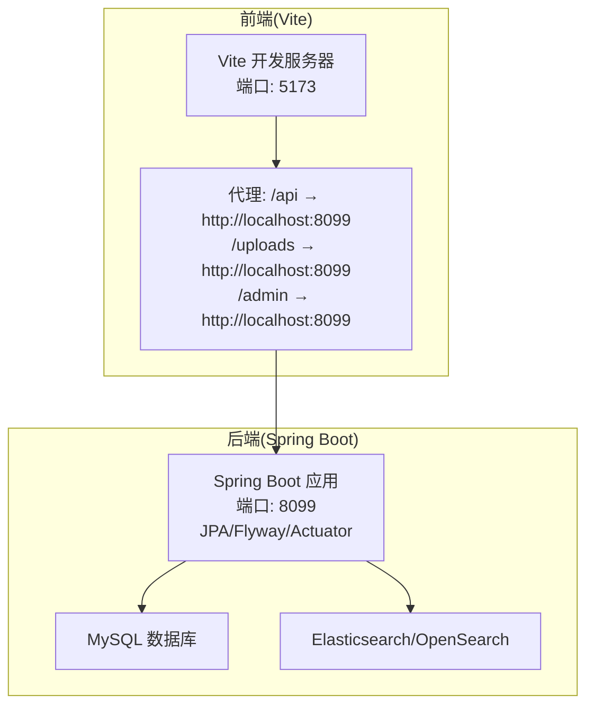
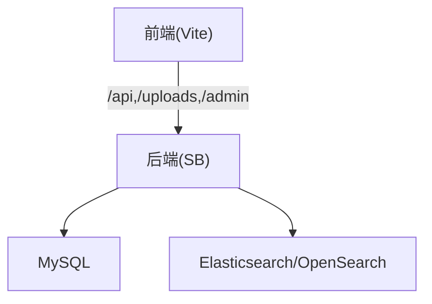
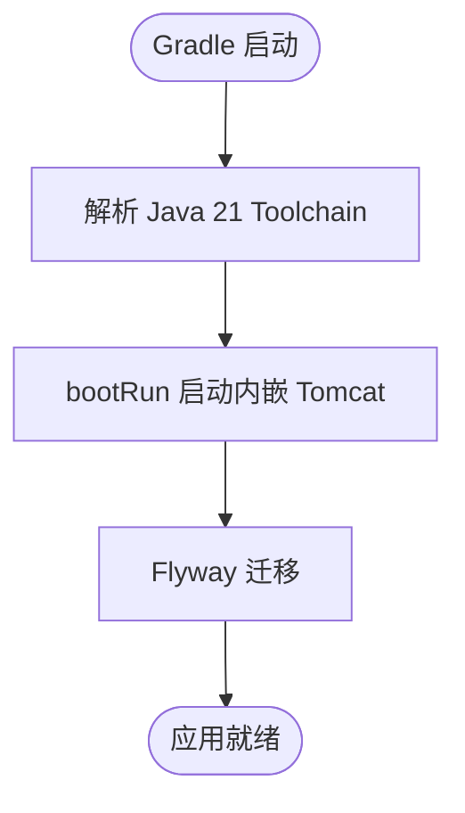
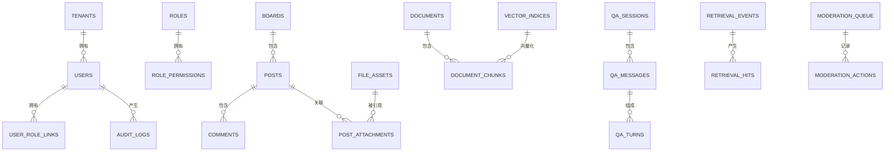
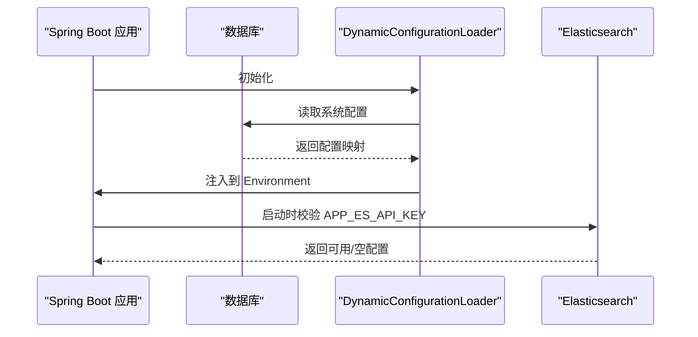
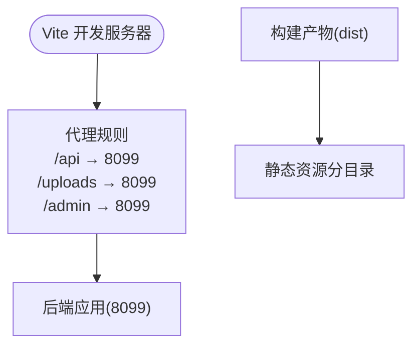
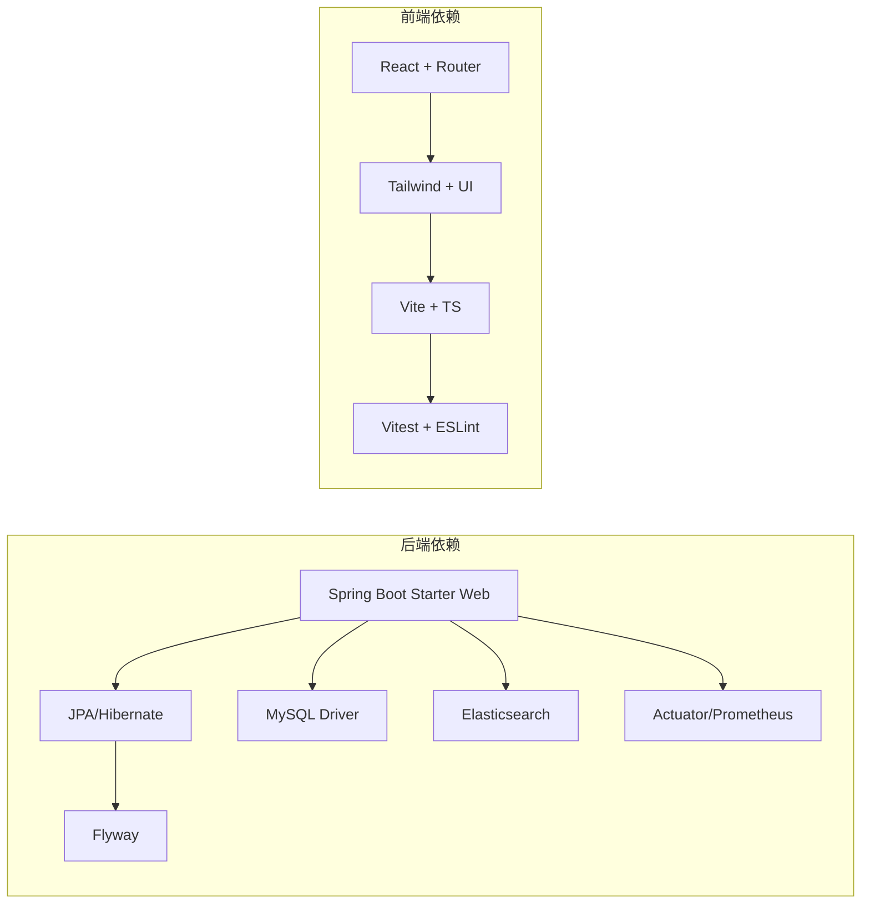

# 开发环境

<cite>
**本文引用的文件**
- [build.gradle](file://build.gradle)
- [settings.gradle](file://settings.gradle)
- [gradle.properties](file://gradle.properties)
- [gradle-wrapper.properties](file://gradle/wrapper/gradle-wrapper.properties)
- [application.properties](file://src/main/resources/application.properties)
- [logback-spring.xml](file://src/main/resources/logback-spring.xml)
- [V1__table_design.sql](file://src/main/resources/db/migration/V1__table_design.sql)
- [package.json](file://my-vite-app/package.json)
- [vite.config.ts](file://my-vite-app/vite.config.ts)
- [tsconfig.json](file://my-vite-app/tsconfig.json)
- [run-jmeter.ps1](file://perf/jmeter/run-jmeter.ps1)
- [EsAuthProperties.java](file://src/main/java/com/example/EnterpriseRagCommunity/config/EsAuthProperties.java)
- [ElasticsearchAuthConfigValidator.java](file://src/main/java/com/example/EnterpriseRagCommunity/config/ElasticsearchAuthConfigValidator.java)
- [DynamicConfigurationLoader.java](file://src/main/java/com/example/EnterpriseRagCommunity/config/DynamicConfigurationLoader.java)
- [SetupController.java](file://src/main/java/com/example/EnterpriseRagCommunity/controller/SetupController.java)
- [ImportConfigurationForm.tsx](file://my-vite-app/src/components/initialization/ImportConfigurationForm.tsx)
</cite>

## 目录
1. [简介](#简介)
2. [项目结构](#项目结构)
3. [核心组件](#核心组件)
4. [架构总览](#架构总览)
5. [详细组件分析](#详细组件分析)
6. [依赖分析](#依赖分析)
7. [性能考虑](#性能考虑)
8. [故障排查指南](#故障排查指南)
9. [结论](#结论)
10. [附录](#附录)

## 简介
本指南面向企业级RAG社区平台的本地开发环境搭建，覆盖后端Spring Boot应用与前端Vite工程的完整链路，包括JDK、MySQL、Elasticsearch/OpenSearch、日志与构建工具的配置要点，以及Gradle与Vite的启动方式、IDE配置建议、调试技巧、容器化部署思路、常见问题与最佳实践，帮助开发者快速上手并稳定迭代。

## 项目结构
该仓库采用“后端Spring Boot + 前端Vite”的双工程布局：
- 后端：Spring Boot 3 应用，使用Tomcat内嵌、JPA/Hibernate、Flyway迁移、Actuator/Prometheus、安全与邮件等模块。
- 前端：Vite React 应用，通过代理将 /api、/uploads、/admin 请求转发至后端8099端口。
- 性能压测：提供JMeter脚本与测试计划，便于在本地进行基础负载测试。

**图表来源**
- [application.properties:27-31](file://src/main/resources/application.properties#L27-L31)
- [vite.config.ts:64-77](file://my-vite-app/vite.config.ts#L64-L77)
- [build.gradle:104-111](file://build.gradle#L104-L111)

**章节来源**
- [build.gradle:104-111](file://build.gradle#L104-L111)
- [application.properties:27-31](file://src/main/resources/application.properties#L27-L31)
- [vite.config.ts:64-77](file://my-vite-app/vite.config.ts#L64-L77)

## 核心组件
- 构建与运行
  - Gradle 9.x + Java 21 Toolchain，Spring Boot 3.5.x，Tomcat内嵌，DevTools热加载。
  - 默认打包为 WAR，禁用 JAR。
- 数据持久化
  - MySQL 8.0 + InnoDB + utf8mb4，Flyway迁移，初始表结构见 V1 版本。
  - HikariCP 连接池参数可由环境变量注入。
- 搜索与向量
  - Spring Data Elasticsearch 客户端，支持连接超时、Socket超时、用户名/密码与API Key。
  - 默认OpenSearch平台参数可配置，便于对接阿里云OpenSearch。
- 日志
  - Logback，控制台与文件编码UTF-8，支持滚动策略与文件大小限制。
- 前端
  - Vite + React + SWC，代理后端接口，构建产物包含manifest与静态资源分目录。
- 性能与监控
  - Actuator + Prometheus，JVM内存与并发参数在Gradle中统一配置。

**章节来源**
- [build.gradle:37-53](file://build.gradle#L37-L53)
- [gradle.properties:1-13](file://gradle.properties#L1-L13)
- [application.properties:7-84](file://src/main/resources/application.properties#L7-L84)
- [logback-spring.xml:1-8](file://src/main/resources/logback-spring.xml#L1-L8)
- [V1__table_design.sql:1-14](file://src/main/resources/db/migration/V1__table_design.sql#L1-L14)

## 架构总览
后端负责业务逻辑、认证授权、内容管理、RAG检索与审核流水线；前端提供管理后台与门户页面，通过代理访问后端API；数据库与搜索引擎作为基础设施，分别承载结构化数据与非结构化检索能力。

**图表来源**
- [vite.config.ts:64-77](file://my-vite-app/vite.config.ts#L64-L77)
- [application.properties:7-84](file://src/main/resources/application.properties#L7-L84)

## 详细组件分析

### 后端构建与运行配置
- JDK与工具链
  - 使用 Gradle Toolchain 指定 Java 21，确保编译与运行一致。
- Spring Boot与嵌入式容器
  - 启用 Web、Validation、Mail、JPA、Security、Actuator、Prometheus。
  - DevTools 开发期热加载，禁用 JAR 打包，生成 WAR。
- 测试与覆盖率
  - JUnit 5、Mockito、Testcontainers，Jacoco 覆盖率报告，支持聚焦类覆盖率任务。
- 依赖与镜像
  - Maven 中央镜像与阿里云镜像，提升依赖下载稳定性。

**图表来源**
- [build.gradle:37-53](file://build.gradle#L37-L53)
- [build.gradle:92-101](file://build.gradle#L92-L101)
- [build.gradle:104-111](file://build.gradle#L104-L111)

**章节来源**
- [build.gradle:37-53](file://build.gradle#L37-L53)
- [build.gradle:92-101](file://build.gradle#L92-L101)
- [build.gradle:104-111](file://build.gradle#L104-L111)
- [settings.gradle:1-15](file://settings.gradle#L1-L15)
- [gradle.properties:1-13](file://gradle.properties#L1-L13)

### 数据库与迁移
- 连接与池化
  - JDBC URL、用户名/密码、HikariCP 参数均可通过环境变量注入。
- 迁移
  - Flyway 启用，迁移脚本位于 classpath:db/migration，初始版本为 V1。
- 表结构
  - V1 包含租户、用户、角色、权限、会话、内容、RAG文档/分片、审核队列、指标与通知等核心表。

**图表来源**
- [V1__table_design.sql:6-800](file://src/main/resources/db/migration/V1__table_design.sql#L6-L800)

**章节来源**
- [application.properties:7-16](file://src/main/resources/application.properties#L7-L16)
- [application.properties:18-24](file://src/main/resources/application.properties#L18-L24)
- [V1__table_design.sql:1-14](file://src/main/resources/db/migration/V1__table_design.sql#L1-L14)

### 搜索与认证配置
- Elasticsearch/OpenSearch
  - 支持连接超时、Socket超时、用户名/密码与API Key；默认从数据库动态配置加载。
  - 启动时对API Key配置进行校验，无密钥时提示安全集群可能返回401。
- 动态配置加载
  - 启动时将数据库中的系统配置注入到Spring Environment，实现“数据库即配置中心”。

**图表来源**
- [DynamicConfigurationLoader.java:24-45](file://src/main/java/com/example/EnterpriseRagCommunity/config/DynamicConfigurationLoader.java#L24-L45)
- [EsAuthProperties.java:1-24](file://src/main/java/com/example/EnterpriseRagCommunity/config/EsAuthProperties.java#L1-L24)
- [ElasticsearchAuthConfigValidator.java:23-31](file://src/main/java/com/example/EnterpriseRagCommunity/config/ElasticsearchAuthConfigValidator.java#L23-L31)

**章节来源**
- [application.properties:72-82](file://src/main/resources/application.properties#L72-L82)
- [EsAuthProperties.java:1-24](file://src/main/java/com/example/EnterpriseRagCommunity/config/EsAuthProperties.java#L1-L24)
- [ElasticsearchAuthConfigValidator.java:1-32](file://src/main/java/com/example/EnterpriseRagCommunity/config/ElasticsearchAuthConfigValidator.java#L1-L32)
- [DynamicConfigurationLoader.java:1-46](file://src/main/java/com/example/EnterpriseRagCommunity/config/DynamicConfigurationLoader.java#L1-L46)

### 前端开发与代理
- 代理规则
  - 将 /api、/uploads、/admin 请求转发至后端 8099 端口，便于联调。
- 构建与别名
  - 构建生成 manifest，静态资源按类型分目录；tsconfig 设置 baseUrl 与路径别名 /components/* → src/components/*。
- 依赖与脚本
  - React、React Router、Tailwind、Axios 等；提供 dev/build/lint/preview/test 等脚本。

**图表来源**
- [vite.config.ts:64-77](file://my-vite-app/vite.config.ts#L64-L77)
- [vite.config.ts:91-114](file://my-vite-app/vite.config.ts#L91-L114)
- [tsconfig.json:3-10](file://my-vite-app/tsconfig.json#L3-L10)

**章节来源**
- [vite.config.ts:64-77](file://my-vite-app/vite.config.ts#L64-L77)
- [vite.config.ts:91-114](file://my-vite-app/vite.config.ts#L91-L114)
- [tsconfig.json:3-10](file://my-vite-app/tsconfig.json#L3-L10)
- [package.json:6-12](file://my-vite-app/package.json#L6-L12)

### 日志与运行参数
- 日志
  - 控制台与文件编码 UTF-8，滚动策略与文件大小上限可配置。
- JVM 与 Gradle
  - Gradle JVM 参数统一设置，避免不同环境差异；Spring 虚拟线程开启。

**章节来源**
- [logback-spring.xml:1-8](file://src/main/resources/logback-spring.xml#L1-L8)
- [gradle.properties:1-1](file://gradle.properties#L1-L1)
- [application.properties:5-5](file://src/main/resources/application.properties#L5-L5)

## 依赖分析
- 后端依赖
  - Web、Validation、Mail、JPA、Security、Actuator、Prometheus、Tomcat JSP/JSTL、Flyway、MySQL Connector、POI/Tika、Elasticsearch等。
- 前端依赖
  - React 生态、UI 工具库、Tailwind、Vitest、ESLint、TypeScript、Vite 插件等。
- 测试与集成
  - JUnit 5、Mockito、Testcontainers（MySQL）、Jacoco 覆盖率、聚焦类覆盖率任务。

**图表来源**
- [build.gradle:104-137](file://build.gradle#L104-L137)
- [package.json:14-76](file://my-vite-app/package.json#L14-L76)

**章节来源**
- [build.gradle:104-137](file://build.gradle#L104-L137)
- [package.json:14-76](file://my-vite-app/package.json#L14-L76)

## 性能考虑
- JVM 与并发
  - Gradle 统一设置 JVM 参数，启用虚拟线程，限制元空间大小，避免测试期间内存抖动。
- 数据库与搜索
  - HikariCP 参数可调，Flyway 迁移避免缺失位置导致失败；Elasticsearch 连接/Socket 超时合理配置。
- 前端构建
  - 构建产物按类型分目录，manifest 便于缓存与版本管理；代理减少跨域与重复请求。

**章节来源**
- [build.gradle:55-66](file://build.gradle#L55-L66)
- [application.properties:11-16](file://src/main/resources/application.properties#L11-L16)
- [application.properties:79-82](file://src/main/resources/application.properties#L79-L82)
- [vite.config.ts:95-114](file://my-vite-app/vite.config.ts#L95-L114)

## 故障排查指南
- 启动失败（数据库连接）
  - 检查 JDBC URL、用户名/密码与网络连通性；确认数据库存在且字符集为 utf8mb4。
  - 参考：[application.properties:7-16](file://src/main/resources/application.properties#L7-L16)
- 启动失败（Flyway 迁移）
  - 检查迁移脚本位置与编码；baseline-on-migrate 与 baseline-version 配置。
  - 参考：[application.properties:18-24](file://src/main/resources/application.properties#L18-L24)
- 启动失败（Elasticsearch 认证）
  - 若启用安全，需在数据库保存 APP_ES_API_KEY；否则将收到 401。
  - 参考：[ElasticsearchAuthConfigValidator.java:23-31](file://src/main/java/com/example/EnterpriseRagCommunity/config/ElasticsearchAuthConfigValidator.java#L23-L31)
- 前端无法访问后端接口
  - 确认 Vite 代理已配置 /api、/uploads、/admin 指向 8099；浏览器 Network 面板检查跨域与重定向。
  - 参考：[vite.config.ts:64-77](file://my-vite-app/vite.config.ts#L64-L77)
- 日志乱码或编码异常
  - 确认 logback 与系统编码一致，UTF-8。
  - 参考：[logback-spring.xml:1-8](file://src/main/resources/logback-spring.xml#L1-L8)
- 性能压测
  - 使用 JMeter 脚本执行基础负载测试，检查结果与日志。
  - 参考：[run-jmeter.ps1:1-74](file://perf/jmeter/run-jmeter.ps1#L1-L74)

**章节来源**
- [application.properties:7-24](file://src/main/resources/application.properties#L7-L24)
- [ElasticsearchAuthConfigValidator.java:23-31](file://src/main/java/com/example/EnterpriseRagCommunity/config/ElasticsearchAuthConfigValidator.java#L23-L31)
- [vite.config.ts:64-77](file://my-vite-app/vite.config.ts#L64-L77)
- [logback-spring.xml:1-8](file://src/main/resources/logback-spring.xml#L1-L8)
- [run-jmeter.ps1:1-74](file://perf/jmeter/run-jmeter.ps1#L1-L74)

## 结论
本指南提供了从JDK、数据库、搜索到前后端与性能测试的全链路开发环境设置方法。遵循本文步骤，可在本地快速搭建稳定可迭代的企业级RAG社区平台开发环境，并通过动态配置与代理机制实现高效联调。

## 附录

### 本地开发环境搭建步骤
- JDK 与 Gradle
  - 安装 JDK 21，Gradle 9.x；Gradle Wrapper 已内置。
  - 参考：[gradle-wrapper.properties:1-8](file://gradle/wrapper/gradle-wrapper.properties#L1-L8)
- 数据库
  - 安装 MySQL 8.0，创建数据库（或使用 createDatabaseIfNotExist），准备 Flyway 迁移。
  - 参考：[application.properties:7-24](file://src/main/resources/application.properties#L7-L24)
- 搜索引擎
  - 准备 Elasticsearch 或 OpenSearch 实例；如启用安全，准备 API Key 并保存至数据库。
  - 参考：[application.properties:72-82](file://src/main/resources/application.properties#L72-L82)
- 后端启动
  - 在项目根目录执行 Gradle bootRun，默认端口 8099。
  - 参考：[build.gradle:92-101](file://build.gradle#L92-L101)
- 前端启动
  - 在 my-vite-app 目录执行 npm run dev，默认端口 5173，自动代理后端接口。
  - 参考：[package.json:6-12](file://my-vite-app/package.json#L6-L12)，[vite.config.ts:64-77](file://my-vite-app/vite.config.ts#L64-L77)
- IDE 配置建议
  - 使用 IntelliJ IDEA 或 VS Code，启用 Lombok、Spring Boot Dashboard、ESLint、TypeScript。
  - 后端启用 DevTools 热加载；前端启用 Vite 预览与代理。
- 调试技巧
  - 后端：通过 bootRun 附加调试；Gradle JVM 参数已在构建脚本中统一设置。
  - 前端：Vite dev + React DevTools + ESLint 即时报错。
- Docker 容器化部署（思路）
  - 后端：基于 OpenJDK 21 镜像，复制 WAR 与配置，暴露 8099 端口。
  - 前端：基于 Nginx 或 Node 镜像，构建产物 dist 部署，反向代理 /api → 后端。
  - 数据库与搜索：使用官方镜像，挂载卷与环境变量。
  - 注意：本仓库未提供现成 docker-compose，请根据上述思路自行编写。
- 测试环境与生产环境差异
  - 测试环境：使用 Testcontainers 的 MySQL 容器，Flyway locations 指向测试资源。
  - 生产环境：Flyway locations 指向 classpath:db/migration，日志与监控启用。
  - 参考：[application.properties:18-24](file://src/main/resources/application.properties#L18-L24)