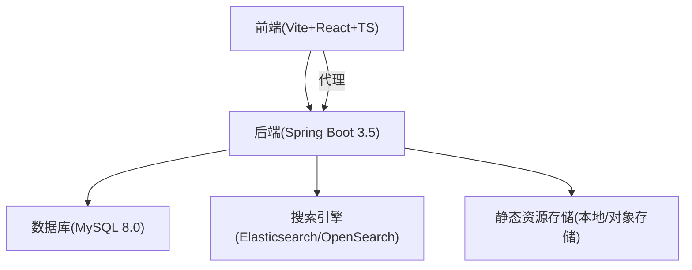
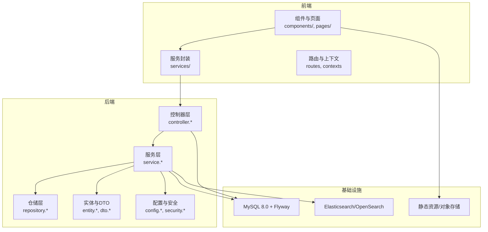
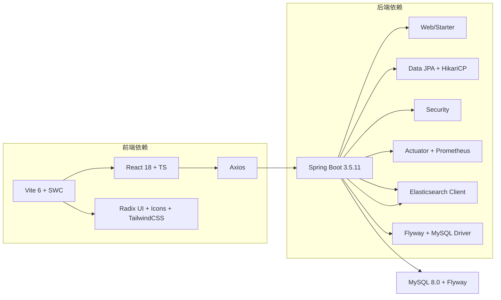

# 技术栈

<cite>
**本文引用的文件**
- [build.gradle](file://build.gradle)
- [settings.gradle](file://settings.gradle)
- [gradle.properties](file://gradle.properties)
- [application.properties](file://src/main/resources/application.properties)
- [EnterpriseRagCommunityApplication.java](file://src/main/java/com/example/EnterpriseRagCommunity/EnterpriseRagCommunityApplication.java)
- [V1__table_design.sql](file://src/main/resources/db/migration/V1__table_design.sql)
- [package.json](file://my-vite-app/package.json)
- [vite.config.ts](file://my-vite-app/vite.config.ts)
- [tsconfig.json](file://my-vite-app/tsconfig.json)
- [tailwind.config.js](file://my-vite-app/tailwind.config.js)
- [postcss.config.js](file://my-vite-app/postcss.config.js)
</cite>

## 目录
1. [引言](#引言)
2. [项目结构](#项目结构)
3. [核心组件](#核心组件)
4. [架构总览](#架构总览)
5. [详细组件分析](#详细组件分析)
6. [依赖关系分析](#依赖关系分析)
7. [性能考量](#性能考量)
8. [故障排查指南](#故障排查指南)
9. [结论](#结论)
10. [附录](#附录)

## 引言
本文件面向企业级RAG社区平台，系统梳理后端技术栈（Spring Boot、Java、数据库与缓存）、前端技术栈（Vite、React、TypeScript、UI生态）、中间件与基础设施（消息队列、搜索引擎、存储服务），并解释微服务架构设计与模块划分原则，辅以技术选型的决策依据与优势分析，帮助读者快速理解并高效落地。

## 项目结构
该工程采用前后端分离架构：
- 后端：基于Spring Boot 3.5.x，使用Gradle构建，JDK 21工具链，MySQL 8.0 + Flyway迁移，集成Elasticsearch/OpenSearch作为检索与向量化索引支撑。
- 前端：基于Vite 6 + React 18 + TypeScript 5.7，TailwindCSS + shadcn/ui风格体系，Axios进行HTTP通信，路由使用React Router 7。
- 数据库：统一采用utf8mb4字符集、InnoDB引擎，Flyway管理迁移脚本，包含用户、内容、RAG检索、审核流水线、指标与成本等完整业务表。

**图表来源**
- [EnterpriseRagCommunityApplication.java:20-24](file://src/main/java/com/example/EnterpriseRagCommunity/EnterpriseRagCommunityApplication.java#L20-L24)
- [application.properties:7-83](file://src/main/resources/application.properties#L7-L83)
- [build.gradle:102-138](file://build.gradle#L102-L138)
- [package.json:14-51](file://my-vite-app/package.json#L14-L51)

**章节来源**
- [settings.gradle:1-15](file://settings.gradle#L1-L15)
- [gradle.properties:1-13](file://gradle.properties#L1-L13)
- [build.gradle:14-53](file://build.gradle#L14-L53)
- [application.properties:1-84](file://src/main/resources/application.properties#L1-L84)

## 核心组件
- 后端框架与运行环境
  - Spring Boot 3.5.11，启用异步与Spring Data Web DTO序列化，排除Flyway与Elasticsearch Repositories自动配置，显式注册JSP视图解析器。
  - JDK 21工具链，Gradle测试配置提升堆内存与并发控制，支持Jacoco覆盖率与Sonar质量门禁。
  - 数据持久层：Spring Data JPA + HikariCP连接池 + Flyway迁移。
  - 搜索与向量化：Spring Data Elasticsearch客户端，OpenSearch平台配置项。
- 前端框架与构建
  - Vite 6 + React 18 + TypeScript 5.7，SWC React插件，开发服务器代理后端API。
  - UI生态：Radix UI、Lucide React、Heroicons、FontAwesome等，TailwindCSS + shadcn/ui组件风格。
  - 构建产物：manifest清单、按类型分目录的静态资源命名策略，支持字体与样式资源复制。
- 数据库与迁移
  - Flyway迁移脚本V1__table_design.sql，涵盖租户、用户、角色权限、内容、RAG文档与分片、检索事件、审核队列、指标与成本等核心表。
  - 字符集与索引：统一utf8mb4，InnoDB，全文索引与复合索引覆盖高频查询。

**章节来源**
- [EnterpriseRagCommunityApplication.java:20-52](file://src/main/java/com/example/EnterpriseRagCommunity/EnterpriseRagCommunityApplication.java#L20-L52)
- [build.gradle:102-138](file://build.gradle#L102-L138)
- [application.properties:7-83](file://src/main/resources/application.properties#L7-L83)
- [V1__table_design.sql:1-800](file://src/main/resources/db/migration/V1__table_design.sql#L1-L800)
- [package.json:14-51](file://my-vite-app/package.json#L14-L51)
- [vite.config.ts:57-115](file://my-vite-app/vite.config.ts#L57-L115)

## 架构总览
后端采用单体架构，围绕“内容+RAG+审核+指标”四大域划分模块，通过清晰的包结构与职责边界实现高内聚低耦合。前端通过Vite代理与后端交互，静态资源由后端统一托管或外部对象存储承载。

**图表来源**
- [EnterpriseRagCommunityApplication.java:20-24](file://src/main/java/com/example/EnterpriseRagCommunity/EnterpriseRagCommunityApplication.java#L20-L24)
- [build.gradle:102-138](file://build.gradle#L102-L138)
- [application.properties:7-83](file://src/main/resources/application.properties#L7-L83)

## 详细组件分析

### 后端技术栈与配置
- Spring Boot与运行时
  - 排除Flyway与Elasticsearch Repositories自动配置，避免与自定义初始化冲突。
  - 开启@EnableAsync支持异步任务；开启Spring Data Web DTO序列化，降低循环引用与传输体积。
  - 显式注册InternalResourceViewResolver，支持JSP视图（/home、/converted）。
- 数据库与连接池
  - MySQL驱动与HikariCP连接池参数可配置，支持最大池大小、空闲超时、最大生存时间等。
  - Flyway启用，支持迁移位置、编码与基线策略。
- 搜索与向量化
  - Spring Data Elasticsearch客户端版本与连接/Socket超时可配置。
  - OpenSearch平台参数支持主机、工作空间、服务ID与超时配置。
- 日志与性能
  - 日志文件滚动策略、级别与访问日志体截断可配置。
  - 虚拟线程开启，Tomcat表单大小上限提升以适配大文件上传。

**章节来源**
- [EnterpriseRagCommunityApplication.java:20-52](file://src/main/java/com/example/EnterpriseRagCommunity/EnterpriseRagCommunityApplication.java#L20-L52)
- [application.properties:7-83](file://src/main/resources/application.properties#L7-L83)
- [build.gradle:102-138](file://build.gradle#L102-L138)

### 数据库设计与缓存策略
- 表结构概览
  - 租户与用户：支持多租户与用户会话、TOTP、登录尝试与审计日志。
  - 权限与角色：内置角色、用户-角色关联、细粒度权限矩阵。
  - 内容与组织：板块、帖子、草稿、版本、评论与层级闭包表。
  - 文件资产：统一文件索引与附件关联，支持图片元数据。
  - RAG与检索：文档、分片与嵌入、向量索引元信息、检索事件与命中明细、上下文窗口。
  - 审核流水线：规则、相似度命中、审核队列、动作与风险标签。
  - 指标与成本：通用指标事件、评测批与样本、评测结果、成本明细、效率统计。
- 缓存与热点
  - 热度分缓存表hot_scores，按24h/7d/累计分与衰减基数维护，定期重算。
  - 检索命中与上下文窗口记录，便于后续优化与重排。
- 索引与全文
  - 文档分片与QA消息均建立全文索引，检索事件表与命中明细支持多路召回与重排。

**章节来源**
- [V1__table_design.sql:6-800](file://src/main/resources/db/migration/V1__table_design.sql#L6-L800)

### 前端技术栈与构建
- 框架与生态
  - React 18 + TypeScript 5.7，SWC加速编译，Testing Library与Vitest测试。
  - UI组件：Radix UI、Lucide、Heroicons、FontAwesome；TailwindCSS + shadcn/ui。
  - Markdown渲染：react-markdown + rehype插件链；图表：ECharts。
- 构建与开发
  - Vite开发服务器代理后端API（/api、/uploads、/admin），支持字体与样式资源复制。
  - 构建产物包含manifest，按JS/CSS/图片/字体分类命名，便于CDN与缓存管理。
- 路由与别名
  - React Router 7，路径别名“/components”指向src/components，提升导入一致性。

**章节来源**
- [package.json:14-81](file://my-vite-app/package.json#L14-L81)
- [vite.config.ts:57-115](file://my-vite-app/vite.config.ts#L57-L115)
- [tsconfig.json:3-10](file://my-vite-app/tsconfig.json#L3-L10)
- [tailwind.config.js:1-65](file://my-vite-app/tailwind.config.js#L1-L65)
- [postcss.config.js:1-7](file://my-vite-app/postcss.config.js#L1-L7)

### 中间件与基础设施
- 消息队列
  - 未在Gradle依赖中发现消息队列客户端，建议结合业务异步需求引入RabbitMQ/Kafka等。
- 搜索引擎
  - Spring Data Elasticsearch客户端与OpenSearch平台参数已配置，满足检索与向量化召回。
- 存储服务
  - 上传大小上限与静态资源托管配置明确，可对接对象存储（如阿里云OSS）实现高可用与CDN加速。

**章节来源**
- [build.gradle:102-138](file://build.gradle#L102-L138)
- [application.properties:33-36](file://src/main/resources/application.properties#L33-L36)
- [application.properties:72-76](file://src/main/resources/application.properties#L72-L76)

### 微服务架构设计与模块划分
- 单体到微服务演进原则
  - 以业务域为核心划分模块：内容域（用户、帖子、评论、草稿）、RAG域（文档、分片、检索、评测）、审核域（规则、队列、动作）、指标与成本域。
  - 通过清晰的包结构与接口契约隔离，逐步拆分跨域依赖，最终形成独立服务。
- 模块内聚与边界
  - 控制器层仅负责请求编排与异常转换；服务层封装业务规则与跨表事务；仓储层抽象数据访问；实体与DTO严格区分。
- 配置与安全
  - Spring Security与方法级安全配置，结合权限矩阵与角色作用域，确保跨模块访问控制一致。

**章节来源**
- [EnterpriseRagCommunityApplication.java:20-24](file://src/main/java/com/example/EnterpriseRagCommunity/EnterpriseRagCommunityApplication.java#L20-L24)
- [build.gradle:102-138](file://build.gradle#L102-L138)

## 依赖关系分析
后端依赖以Spring Boot Starter为核心，整合Web、JPA、Security、Actuator与Elasticsearch；前端依赖React、UI组件与构建工具链；数据库与迁移脚本通过Flyway统一管理。

**图表来源**
- [build.gradle:102-138](file://build.gradle#L102-L138)
- [package.json:14-51](file://my-vite-app/package.json#L14-L51)

**章节来源**
- [build.gradle:102-138](file://build.gradle#L102-L138)
- [package.json:14-51](file://my-vite-app/package.json#L14-L51)

## 性能考量
- JVM与测试
  - Gradle测试任务设置最大堆与元空间限制，限制并行fork数量，减少GC压力。
- 数据库
  - Flyway基线迁移与UTF8MB4统一字符集，避免跨库字符集不一致导致的性能问题。
  - 关键查询建立复合索引与全文索引，检索事件与命中明细表支持多路召回与重排。
- 搜索与向量化
  - Elasticsearch连接与Socket超时可配置，OpenSearch平台参数支持高并发场景。
- 前端构建
  - Vite按类型分目录输出静态资源，manifest便于缓存与版本管理；字体与样式资源复制保障CDN部署一致性。

**章节来源**
- [build.gradle:55-79](file://build.gradle#L55-L79)
- [application.properties:18-24](file://src/main/resources/application.properties#L18-L24)
- [application.properties:79-83](file://src/main/resources/application.properties#L79-L83)
- [vite.config.ts:95-114](file://my-vite-app/vite.config.ts#L95-L114)

## 故障排查指南
- 启动与JSP视图
  - 如JSP视图无法解析，检查InternalResourceViewResolver的前缀、后缀与视图名匹配。
- 数据库连接与迁移
  - 若Flyway迁移失败，确认数据库URL、凭据与迁移位置配置；检查基线版本与编码设置。
- 搜索与向量化
  - Elasticsearch连接超时或认证失败，检查用户名/密码与超时参数；确认OpenSearch平台参数正确。
- 前端代理与资源
  - 开发代理未生效或静态资源缺失，检查vite.config.ts代理配置与字体/样式复制插件。

**章节来源**
- [EnterpriseRagCommunityApplication.java:37-52](file://src/main/java/com/example/EnterpriseRagCommunity/EnterpriseRagCommunityApplication.java#L37-L52)
- [application.properties:7-83](file://src/main/resources/application.properties#L7-L83)
- [vite.config.ts:63-78](file://my-vite-app/vite.config.ts#L63-L78)

## 结论
本技术栈以Spring Boot 3.5 + JDK 21为核心，配合MySQL/Flyway与Elasticsearch/OpenSearch，构建了具备RAG检索、内容治理与审核流水线的企业级平台。前端采用Vite+React+TS与TailwindCSS，具备良好的开发体验与构建性能。建议在演进至微服务阶段时，结合业务域进一步拆分服务，并引入消息队列与对象存储以增强弹性与可扩展性。

## 附录
- 技术选型要点
  - 后端：Spring Boot 3.5聚焦现代化特性与性能；JDK 21工具链与虚拟线程提升吞吐；Elasticsearch/OpenSearch满足RAG检索与向量化。
  - 前端：Vite 6 + SWC显著缩短冷启动与热更新时间；React 18 + TS保障类型安全；TailwindCSS + shadcn/ui兼顾灵活性与一致性。
  - 数据库：Flyway统一迁移，utf8mb4与InnoDB满足国际化与高并发；全文索引与复合索引覆盖高频查询。
- 最佳实践
  - 后端：严格模块划分与接口契约；启用异步与缓存；完善监控与日志；持续集成覆盖率与质量门禁。
  - 前端：组件化与路由模块化；构建产物版本化与CDN缓存；测试驱动与覆盖率校验。