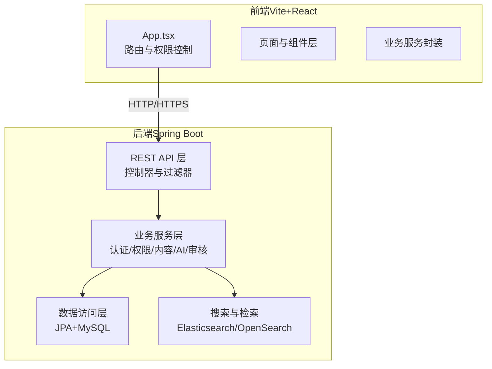
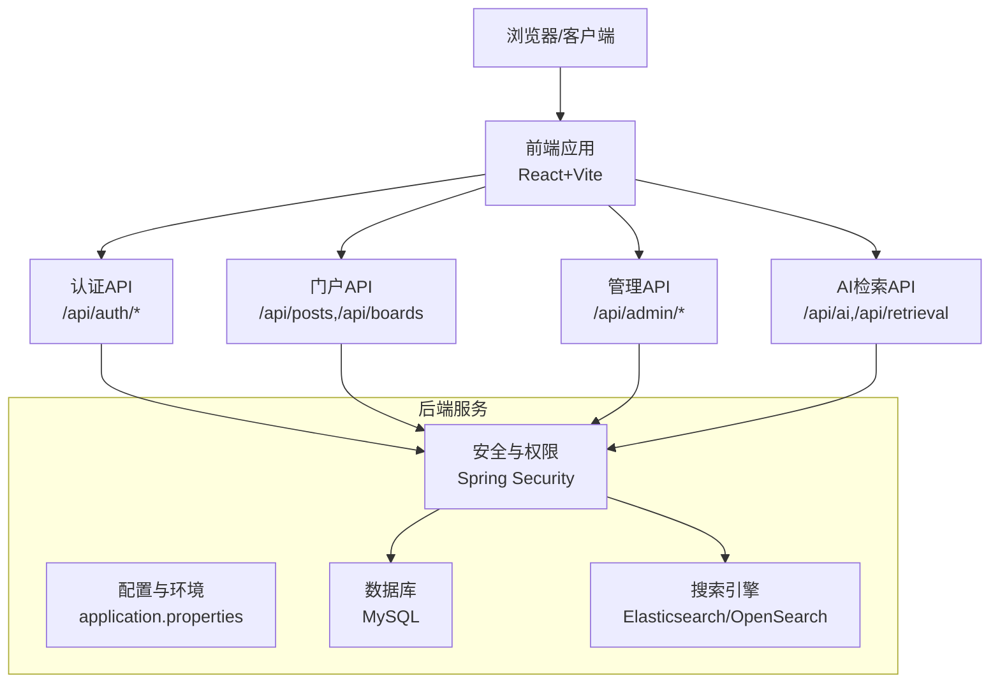
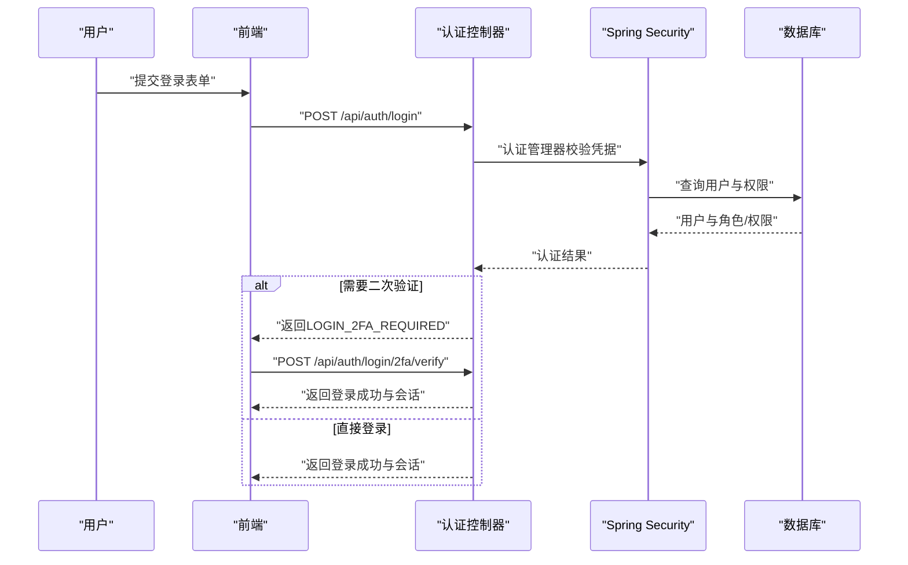
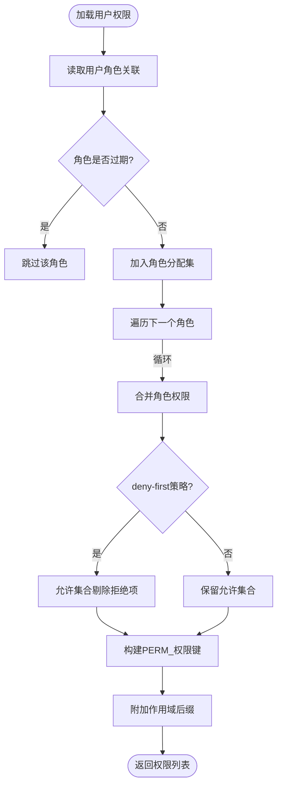
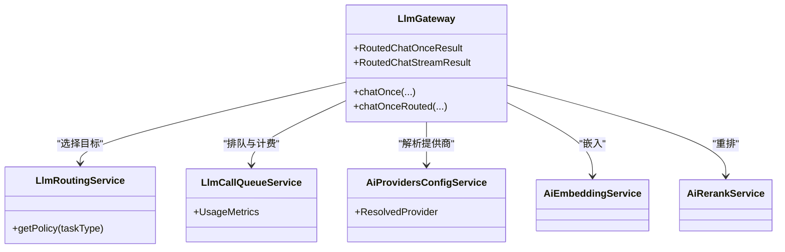
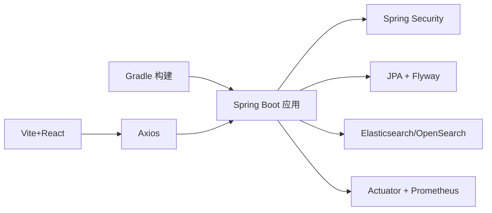

# 架构总览

<cite>
**本文档引用的文件**
- [EnterpriseRagCommunityApplication.java](file://src/main/java/com/example/EnterpriseRagCommunity/EnterpriseRagCommunityApplication.java)
- [application.properties](file://src/main/resources/application.properties)
- [SecurityConfig.java](file://src/main/java/com/example/EnterpriseRagCommunity/config/SecurityConfig.java)
- [MethodSecurityConfig.java](file://src/main/java/com/example/EnterpriseRagCommunity/config/MethodSecurityConfig.java)
- [Permissions.java](file://src/main/java/com/example/EnterpriseRagCommunity/security/Permissions.java)
- [AuthController.java](file://src/main/java/com/example/EnterpriseRagCommunity/controller/AuthController.java)
- [AccessControlService.java](file://src/main/java/com/example/EnterpriseRagCommunity/service/access/AccessControlService.java)
- [App.tsx](file://my-vite-app/src/App.tsx)
- [package.json](file://my-vite-app/package.json)
- [build.gradle](file://build.gradle)
</cite>

## 目录
1. [引言](#引言)
2. [项目结构](#项目结构)
3. [核心组件](#核心组件)
4. [架构总览](#架构总览)
5. [详细组件分析](#详细组件分析)
6. [依赖分析](#依赖分析)
7. [性能考虑](#性能考虑)
8. [故障排除指南](#故障排除指南)
9. [结论](#结论)
10. [附录](#附录)

## 引言
本文件为企业级RAG社区平台的架构总览文档，面向技术与非技术读者，系统阐述整体系统架构设计、前后端分离模式、微服务划分、数据流向、核心模块职责与交互关系、安全架构设计（权限控制、数据加密、访问日志）、部署架构与扩展性考虑，并提供架构图表与组件关系说明。

## 项目结构
系统采用前后端分离架构：
- 后端：基于Spring Boot的Java应用，提供REST API、认证授权、内容管理、AI服务编排、审核系统、监控与审计等能力。
- 前端：基于React + Vite的单页应用（SPA），通过Axios与后端API交互，实现门户、管理后台、智能助手等功能。

**图表来源**
- [App.tsx:1-352](file://my-vite-app/src/App.tsx#L1-L352)
- [EnterpriseRagCommunityApplication.java:1-64](file://src/main/java/com/example/EnterpriseRagCommunity/EnterpriseRagCommunityApplication.java#L1-L64)

**章节来源**
- [App.tsx:1-352](file://my-vite-app/src/App.tsx#L1-L352)
- [build.gradle:102-138](file://build.gradle#L102-L138)

## 核心组件
- 应用入口与容器
  - 后端入口类负责启动Spring Boot应用、注册JSP视图解析器，支持传统JSP与现代API共存。
  - 前端通过Vite构建，打包产物位于dist目录，运行时由后端静态资源策略或独立Nginx提供。
- 安全与认证
  - Spring Security配置双链路：API专用过滤链与Web页面过滤链；支持CSRF、CORS、会话管理、2FA策略。
  - 认证控制器提供登录、二次验证、登出、CSRF令牌获取等接口。
  - 权限体系基于角色与细粒度权限，支持作用域限定。
- 数据与存储
  - MySQL作为主数据库，Flyway迁移；JPA访问；Elasticsearch/OpenSearch用于检索与向量化索引。
- AI与RAG
  - LLM网关统一编排多提供商模型调用、排队与计费、重排与嵌入、流式与一次性对话。
- 审核与内容
  - 审核流水线、规则引擎、证据链与日志追踪；内容安全熔断器与访问日志过滤器。
- 监控与可观测性
  - Actuator + Prometheus指标；日志滚动策略；访问/审计日志。

**章节来源**
- [EnterpriseRagCommunityApplication.java:20-64](file://src/main/java/com/example/EnterpriseRagCommunity/EnterpriseRagCommunityApplication.java#L20-L64)
- [SecurityConfig.java:74-236](file://src/main/java/com/example/EnterpriseRagCommunity/config/SecurityConfig.java#L74-L236)
- [AuthController.java:321-725](file://src/main/java/com/example/EnterpriseRagCommunity/controller/AuthController.java#L321-L725)
- [AccessControlService.java:31-222](file://src/main/java/com/example/EnterpriseRagCommunity/service/access/AccessControlService.java#L31-L222)
- [application.properties:1-84](file://src/main/resources/application.properties#L1-L84)

## 架构总览
系统采用“前端SPA + 后端API + 数据与搜索”的三层架构，结合细粒度权限与AI服务编排，形成可扩展的企业级RAG社区平台。

**图表来源**
- [App.tsx:104-323](file://my-vite-app/src/App.tsx#L104-L323)
- [SecurityConfig.java:74-236](file://src/main/java/com/example/EnterpriseRagCommunity/config/SecurityConfig.java#L74-L236)
- [application.properties:72-84](file://src/main/resources/application.properties#L72-L84)

## 详细组件分析

### 安全与认证架构
- 双过滤链设计
  - API过滤链：仅对/api/**生效，强制认证，支持CSRF与CORS；放行初始化、公开接口与部分管理端点。
  - Web过滤链：对其他请求生效，SPA路由交由前端处理，保持会话与CSRF。
- 2FA策略与登录流程
  - 登录后根据策略决定是否触发邮箱/TOTP二次验证；二次验证通过后完成会话建立。
- 权限体系
  - 基于角色（ROLE_）与细粒度权限（PERM_）组合；支持全局与作用域权限；权限字符串生成工具类提供命名规范。
- 审计与日志
  - 认证与操作审计日志写入；访问日志过滤器捕获请求体与响应体（可配置大小）。

**图表来源**
- [AuthController.java:321-642](file://src/main/java/com/example/EnterpriseRagCommunity/controller/AuthController.java#L321-L642)
- [SecurityConfig.java:74-194](file://src/main/java/com/example/EnterpriseRagCommunity/config/SecurityConfig.java#L74-L194)

**章节来源**
- [SecurityConfig.java:74-236](file://src/main/java/com/example/EnterpriseRagCommunity/config/SecurityConfig.java#L74-L236)
- [AuthController.java:321-725](file://src/main/java/com/example/EnterpriseRagCommunity/controller/AuthController.java#L321-L725)
- [AccessControlService.java:31-118](file://src/main/java/com/example/EnterpriseRagCommunity/service/access/AccessControlService.java#L31-L118)
- [Permissions.java:8-25](file://src/main/java/com/example/EnterpriseRagCommunity/security/Permissions.java#L8-L25)

### 权限控制与作用域
- 权限模型
  - 角色：ROLE_USER、ROLE_ADMIN等；同时生成ROLE_ID_{id}便于调试。
  - 权限：PERM_{resource}:{action}，支持作用域后缀@TYPE:id。
- 权限构建
  - 在单事务内加载用户角色、角色权限与权限键，合并去重，支持deny-first策略。
- 前端路由守卫
  - 基于权限字符串与角色进行路由守卫，未授权跳转403。

**图表来源**
- [AccessControlService.java:120-200](file://src/main/java/com/example/EnterpriseRagCommunity/service/access/AccessControlService.java#L120-L200)
- [Permissions.java:13-22](file://src/main/java/com/example/EnterpriseRagCommunity/security/Permissions.java#L13-L22)

**章节来源**
- [AccessControlService.java:31-222](file://src/main/java/com/example/EnterpriseRagCommunity/service/access/AccessControlService.java#L31-L222)
- [Permissions.java:8-25](file://src/main/java/com/example/EnterpriseRagCommunity/security/Permissions.java#L8-L25)
- [App.tsx:54-102](file://my-vite-app/src/App.tsx#L54-L102)

### AI服务与RAG编排
- LLM网关
  - 提供一次性对话与流式对话；支持指定提供商/模型或自动路由；内置排队、计费、重排、嵌入与令牌统计。
- 模型路由与熔断
  - 基于策略选择目标提供商与模型；支持轮询与权重；异常时降级与重试。
- 向量化与检索
  - 结合OpenSearch/Elasticsearch构建向量索引，支持混合检索与引用溯源。

**图表来源**
- [LlmGateway.java:26-151](file://src/main/java/com/example/EnterpriseRagCommunity/service/ai/LlmGateway.java#L26-L151)

**章节来源**
- [LlmGateway.java:54-200](file://src/main/java/com/example/EnterpriseRagCommunity/service/ai/LlmGateway.java#L54-L200)

### 审核系统与内容治理
- 审核流水线
  - 规则自动执行、样本同步、队列管理与回退策略；支持证据链与风险标签。
- 内容安全
  - 内容安全熔断器过滤器，防止高风险内容传播；访问日志过滤器记录敏感信息（可配置）。
- 审计与追踪
  - 操作审计日志与审核轨迹，支持回溯与合规。

**章节来源**
- [SecurityConfig.java:36-42](file://src/main/java/com/example/EnterpriseRagCommunity/config/SecurityConfig.java#L36-L42)

### 前后端交互与路由
- 前端路由
  - 基于React Router v7的受保护路由与权限守卫；管理员入口按权限动态重定向。
- API交互
  - Axios封装各业务服务；前端通过CSRF Cookie与后端保持会话一致性。

**章节来源**
- [App.tsx:104-323](file://my-vite-app/src/App.tsx#L104-L323)
- [package.json:14-81](file://my-vite-app/package.json#L14-L81)

## 依赖分析
- 技术栈
  - 后端：Spring Boot 3.x、Spring Security、JPA、Flyway、Actuator、Micrometer、Elasticsearch、MySQL。
  - 前端：React 18、React Router 7、TailwindCSS、Vite、TypeScript。
- 构建与测试
  - Gradle多任务覆盖验证与Jacoco报告；集成测试与单元测试并行。
- 外部依赖
  - OpenSearch平台配置项用于检索与向量化；邮件服务用于验证码与通知。

**图表来源**
- [build.gradle:102-138](file://build.gradle#L102-L138)
- [package.json:14-81](file://my-vite-app/package.json#L14-L81)

**章节来源**
- [build.gradle:102-138](file://build.gradle#L102-L138)
- [application.properties:72-84](file://src/main/resources/application.properties#L72-L84)

## 性能考虑
- 并发与线程
  - 启用虚拟线程；Tomcat上传限制与文件大小上限；日志滚动策略控制磁盘占用。
- 缓存与索引
  - 搜索索引与向量索引优化查询延迟；AI调用排队与限流降低上游压力。
- 监控与可观测性
  - Actuator + Prometheus指标；日志级别与文件滚动策略；访问日志体截断避免过大日志。
- 前端体验
  - 路由懒加载减少首屏负载；Toast提示与骨架屏提升交互反馈。

**章节来源**
- [application.properties:33-50](file://src/main/resources/application.properties#L33-L50)
- [build.gradle:229-267](file://build.gradle#L229-L267)

## 故障排除指南
- 认证与会话
  - CSRF 403：确认前端正确携带Cookie与_token；检查忽略路径与属性名。
  - 2FA失败：检查邮箱/TOTP服务可用性与验证码有效期。
- 权限不足
  - 403：确认用户角色与权限键；检查作用域后缀；deny-first策略影响。
- 搜索与AI
  - 索引异常：检查OpenSearch/Elasticsearch连接参数与认证；查看日志定位。
  - AI调用超时：调整超时配置与重试策略；检查提供商可用性。
- 日志与审计
  - 访问日志过大：调整最大体大小与日志级别；关注敏感字段掩码。

**章节来源**
- [SecurityConfig.java:110-142](file://src/main/java/com/example/EnterpriseRagCommunity/config/SecurityConfig.java#L110-L142)
- [AuthController.java:424-441](file://src/main/java/com/example/EnterpriseRagCommunity/controller/AuthController.java#L424-L441)
- [application.properties:58-61](file://src/main/resources/application.properties#L58-L61)

## 结论
本架构以Spring Boot为核心，结合前后端分离与细粒度权限体系，实现了企业级RAG社区平台的认证授权、内容管理、AI服务编排与审核治理。通过双过滤链、2FA策略、内容安全熔断与审计日志，保障了安全性与可追溯性；通过Actuator/Prometheus与日志滚动策略，提供了良好的可观测性。整体设计具备清晰的模块边界与扩展点，适合在生产环境中持续演进。

## 附录
- 部署建议
  - 后端：容器化部署，配置数据库与搜索集群；启用TLS；配置健康检查与灰度发布。
  - 前端：静态资源托管于CDN或Nginx；开启缓存与压缩；配置CORS白名单。
- 扩展性
  - 微服务拆分：将AI服务、审核服务、内容服务进一步拆分；引入消息队列异步化长耗时任务。
  - 多租户：基于租户维度隔离数据与索引；动态配置加载。
- 最佳实践
  - 严格区分API与Web过滤链；最小权限原则；定期审查权限矩阵；完善自动化测试与覆盖率。