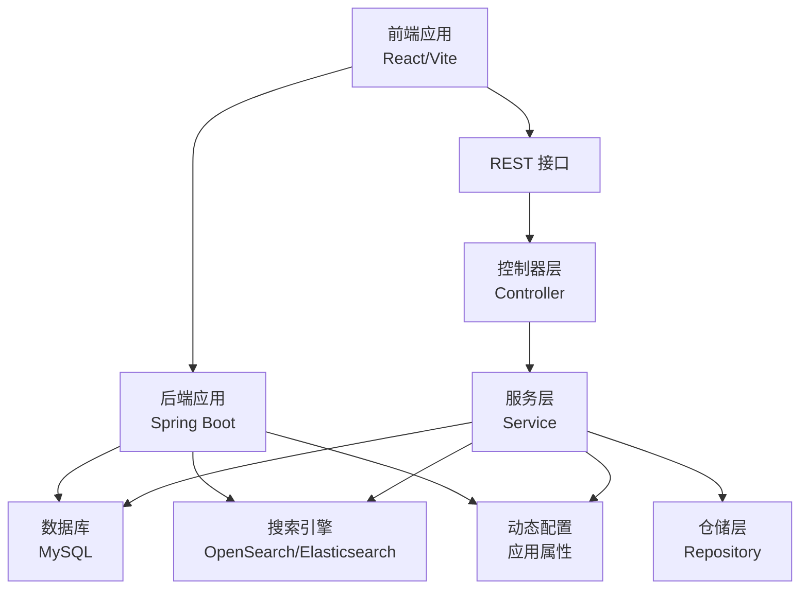
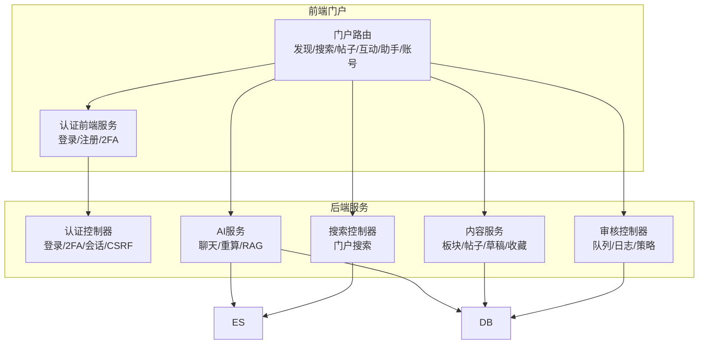
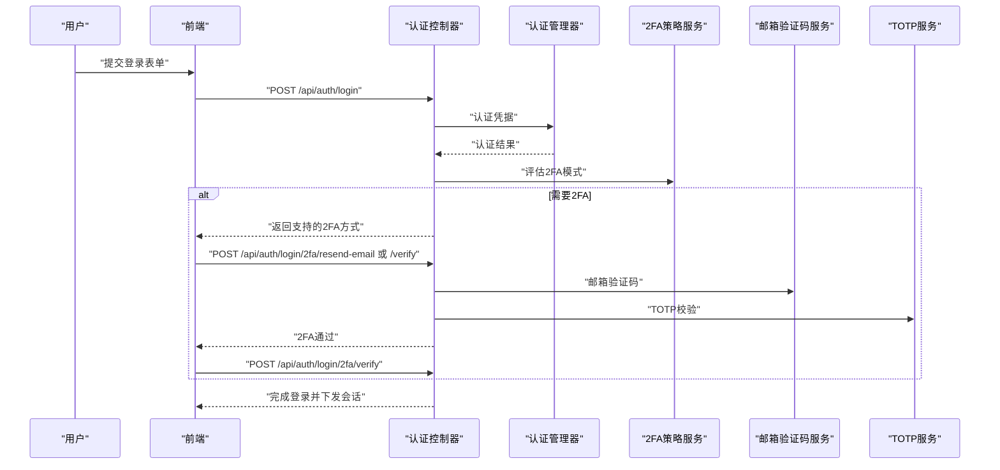
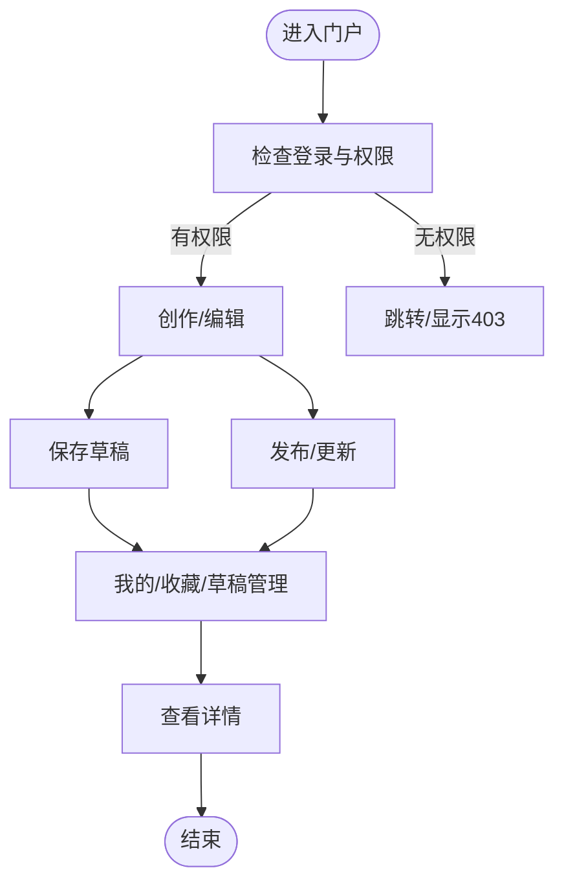
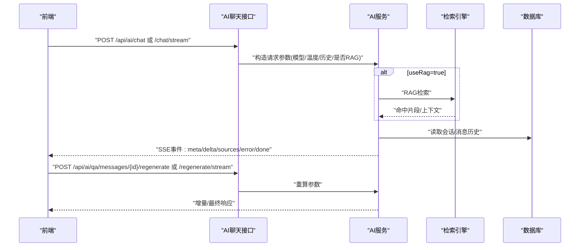
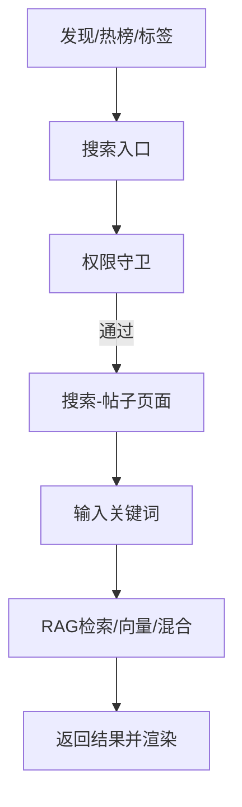
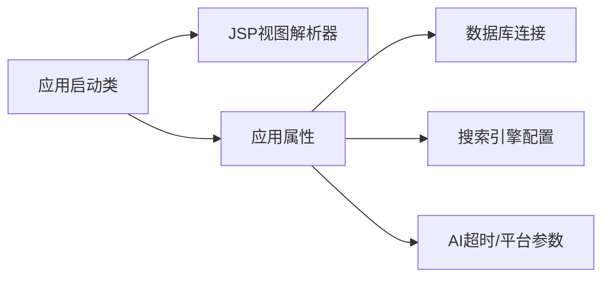

# 核心功能

<cite>
**本文引用的文件**
- [EnterpriseRagCommunityApplication.java](file://src/main/java/com/example/EnterpriseRagCommunity/EnterpriseRagCommunityApplication.java)
- [application.properties](file://src/main/resources/application.properties)
- [App.tsx](file://my-vite-app/src/App.tsx)
- [AuthController.java](file://src/main/java/com/example/EnterpriseRagCommunity/controller/AuthController.java)
- [UserService.java](file://src/main/java/com/example/EnterpriseRagCommunity/service/UserService.java)
- [BoardService.java](file://src/main/java/com/example/EnterpriseRagCommunity/service/BoardService.java)
- [aiChatService.ts](file://my-vite-app/src/services/aiChatService.ts)
</cite>

## 目录
1. [引言](#引言)
2. [项目结构](#项目结构)
3. [核心组件](#核心组件)
4. [架构总览](#架构总览)
5. [详细组件分析](#详细组件分析)
6. [依赖分析](#依赖分析)
7. [性能考虑](#性能考虑)
8. [故障排查指南](#故障排查指南)
9. [结论](#结论)
10. [附录](#附录)

## 引言
本文件为企业级RAG社区平台的核心功能概览，聚焦以下关键模块：用户认证与权限管理、内容发布与管理、AI聊天助手、智能搜索、社区互动、内容审核。文档从系统架构、组件职责、数据流与处理逻辑、功能特性对比与差异化优势、用户体验与交互流程等方面进行说明，并辅以可视化图示帮助读者快速理解平台能力与使用场景。

## 项目结构
平台采用前后端分离架构：
- 后端基于Spring Boot，提供REST接口、安全与权限控制、业务服务与数据持久化。
- 前端基于React + Vite，通过路由与权限守卫实现门户、管理后台、AI助手、搜索、互动、审核等功能区域的访问控制与导航。

图表来源
- [EnterpriseRagCommunityApplication.java:20-52](file://src/main/java/com/example/EnterpriseRagCommunity/EnterpriseRagCommunityApplication.java#L20-L52)
- [application.properties:7-84](file://src/main/resources/application.properties#L7-L84)

章节来源
- [EnterpriseRagCommunityApplication.java:20-52](file://src/main/java/com/example/EnterpriseRagCommunity/EnterpriseRagCommunityApplication.java#L20-L52)
- [application.properties:7-84](file://src/main/resources/application.properties#L7-L84)

## 核心组件
- 用户认证与权限管理：提供登录、注册、二次验证、会话与CSRF保护、权限校验与审计日志。
- 内容发布与管理：支持板块管理、帖子创作/草稿/收藏/查看、用户画像与权限映射。
- AI聊天助手：支持流式与一次性对话、重算、RAG检索增强、引用溯源、多模态图片/文件上传。
- 智能搜索：门户内搜索入口与权限控制，结合RAG检索提升搜索质量。
- 社区互动：回复、点赞、提及、举报、全量互动聚合、安全与合规入口。
- 内容审核：审核队列、审核日志、策略与规则、管理员后台配置与监控。

章节来源
- [App.tsx:150-323](file://my-vite-app/src/App.tsx#L150-L323)
- [AuthController.java:321-800](file://src/main/java/com/example/EnterpriseRagCommunity/controller/AuthController.java#L321-L800)
- [aiChatService.ts:140-307](file://my-vite-app/src/services/aiChatService.ts#L140-L307)

## 架构总览
平台围绕“门户+后台”的双域布局，前端通过受保护路由与权限守卫控制访问；后端通过控制器、服务、仓储三层解耦，配合动态配置、搜索引擎与数据库协同工作。

图表来源
- [App.tsx:150-323](file://my-vite-app/src/App.tsx#L150-L323)
- [AuthController.java:321-800](file://src/main/java/com/example/EnterpriseRagCommunity/controller/AuthController.java#L321-L800)
- [aiChatService.ts:140-307](file://my-vite-app/src/services/aiChatService.ts#L140-L307)

## 详细组件分析

### 用户认证与权限管理
- 功能要点
  - 支持邮箱/密码登录与二次验证（TOTP/邮箱验证码），登录成功写入会话并下发Cookie。
  - 提供注册、邮箱验证、密码重置、登出、CSRF令牌获取等。
  - 基于权限资源与动作进行细粒度访问控制，支持管理员后台UI入口与各功能区权限。
  - 审计日志记录认证与授权事件，便于追踪与合规。
- 数据流与处理逻辑
  - 登录流程：接收凭据→认证管理器校验→二次验证策略评估→必要时进入2FA待处理→通过后完成会话与Cookie下发。
  - 2FA流程：根据策略选择邮箱或TOTP→下发验证码→校验通过→重建认证→完成登录。
  - 注册流程：检查开关→去重→创建用户→绑定默认角色→可选邮箱验证→返回结果。
- 差异化优势
  - 细粒度权限模型与资源动作分离，支持不同角色对不同功能区的精确访问。
  - 2FA策略灵活，支持邮箱与TOTP组合，兼顾易用性与安全性。
- 用户体验
  - 登录失败与未验证提示明确；2FA流程引导清晰；登出后清理上下文与会话。

图表来源
- [AuthController.java:321-642](file://src/main/java/com/example/EnterpriseRagCommunity/controller/AuthController.java#L321-L642)

章节来源
- [AuthController.java:321-800](file://src/main/java/com/example/EnterpriseRagCommunity/controller/AuthController.java#L321-L800)
- [App.tsx:292-312](file://my-vite-app/src/App.tsx#L292-L312)

### 内容发布与管理
- 功能要点
  - 板块管理：分页查询、创建、更新、删除。
  - 帖子管理：创作/编辑、草稿、我的帖子、收藏、详情页。
  - 用户管理：基础搜索（账户/邮箱/角色/时间范围），兼容历史参数映射。
- 数据流与处理逻辑
  - 板块：控制器接收DTO→调用服务接口→仓储持久化→返回DTO。
  - 帖子：门户路由控制权限→前端页面渲染→服务层读取/写入→数据库落盘。
  - 用户：服务层构建Specification→拼装条件→查询返回实体列表。
- 差异化优势
  - 权限守卫覆盖“创作/查看/收藏”等关键路径，确保内容安全。
  - 用户搜索兼容旧参数，降低迁移成本。
- 用户体验
  - 权限不足时自动跳转/显示403，避免无效操作。

图表来源
- [App.tsx:180-202](file://my-vite-app/src/App.tsx#L180-L202)
- [BoardService.java:9-37](file://src/main/java/com/example/EnterpriseRagCommunity/service/BoardService.java#L9-L37)
- [UserService.java:43-110](file://src/main/java/com/example/EnterpriseRagCommunity/service/UserService.java#L43-L110)

章节来源
- [BoardService.java:9-37](file://src/main/java/com/example/EnterpriseRagCommunity/service/BoardService.java#L9-L37)
- [UserService.java:43-110](file://src/main/java/com/example/EnterpriseRagCommunity/service/UserService.java#L43-L110)
- [App.tsx:180-202](file://my-vite-app/src/App.tsx#L180-L202)

### AI聊天助手
- 功能要点
  - 流式与一次性对话：支持SSE事件解析，增量输出与最终响应。
  - RAG检索增强：可选开启，返回引用来源与片段。
  - 重算能力：针对特定问题消息进行重算，支持参数调整。
  - 多模态：支持图片/文件上传，结合视觉模型生成回答。
- 数据流与处理逻辑
  - 前端发起请求→携带CSRF与会话→后端解析SSE事件→流式推送增量内容→完成后返回完整响应与引用。
  - 重算流程：指定问题消息ID→后端重建上下文→执行推理→流式返回。
- 差异化优势
  - 增量式体验更自然，适合复杂问答与长对话。
  - 引用溯源增强可信度，便于回溯与交叉验证。
- 用户体验
  - 事件驱动的交互反馈，支持取消与中断；错误提示明确。

图表来源
- [aiChatService.ts:140-307](file://my-vite-app/src/services/aiChatService.ts#L140-L307)

章节来源
- [aiChatService.ts:140-307](file://my-vite-app/src/services/aiChatService.ts#L140-L307)

### 智能搜索
- 功能要点
  - 门户内提供搜索入口，统一跳转至“搜索-帖子”页面。
  - 搜索页面具备权限控制，仅授权用户可见。
  - 搜索底层结合RAG检索与向量/关键词混合策略，提升召回与排序质量。
- 数据流与处理逻辑
  - 前端路由控制→权限守卫→调用后端搜索接口→检索引擎返回结果→渲染页面。
- 差异化优势
  - 将“发现/热榜/标签”与“搜索”打通，形成闭环的信息发现路径。
  - 结合RAG与向量索引，显著提升复杂语义查询的准确性。
- 用户体验
  - 一键直达搜索，减少跳转层级；结果高相关性提升满意度。

图表来源
- [App.tsx:169-178](file://my-vite-app/src/App.tsx#L169-L178)

章节来源
- [App.tsx:169-178](file://my-vite-app/src/App.tsx#L169-L178)

### 社区互动
- 功能要点
  - 回复、点赞、提及、举报、全量互动聚合、安全与合规入口。
  - 账号中心复用帖子权限，支持“我的/收藏”。
- 数据流与处理逻辑
  - 前端路由→权限守卫→调用对应服务→数据库读写→返回结果。
- 差异化优势
  - 将互动与安全、举报通道一体化，便于运营与风控。
- 用户体验
  - 一站式查看互动与安全信息，降低管理成本。

章节来源
- [App.tsx:204-225](file://my-vite-app/src/App.tsx#L204-L225)
- [App.tsx:255-279](file://my-vite-app/src/App.tsx#L255-L279)

### 内容审核
- 功能要点
  - 审核队列与日志、策略与规则配置、管理员后台监控与配置。
  - 基于板块的审核员授权与权限守卫。
- 数据流与处理逻辑
  - 前端路由→权限守卫→调用审核服务→数据库落盘→审计日志记录。
- 差异化优势
  - 审核员可按板块维度参与，提高治理效率。
- 用户体验
  - 清晰的队列与日志视图，便于追踪与复盘。

章节来源
- [App.tsx:245-253](file://my-vite-app/src/App.tsx#L245-L253)

## 依赖分析
- 前端路由与权限
  - React路由定义各功能域（门户/管理后台），通过RequireAccess/RequirePermission/RequireModeratedBoards实现细粒度权限控制。
- 后端依赖与配置
  - 应用属性集中管理数据库、搜索引擎、上传、AI超时与平台参数，支持动态配置加载。
  - Spring Boot启动类注册JSP视图解析器，便于传统页面与现代化前端共存。

图表来源
- [EnterpriseRagCommunityApplication.java:20-52](file://src/main/java/com/example/EnterpriseRagCommunity/EnterpriseRagCommunityApplication.java#L20-L52)
- [application.properties:7-84](file://src/main/resources/application.properties#L7-L84)

章节来源
- [EnterpriseRagCommunityApplication.java:20-52](file://src/main/java/com/example/EnterpriseRagCommunity/EnterpriseRagCommunityApplication.java#L20-L52)
- [application.properties:7-84](file://src/main/resources/application.properties#L7-L84)

## 性能考虑
- 并发与线程
  - 启用虚拟线程以提升并发处理能力。
- 存储与IO
  - 多媒体与大文件上传上限高，结合分片/断点续传策略优化上传体验。
- 搜索与检索
  - 结合向量索引与关键词检索，合理设置RAG TopK与历史长度，平衡准确率与延迟。
- 缓存与会话
  - 会话Cookie与审计日志记录，注意会话失效与访问变更的同步。

## 故障排查指南
- 登录与2FA
  - 若登录失败，检查邮箱验证状态与凭据；若提示需要2FA，确认支持的方式与验证码发送状态。
- CSRF与会话
  - 获取CSRF令牌失败时，检查后端跨域配置与会话状态。
- AI聊天
  - SSE流异常时，检查网络与后端事件格式；重算失败时确认问题消息ID与参数。
- 权限与路由
  - 403常见于权限不足或未登录，检查路由守卫与资源动作权限。

章节来源
- [AuthController.java:710-725](file://src/main/java/com/example/EnterpriseRagCommunity/controller/AuthController.java#L710-L725)
- [aiChatService.ts:140-193](file://my-vite-app/src/services/aiChatService.ts#L140-L193)

## 结论
平台通过“门户+后台”的清晰边界与细粒度权限体系，结合AI聊天、RAG检索、内容管理与审核治理，构建了面向企业级场景的社区平台能力基座。前端路由与后端控制器/服务/仓储的分层协作，确保了功能扩展性与运行稳定性。建议在生产环境中持续完善动态配置、监控告警与安全加固，以进一步提升可用性与治理水平。

## 附录
- 关键配置项参考
  - 数据库连接与连接池、搜索引擎连接、上传目录与URL前缀、AI超时与默认历史限制、OpenSearch平台参数等。
- 前端路由与权限对照
  - 门户路由与权限守卫清单，涵盖发现/搜索/帖子/互动/助手/账号等区域。

章节来源
- [application.properties:7-84](file://src/main/resources/application.properties#L7-L84)
- [App.tsx:150-323](file://my-vite-app/src/App.tsx#L150-L323)