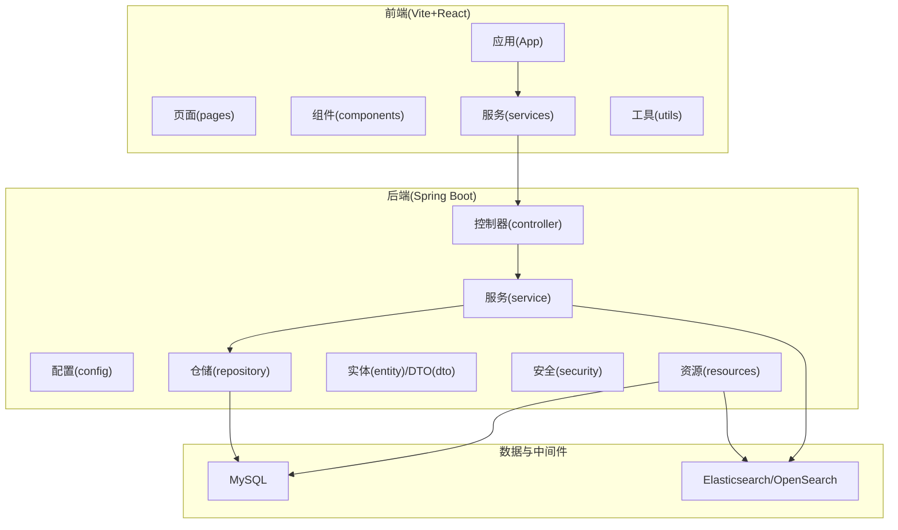
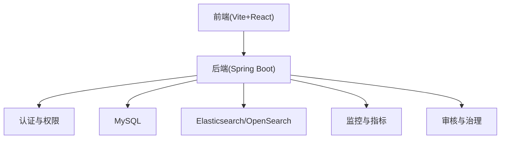
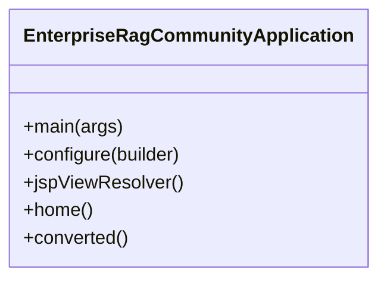
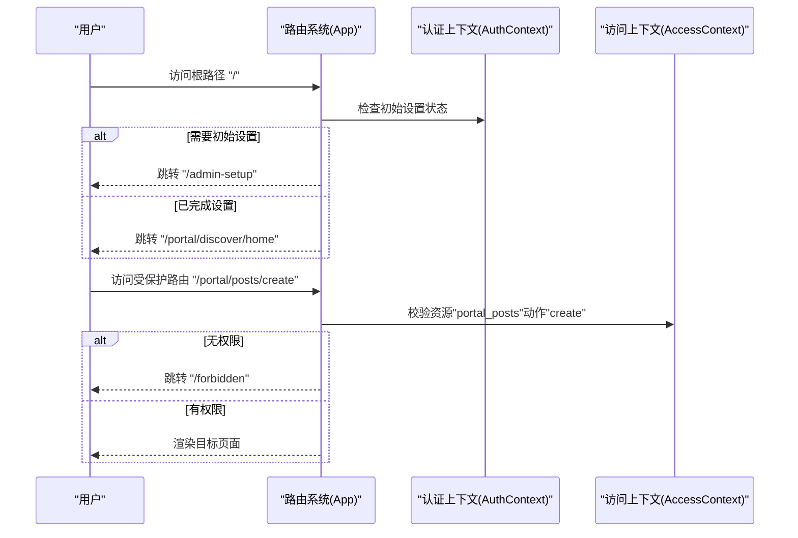
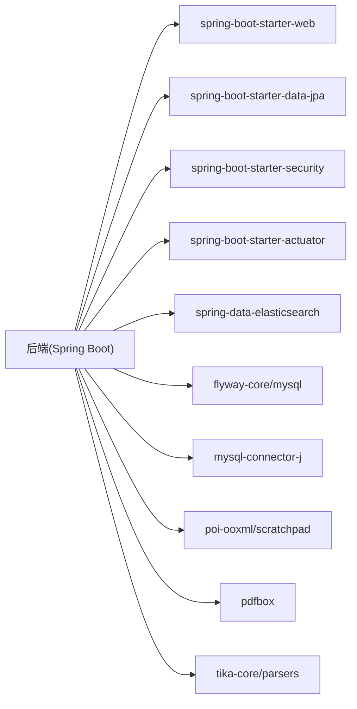

# 项目概览

<cite>
**本文引用的文件**   
- [EnterpriseRagCommunityApplication.java](file://src/main/java/com/example/EnterpriseRagCommunity/EnterpriseRagCommunityApplication.java)
- [build.gradle](file://build.gradle)
- [package.json](file://my-vite-app/package.json)
- [application.properties](file://src/main/resources/application.properties)
- [App.tsx](file://my-vite-app/src/App.tsx)
- [spec.md](file://docs/specs/streamRegenerate-coverage-20260312/spec.md)
</cite>

## 目录
1. [引言](#引言)
2. [项目结构](#项目结构)
3. [核心组件](#核心组件)
4. [架构总览](#架构总览)
5. [详细组件分析](#详细组件分析)
6. [依赖分析](#依赖分析)
7. [性能考虑](#性能考虑)
8. [故障排查指南](#故障排查指南)
9. [结论](#结论)
10. [附录](#附录)

## 引言
本项目是一个面向企业级的社区平台，围绕 RAG（检索增强生成）技术构建，旨在为用户提供智能问答、内容创作与管理、以及基于 AI 的内容审核与治理能力。平台采用前后端分离架构：后端基于 Spring Boot 提供高可用的微服务能力，前端采用 Vite + React 构建现代化的用户界面；数据层结合 MySQL 与 Elasticsearch/OpenSearch，支撑全文检索、向量检索与多模态内容处理。

项目目标是通过工程化的手段，将 RAG 能力与社区治理、权限体系、内容安全、性能监控等企业级需求深度融合，形成可扩展、可观测、可治理的智能社区基础设施。

## 项目结构
项目采用典型的分层与领域划分组织方式：
- 后端（Spring Boot）
  - config：配置类与安全配置
  - controller：HTTP 控制器层，暴露 REST 接口
  - service：业务服务层，封装领域逻辑与编排
  - repository：数据访问层
  - entity/dto：数据模型与传输对象
  - security：权限与安全过滤器
  - utils：工具类
  - resources：配置文件、Flyway 迁移脚本
- 前端（Vite + React）
  - src：页面、组件、服务、类型定义、工具函数
  - public：静态资源
  - 构建产物输出至 dist
- 文档与测试
  - docs：规范、任务与覆盖率文档
  - src/test、src/integrationTest：单元与集成测试

图表来源
- [build.gradle:102-138](file://build.gradle#L102-L138)
- [application.properties:7-84](file://src/main/resources/application.properties#L7-L84)

章节来源
- [build.gradle:102-138](file://build.gradle#L102-L138)
- [application.properties:7-84](file://src/main/resources/application.properties#L7-L84)

## 核心组件
- 应用入口与容器
  - 后端入口类启用异步、分页 DTO 序列化、JSP 视图解析器，支持 WAR 打包与内嵌 Tomcat。
- 前端路由与权限
  - 基于 React Router 的受保护路由与细粒度权限控制，支持管理员后台、发现页、帖子、互动、智能助手、账号中心等模块。
- 数据与检索
  - MySQL 作为主数据存储，Flyway 管理迁移；Elasticsearch/OpenSearch 支持检索与向量索引。
- AI 与 RAG 能力
  - 包含 AI 聊天、标题生成、翻译、语言检测、RAG 检索、重排、队列与路由等服务模块。
- 审核与治理
  - 审核规则、样本同步、自动运行器、风险标签、证据链路与追踪等。

章节来源
- [EnterpriseRagCommunityApplication.java:20-61](file://src/main/java/com/example/EnterpriseRagCommunity/EnterpriseRagCommunityApplication.java#L20-L61)
- [App.tsx:104-323](file://my-vite-app/src/App.tsx#L104-L323)
- [application.properties:7-84](file://src/main/resources/application.properties#L7-L84)

## 架构总览
整体架构由“前端门户 + 后端服务 + 数据与检索引擎”三层组成，配合“权限与安全”“监控与可观测”“治理与审核”贯穿各层。

图表来源
- [build.gradle:102-138](file://build.gradle#L102-L138)
- [application.properties:7-84](file://src/main/resources/application.properties#L7-L84)

## 详细组件分析

### 后端应用入口与容器
- 功能要点
  - 启用异步处理、分页 DTO 序列化、JSP 视图解析器，便于传统视图与现代接口共存。
  - WAR 打包与内嵌 Tomcat，适配企业部署形态。
- 关键配置
  - 数据源、Flyway、日志、上传、AI 超时与 OpenSearch 平台连接参数等集中于配置文件。

图表来源
- [EnterpriseRagCommunityApplication.java:24-61](file://src/main/java/com/example/EnterpriseRagCommunity/EnterpriseRagCommunityApplication.java#L24-L61)

章节来源
- [EnterpriseRagCommunityApplication.java:20-61](file://src/main/java/com/example/EnterpriseRagCommunity/EnterpriseRagCommunityApplication.java#L20-L61)
- [application.properties:7-84](file://src/main/resources/application.properties#L7-L84)

### 前端路由与权限控制
- 功能要点
  - 根据初始设置状态动态跳转；受保护路由仅对已登录用户开放；管理员后台按细粒度权限决定默认入口。
  - 门户模块覆盖发现、搜索、帖子、互动、智能助手、账号中心与审核入口。
- 权限模型
  - 结合资源与动作（如 portal_discover_home:view）进行细粒度控制；管理员通过权限位或角色进入后台。

图表来源
- [App.tsx:104-323](file://my-vite-app/src/App.tsx#L104-L323)

章节来源
- [App.tsx:104-323](file://my-vite-app/src/App.tsx#L104-L323)

### 数据与检索配置
- 数据库
  - MySQL 驱动、连接池参数、Flyway 迁移启用与编码设置。
- 搜索与向量
  - Elasticsearch/OpenSearch 连接超时、读取超时、凭据与平台工作空间配置。
- 文件上传
  - 单文件与请求大小上限配置，适配大文件与多模态内容。

章节来源
- [application.properties:7-84](file://src/main/resources/application.properties#L7-L84)

### AI 与 RAG 能力
- 聊天与对话
  - 支持流式回复、历史限制、SSE 事件分流与异常降级路径。
- 内容生成
  - 标题生成、翻译、语言检测、多模态处理。
- 检索与重排
  - 帖子/评论/文件资产的向量索引构建与混合检索、重排服务。
- 队列与路由
  - LLM 调用队列、路由策略与监控。

章节来源
- [build.gradle:102-138](file://build.gradle#L102-L138)
- [application.properties:68-77](file://src/main/resources/application.properties#L68-L77)

### 审核与治理
- 自动化规则与样本同步
  - 自动运行器、样本同步作业、向量自动运行器。
- 审核策略与追踪
  - 规则与策略管理、证据上下文展示、审查轨迹与回溯。
- 多模态支持
  - 图像/文本证据的上下文构建与风险标签解析。

章节来源
- [build.gradle:102-138](file://build.gradle#L102-L138)

### 覆盖率与质量保障
- 专项目标
  - 针对特定方法（如 AI 聊天流式重生成）进行分支覆盖率提升，形成结构化问题清单与优先级排序，确保高收益测试先行。
- 质量工具
  - Gradle 集成 JaCoCo 与 SonarQube，支持定向覆盖率任务与报告生成。

章节来源
- [spec.md:1-66](file://docs/specs/streamRegenerate-coverage-20260312/spec.md#L1-L66)
- [build.gradle:229-267](file://build.gradle#L229-L267)

## 依赖分析
- 后端依赖
  - Web、JPA、安全、Actuator、Prometheus、Elasticsearch 客户端、Flyway、MySQL 驱动、POI/PDFBox/Tika 等。
- 前端依赖
  - React、React Router、Axios、TailwindCSS、ECharts、图标库、测试工具链等。

图表来源
- [build.gradle:102-138](file://build.gradle#L102-L138)

章节来源
- [build.gradle:102-138](file://build.gradle#L102-L138)

## 性能考虑
- 连接池与超时
  - 数据库连接池参数与 AI 请求超时配置，平衡吞吐与稳定性。
- 搜索与向量
  - Elasticsearch/OpenSearch 的连接与套接字超时、凭据与平台配置，确保检索延迟可控。
- 前端性能
  - 路由懒加载与权限守卫减少首屏负担；图表与富文本渲染按需加载。

章节来源
- [application.properties:11-16](file://src/main/resources/application.properties#L11-L16)
- [application.properties:68-82](file://src/main/resources/application.properties#L68-L82)
- [App.tsx:59-66](file://my-vite-app/src/App.tsx#L59-L66)

## 故障排查指南
- 启动与视图
  - 如 JSP 视图未生效，检查视图解析器前缀、后缀与视图名匹配。
- 数据库与迁移
  - Flyway 启用与迁移位置配置，确认 baseline 行为与编码设置。
- 搜索与向量
  - 检查 Elasticsearch/OpenSearch 连接参数与凭据；关注连接超时与读取超时。
- 前端路由
  - 受保护路由与权限守卫导致 403 时，核查资源与动作权限位或角色。

章节来源
- [EnterpriseRagCommunityApplication.java:37-52](file://src/main/java/com/example/EnterpriseRagCommunity/EnterpriseRagCommunityApplication.java#L37-L52)
- [application.properties:18-25](file://src/main/resources/application.properties#L18-L25)
- [application.properties:78-82](file://src/main/resources/application.properties#L78-L82)
- [App.tsx:69-102](file://my-vite-app/src/App.tsx#L69-L102)

## 结论
本项目以企业级需求为导向，将 RAG 与社区治理、权限与安全、可观测与质量保障体系深度融合。后端采用 Spring Boot 与现代化依赖栈，前端以 Vite + React 构建灵活的用户界面。通过 MySQL 与 Elasticsearch/OpenSearch 的组合，平台具备强大的内容检索与治理能力。配套的质量与覆盖率专项工作，确保关键路径的稳定性与可维护性。

## 附录
- 技术选型说明
  - Spring Boot：统一的微服务开发体验与生态。
  - Vite + React：高性能前端构建与组件化开发。
  - MySQL + Flyway：稳定的关系型数据与版本化迁移。
  - Elasticsearch/OpenSearch：企业级检索与向量检索能力。
  - Actuator + Prometheus：可观测与运维监控。
- 应用场景
  - 智能问答与内容创作辅助
  - 社区内容的智能检索与推荐
  - 多模态内容的审核与治理
  - 企业内部知识库与智能助手