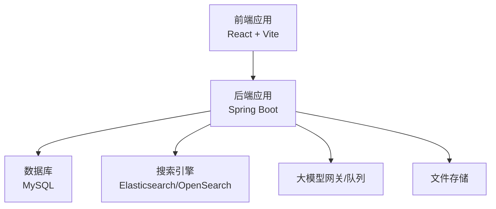
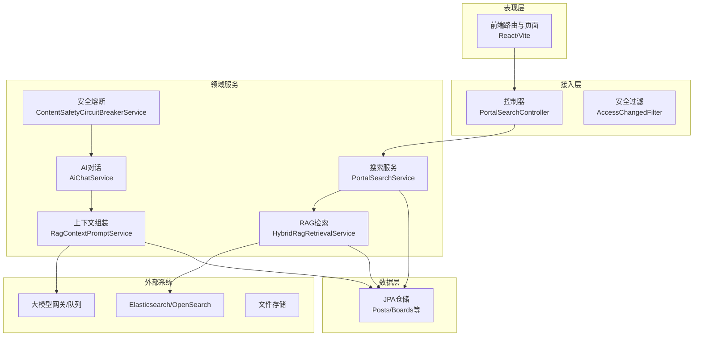
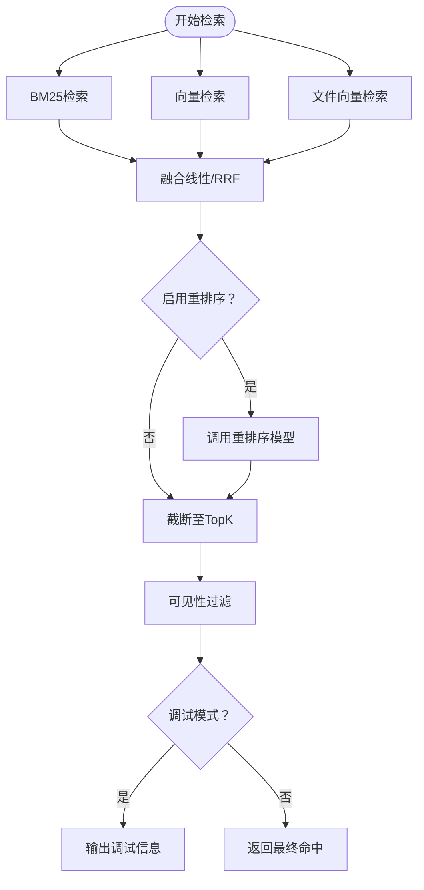
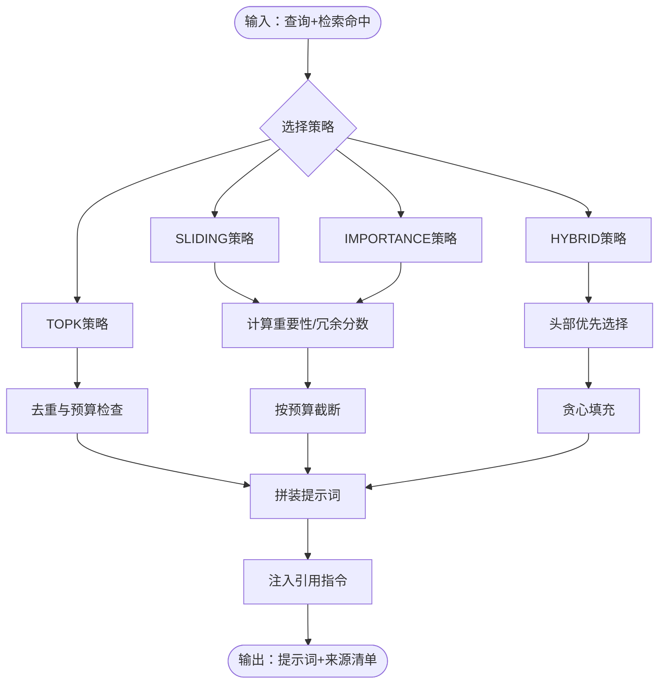
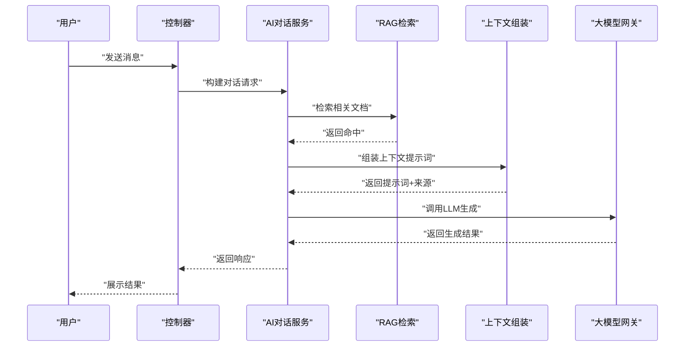
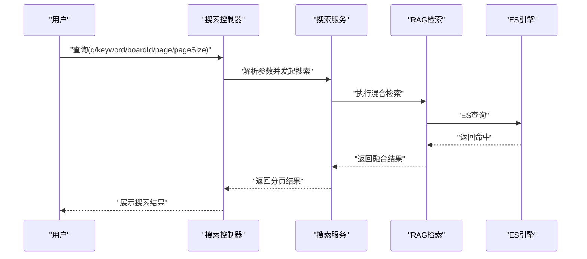
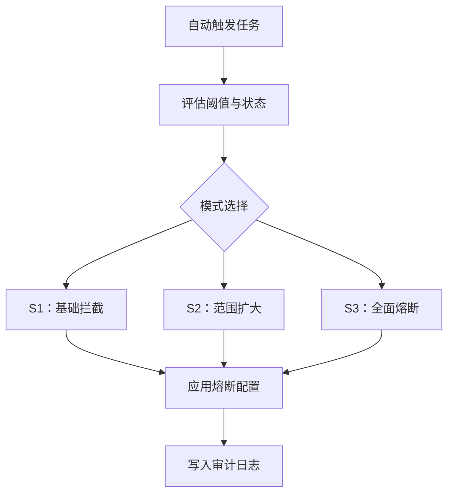
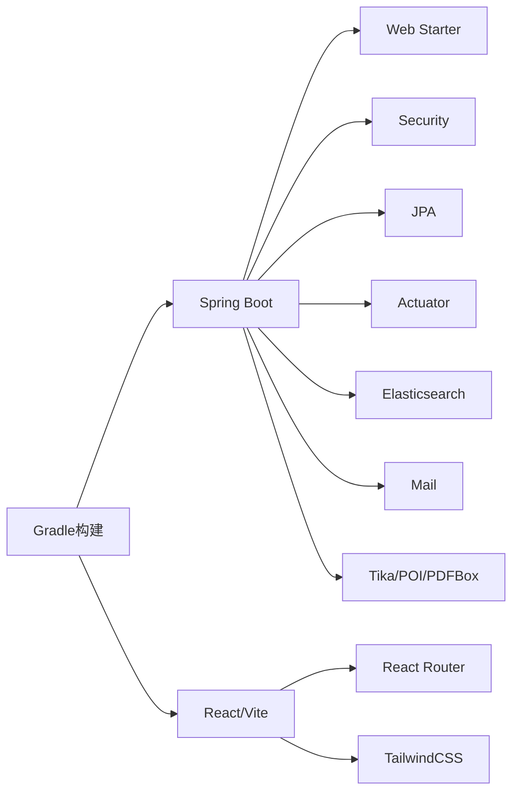

# 项目简介

<cite>
**本文档引用的文件**
- [EnterpriseRagCommunityApplication.java](file://src/main/java/com/example/EnterpriseRagCommunity/EnterpriseRagCommunityApplication.java)
- [build.gradle](file://build.gradle)
- [application.properties](file://src/main/resources/application.properties)
- [HybridRagRetrievalService.java](file://src/main/java/com/example/EnterpriseRagCommunity/service/retrieval/HybridRagRetrievalService.java)
- [RagContextPromptService.java](file://src/main/java/com/example/EnterpriseRagCommunity/service/ai/RagContextPromptService.java)
- [PortalSearchController.java](file://src/main/java/com/example/EnterpriseRagCommunity/controller/content/PortalSearchController.java)
- [PortalSearchService.java](file://src/main/java/com/example/EnterpriseRagCommunity/service/content/PortalSearchService.java)
- [AiChatService.java](file://src/main/java/com/example/EnterpriseRagCommunity/service/ai/AiChatService.java)
- [PostsEntity.java](file://src/main/java/com/example/EnterpriseRagCommunity/entity/content/PostsEntity.java)
- [BoardsEntity.java](file://src/main/java/com/example/EnterpriseRagCommunity/entity/content/BoardsEntity.java)
- [App.tsx](file://my-vite-app/src/App.tsx)
- [ContentSafetyCircuitBreakerService.java](file://src/main/java/com/example/EnterpriseRagCommunity/service/safety/ContentSafetyCircuitBreakerService.java)
- [ContentSafetyAutoTriggerJob.java](file://src/main/java/com/example/EnterpriseRagCommunity/service/safety/ContentSafetyAutoTriggerJob.java)
</cite>

## 目录
1. [项目概述](#项目概述)
2. [项目结构](#项目结构)
3. [核心组件](#核心组件)
4. [架构总览](#架构总览)
5. [详细组件分析](#详细组件分析)
6. [依赖关系分析](#依赖关系分析)
7. [性能考量](#性能考量)
8. [故障排查指南](#故障排查指南)
9. [结论](#结论)
10. [附录](#附录)

## 项目概述
本项目是一个面向企业级的社区平台，以RAG（检索增强生成）为核心能力，通过混合检索、语义嵌入、重排序与上下文窗口管理等技术，实现AI驱动的内容生成、智能搜索与社区互动。平台支持多模态内容检索（文本与文件片段）、可配置的检索融合策略、安全与合规的自动触发机制，以及完善的权限与访问控制体系，旨在为企业用户提供安全、高效、可扩展的知识型社区服务。

- 核心使命：以RAG技术提升社区内容理解与交互质量，降低信息检索成本，提高内容创作效率。
- 核心愿景：构建一个可治理、可扩展、可审计的企业知识社区平台，实现“智能检索 + AI生成 + 社区互动”的一体化体验。

## 项目结构
项目采用前后端分离架构：
- 后端基于Spring Boot，提供REST API、安全认证、权限控制、RAG检索与AI服务集成。
- 前端基于React + Vite，提供门户、发现、搜索、互动、助手、账户、审核等多套布局与页面。
- 数据层包含MySQL、Elasticsearch/OpenSearch、文件存储等基础设施。
- 工程采用Gradle构建，集成测试覆盖、覆盖率统计与持续集成能力。

**图表来源**
- [App.tsx:1-200](file://my-vite-app/src/App.tsx#L1-L200)
- [build.gradle:102-138](file://build.gradle#L102-L138)

**章节来源**
- [build.gradle:102-138](file://build.gradle#L102-L138)
- [application.properties:1-84](file://src/main/resources/application.properties#L1-L84)
- [App.tsx:1-200](file://my-vite-app/src/App.tsx#L1-L200)

## 核心组件
- RAG检索服务：混合BM25/向量/文件向量检索，支持融合与重排序，具备降级与调试能力。
- 上下文组装服务：根据上下文窗口策略与去重规则，动态裁剪与拼接检索结果，保障LLM输入质量。
- AI对话与生成：围绕门户助手、文章创作等场景，提供流式对话、历史管理与提示词配置。
- 搜索服务：统一门户搜索入口，聚合帖子、评论与文件资产的检索结果。
- 安全与合规：内容安全熔断器与自动触发任务，支持分级阈值与范围控制。
- 权限与访问控制：会话内权限刷新、细粒度资源权限与作用域控制。

**章节来源**
- [HybridRagRetrievalService.java:115-202](file://src/main/java/com/example/EnterpriseRagCommunity/service/retrieval/HybridRagRetrievalService.java#L115-L202)
- [RagContextPromptService.java:32-357](file://src/main/java/com/example/EnterpriseRagCommunity/service/ai/RagContextPromptService.java#L32-L357)
- [AiChatService.java:2578-2584](file://src/main/java/com/example/EnterpriseRagCommunity/service/ai/AiChatService.java#L2578-L2584)
- [PortalSearchService.java:41-49](file://src/main/java/com/example/EnterpriseRagCommunity/service/content/PortalSearchService.java#L41-L49)
- [ContentSafetyCircuitBreakerService.java:26-275](file://src/main/java/com/example/EnterpriseRagCommunity/service/safety/ContentSafetyCircuitBreakerService.java#L26-L275)
- [ContentSafetyAutoTriggerJob.java:24-34](file://src/main/java/com/example/EnterpriseRagCommunity/service/safety/ContentSafetyAutoTriggerJob.java#L24-L34)

## 架构总览
平台采用分层架构：表现层（前端路由与页面）、接入层（控制器与权限过滤）、领域服务（RAG、检索、AI、内容、安全）、数据访问层（JPA/Repository）与外部系统（ES/LLM/文件存储）。

**图表来源**
- [PortalSearchController.java:14-30](file://src/main/java/com/example/EnterpriseRagCommunity/controller/content/PortalSearchController.java#L14-L30)
- [PortalSearchService.java:28-40](file://src/main/java/com/example/EnterpriseRagCommunity/service/content/PortalSearchService.java#L28-L40)
- [HybridRagRetrievalService.java:44-86](file://src/main/java/com/example/EnterpriseRagCommunity/service/retrieval/HybridRagRetrievalService.java#L44-L86)
- [RagContextPromptService.java:24-35](file://src/main/java/com/example/EnterpriseRagCommunity/service/ai/RagContextPromptService.java#L24-L35)
- [AiChatService.java:1-20](file://src/main/java/com/example/EnterpriseRagCommunity/service/ai/AiChatService.java#L1-L20)
- [ContentSafetyCircuitBreakerService.java:26-40](file://src/main/java/com/example/EnterpriseRagCommunity/service/safety/ContentSafetyCircuitBreakerService.java#L26-L40)
- [PostsEntity.java:13-75](file://src/main/java/com/example/EnterpriseRagCommunity/entity/content/PostsEntity.java#L13-L75)
- [BoardsEntity.java:9-45](file://src/main/java/com/example/EnterpriseRagCommunity/entity/content/BoardsEntity.java#L9-L45)

## 详细组件分析

### RAG检索与融合
- 支持BM25、向量检索与文件向量检索三路召回，融合策略可选线性归一或RRF，支持重排序与超时控制。
- 提供可见性过滤与调试信息输出，便于定位性能瓶颈与错误来源。
- 具备降级与慢查询告警，确保在上游异常时仍能返回稳定结果。

**图表来源**
- [HybridRagRetrievalService.java:115-202](file://src/main/java/com/example/EnterpriseRagCommunity/service/retrieval/HybridRagRetrievalService.java#L115-L202)
- [HybridRagRetrievalService.java:293-387](file://src/main/java/com/example/EnterpriseRagCommunity/service/retrieval/HybridRagRetrievalService.java#L293-L387)
- [HybridRagRetrievalService.java:389-521](file://src/main/java/com/example/EnterpriseRagCommunity/service/retrieval/HybridRagRetrievalService.java#L389-L521)

**章节来源**
- [HybridRagRetrievalService.java:115-521](file://src/main/java/com/example/EnterpriseRagCommunity/service/retrieval/HybridRagRetrievalService.java#L115-L521)

### 上下文组装与提示词工程
- 根据上下文窗口策略（TOPK/SLIDING/IMPORTANCE/HYBRID），在预算与去重约束下选择最优片段。
- 支持标题/评分/块索引等元信息渲染，以及引用规范注入，保证生成内容可溯源。
- 输出包含选中项统计、块ID清单与来源清单，便于审计与回溯。

**图表来源**
- [RagContextPromptService.java:32-357](file://src/main/java/com/example/EnterpriseRagCommunity/service/ai/RagContextPromptService.java#L32-L357)
- [RagContextPromptService.java:387-516](file://src/main/java/com/example/EnterpriseRagCommunity/service/ai/RagContextPromptService.java#L387-L516)
- [RagContextPromptService.java:518-588](file://src/main/java/com/example/EnterpriseRagCommunity/service/ai/RagContextPromptService.java#L518-L588)

**章节来源**
- [RagContextPromptService.java:32-588](file://src/main/java/com/example/EnterpriseRagCommunity/service/ai/RagContextPromptService.java#L32-L588)

### AI对话与门户助手
- 对话服务整合检索、上下文组装与大模型调用，支持历史限制、深度思考系统提示与流式输出。
- 通过门户聊天配置管理助手行为与系统提示词，支持多场景提示词模板切换。

**图表来源**
- [AiChatService.java:2578-2584](file://src/main/java/com/example/EnterpriseRagCommunity/service/ai/AiChatService.java#L2578-L2584)
- [PortalSearchController.java:14-30](file://src/main/java/com/example/EnterpriseRagCommunity/controller/content/PortalSearchController.java#L14-L30)
- [PortalSearchService.java:41-49](file://src/main/java/com/example/EnterpriseRagCommunity/service/content/PortalSearchService.java#L41-L49)
- [RagContextPromptService.java:32-357](file://src/main/java/com/example/EnterpriseRagCommunity/service/ai/RagContextPromptService.java#L32-L357)

**章节来源**
- [AiChatService.java:1-2584](file://src/main/java/com/example/EnterpriseRagCommunity/service/ai/AiChatService.java#L1-L2584)
- [PortalSearchController.java:14-30](file://src/main/java/com/example/EnterpriseRagCommunity/controller/content/PortalSearchController.java#L14-L30)
- [PortalSearchService.java:28-49](file://src/main/java/com/example/EnterpriseRagCommunity/service/content/PortalSearchService.java#L28-L49)

### 门户搜索与内容组织
- 统一搜索接口支持关键词、版块筛选与分页，内部聚合帖子、评论与文件资产的检索结果。
- 版块与作者信息在展示层进行增强，确保内容呈现的完整性与可读性。

**图表来源**
- [PortalSearchController.java:14-30](file://src/main/java/com/example/EnterpriseRagCommunity/controller/content/PortalSearchController.java#L14-L30)
- [PortalSearchService.java:41-49](file://src/main/java/com/example/EnterpriseRagCommunity/service/content/PortalSearchService.java#L41-L49)
- [HybridRagRetrievalService.java:115-202](file://src/main/java/com/example/EnterpriseRagCommunity/service/retrieval/HybridRagRetrievalService.java#L115-L202)

**章节来源**
- [PortalSearchController.java:14-30](file://src/main/java/com/example/EnterpriseRagCommunity/controller/content/PortalSearchController.java#L14-L30)
- [PortalSearchService.java:28-49](file://src/main/java/com/example/EnterpriseRagCommunity/service/content/PortalSearchService.java#L28-L49)
- [PostsEntity.java:13-75](file://src/main/java/com/example/EnterpriseRagCommunity/entity/content/PostsEntity.java#L13-L75)
- [BoardsEntity.java:9-45](file://src/main/java/com/example/EnterpriseRagCommunity/entity/content/BoardsEntity.java#L9-L45)

### 安全与合规
- 内容安全熔断器支持S1/S2/S3三级模式，可按全局、用户、帖子、入口点等维度配置开关与提示信息。
- 自动触发任务定期评估与更新熔断状态，结合审核流水与审计日志形成闭环。

**图表来源**
- [ContentSafetyAutoTriggerJob.java:24-34](file://src/main/java/com/example/EnterpriseRagCommunity/service/safety/ContentSafetyAutoTriggerJob.java#L24-L34)
- [ContentSafetyCircuitBreakerService.java:26-275](file://src/main/java/com/example/EnterpriseRagCommunity/service/safety/ContentSafetyCircuitBreakerService.java#L26-L275)

**章节来源**
- [ContentSafetyCircuitBreakerService.java:26-275](file://src/main/java/com/example/EnterpriseRagCommunity/service/safety/ContentSafetyCircuitBreakerService.java#L26-L275)
- [ContentSafetyAutoTriggerJob.java:24-34](file://src/main/java/com/example/EnterpriseRagCommunity/service/safety/ContentSafetyAutoTriggerJob.java#L24-L34)

## 依赖关系分析
- 后端依赖：Spring Web、Security、JPA、Actuator、Elasticsearch客户端、邮件、POI/PDFBox/Tika等。
- 前端依赖：React、React Router、Vite、TailwindCSS、热提示等。
- 构建与测试：Gradle插件、Jacoco覆盖率、OWASP依赖检查、SonarQube、Testcontainers集成测试等。

**图表来源**
- [build.gradle:102-138](file://build.gradle#L102-L138)
- [App.tsx:1-200](file://my-vite-app/src/App.tsx#L1-L200)

**章节来源**
- [build.gradle:102-138](file://build.gradle#L102-L138)
- [App.tsx:1-200](file://my-vite-app/src/App.tsx#L1-L200)

## 性能考量
- 检索层：BM25与向量检索并行执行，融合阶段支持线性归一与RRF，重排序阶段限制输入令牌预算与超时，避免长尾延迟。
- 上下文组装：按预算与去重策略动态裁剪，避免超出LLM上下文窗口；支持滑动/重要性/混合策略平衡相关性与冗余。
- 存储与网络：ES查询带高亮与过滤路径，减少传输开销；文件向量检索独立执行，避免主索引压力。
- 并发与隔离：依赖隔离守卫与熔断器，防止下游抖动影响整体稳定性。

[本节为通用指导，不直接分析具体文件]

## 故障排查指南
- 检索异常：查看RAG检索服务的错误字段与降级标志，确认ES连通性与索引状态。
- 重排序失败：关注重排序超时与慢查询日志，调整候选数量与令牌预算。
- 上下文超限：检查上下文窗口策略与预算配置，适当降低每项最大令牌数或最大条目数。
- 安全熔断：检查熔断器配置与自动触发任务状态，确认当前模式与生效范围。
- 权限刷新：若角色变更后权限未生效，检查会话中的访问时间戳与刷新间隔。

**章节来源**
- [HybridRagRetrievalService.java:143-145](file://src/main/java/com/example/EnterpriseRagCommunity/service/retrieval/HybridRagRetrievalService.java#L143-L145)
- [HybridRagRetrievalService.java:186-196](file://src/main/java/com/example/EnterpriseRagCommunity/service/retrieval/HybridRagRetrievalService.java#L186-L196)
- [RagContextPromptService.java:58-62](file://src/main/java/com/example/EnterpriseRagCommunity/service/ai/RagContextPromptService.java#L58-L62)
- [ContentSafetyCircuitBreakerService.java:253-275](file://src/main/java/com/example/EnterpriseRagCommunity/service/safety/ContentSafetyCircuitBreakerService.java#L253-L275)
- [ContentSafetyAutoTriggerJob.java:24-34](file://src/main/java/com/example/EnterpriseRagCommunity/service/safety/ContentSafetyAutoTriggerJob.java#L24-L34)

## 结论
本项目以RAG为核心，构建了从检索、上下文组装到AI生成与社区互动的完整闭环，配合安全熔断与权限控制，满足企业级社区平台对准确性、安全性与可治理性的要求。通过模块化设计与可观测性能力，平台具备良好的扩展性与运维友好性，适合在知识密集型企业环境中部署与演进。

[本节为总结性内容，不直接分析具体文件]

## 附录
- 目标用户：企业内容管理者、知识工作者、AI助手使用者、社区运营与审核人员。
- 典型使用场景：知识问答、智能搜索、AI辅助写作、内容审核与合规治理。
- 业务价值：降低信息检索成本、提升内容生产效率、强化内容安全与合规、优化社区互动体验。

[本节为概览性内容，不直接分析具体文件]